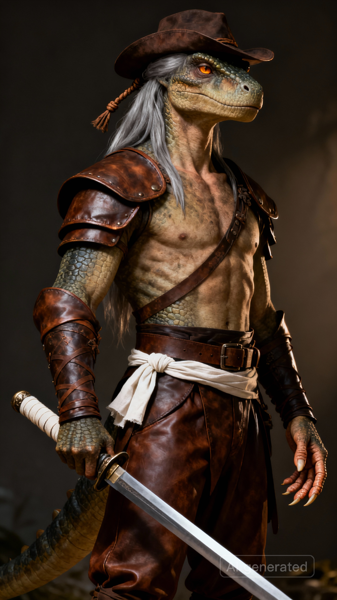

# 伊沙尔 | Ishar

## 基础信息

| 名称 | 伊沙尔 |
|------|-----|
| 种族 | 亚特兰斯人 |
| 性别 | 男 |
| 武器 | 长剑 |
| 穿着 | 皮衣、皮裤、皮帽、腰带 |
| 性格 | 淡泊寡言，心如止水 |
| 过往 | 出身夏尔库拉神殿世家，师门被德鲁克残党屠灭后踏上复仇之路，斩尽仇敌后云游三十年，最终放下执念。 |
| 外貌 | A tall male warrior of an ancient race descended from dinosaurs. Humanoid features, a tall and powerful yet not rugged physique, lean and wiry. His features are sharply defined, with prominent brow bones, and his pale bronze skin, weathered by time, reveals subtle, scaly textures. His long, silver-gray hair is tied back with a leather cord. His deep amber eyes possess a reptilian sharpness, calm yet penetrating, ancient and profound. His fingers are strong and long, with prominent tendons, covered in calluses. He wears well-fitting leather armor, leather trousers, and a leather hat, with a belt around his waist. A longer than usual longsword hangs at his side, its hilt wrapped in a strip of plain white cloth. The posture of a serene master swordsman. Style: Prehistoric dinosaur-blooded humanoid race, a blend of primal power and understated elegance, ancient fantasy warrior, character portrait, character concept design, dramatic lighting. |

---

## 剧情

### 传授剑术

**触发条件**：玩家没有剑术技能时与伊沙尔对话

---

伊沙尔缓缓拔剑，剑身平举，纹丝不动，一阵风拂过他的白发。

伊沙尔：剑是心的倒影。心乱，剑必乱。

伊沙尔将剑递到你面前。

伊沙尔：握住它。

你接过剑，剑身微微颤抖。

伊沙尔：看到了吗？那是你心里的杂念。

伊沙尔缓缓收回了剑。

伊沙尔：去练吧。等剑不再颤抖，再来找我。

---

**结果**：习得剑术技能
