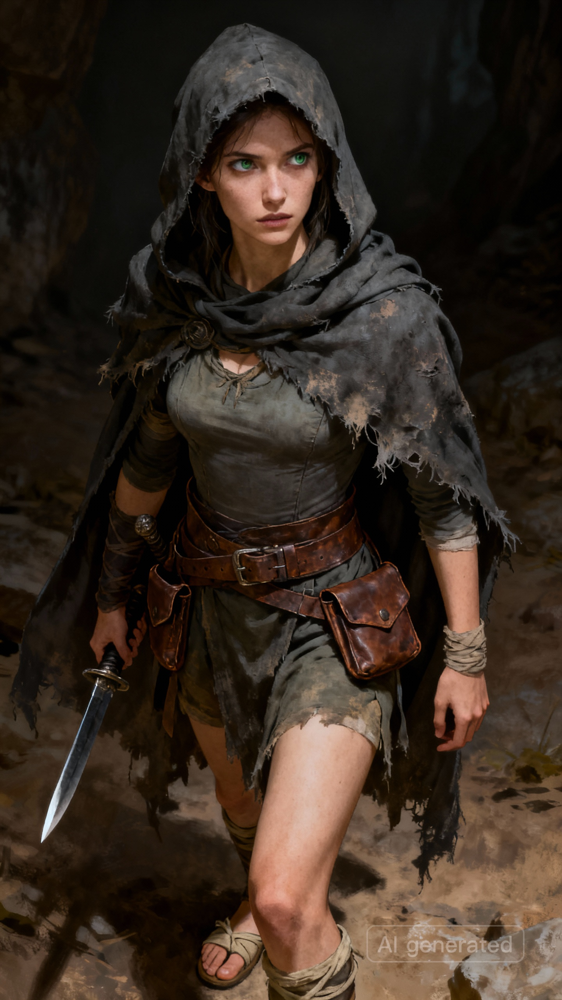

# 萨尔 | Sal

## 基础信息

| 名称 | 萨尔 |
|------|-----|
| 种族 | 雷姆利亚人 |
| 性别 | 女 |
| 武器 | 匕首 |
| 穿着 | 斗篷、布衣、布鞋、腰带 |
| 性格 | 沉默寡言，多疑猜忌 |
| 过往 |她的父母在一次魔兽袭击中丧生，年幼的她流落街头，一直靠偷窃为生。 |
| 外貌 |  A slender and agile young woman with a lean, sharp face and high cheekbones. She has deep grey-green eyes filled with alertness and scrutiny, always observing her surroundings. She wears a worn, faded dark grey hooded cloak with frayed edges over a fitted cloth tunic. A wide leather belt with hidden pockets wraps around her waist, and a dagger is tucked at her lower back. Simple cloth shoes. Atmosphere: mysterious rogue, thief master, survivor, ancient fantasy world setting, prehistoric civilization aesthetic, dramatic lighting, portrait, character concept art|

---

## 剧情

### 传授偷窃

**触发条件**：玩家没有偷窃技能时与萨尔对话

---

萨尔：别靠太近。我不信任何脚步声。

萨尔盯着你，眼神像审视危险。

萨尔的指尖掠过你腰间，又在下一瞬松开。

风吹起萨尔的兜帽边缘，露出她略显疲倦的眼。

萨尔静了一会，像是在权衡你的价值。

萨尔：记住——伸手前，先怀疑所有东西。

萨尔：包括你自己。

萨尔抬指示意你重复她的动作。

萨尔侧过身，没有再看你。

萨尔：行了，你能活下去了。

---

**结果**：习得偷窃技能
