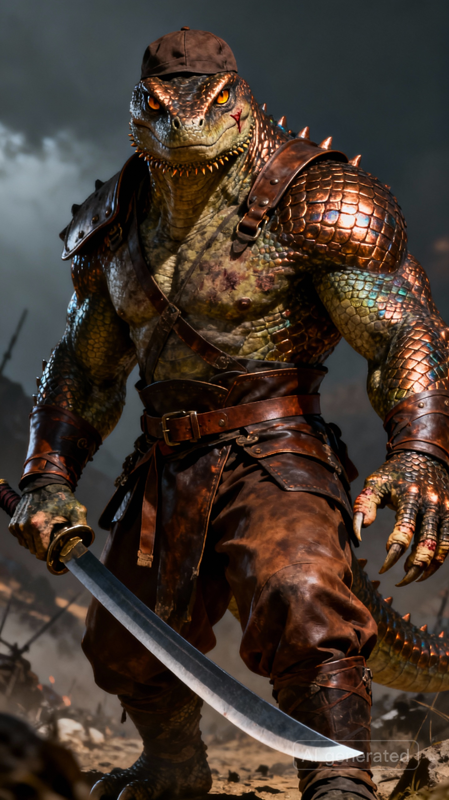

# 阿玛图 | Amatu

## 基础信息

| 名称 | 阿玛图 |
|------|-----|
| 种族 | 亚特兰斯人 |
| 性别 | 男 |
| 武器 | 大刀 |
| 穿着 | 皮衣、皮裤、皮帽、腰带 |
| 性格 | 刚直豪迈，严厉务实 |
| 过往 | 年幼时村落遭德鲁克残党洗劫，父母双亡，被半兽人战士救下并传授刀法，后加入杜尔甘护城队立下战功。 |
| 外貌 | A massive reptilian humanoid warrior with full-body scales covering his entire skin. Lizardman-like appearance with deep bronze-copper iridescent scales, broad powerful shoulders like a gate. Sharp angular facial features, a prominent scar running from left eyebrow to cheekbone, no hair, short beard-like scale protrusions on chin. Deep amber slit-pupil reptilian eyes, fierce and evaluating. Muscular hulking build, much taller than normal humans. Thick powerful clawed hands covered in calluses and old scars. Wearing practical fitted leather armor, leather pants, leather cap, belt. Carries a large curved dao blade, longer and heavier than normal, single-edged Chinese-style broadsword. Style: full-body scaled lizardman warrior, prehistoric dinosaur-descended humanoid, battle-scarred veteran, fierce blade master, ancient fantasy, character portrait, concept art, dramatic lighting |

---

## 剧情

### 传授刀法

**触发条件**：玩家没有刀法技能时与阿玛图对话

---

阿玛图扫了你一眼，目光如刀刃般锋利。

阿玛图：站直了。

他的声音低沉有力，不容置疑。

阿玛图将大刀横在身前，刀身泛着冷光。

阿玛图：刀法没有花招，难的也不是招式，是你敢不敢把刀挥下去。

阿玛图突然抬刀，刀锋停在你眼前一寸。

阿玛图收刀，嘴角微扬。

阿玛图：不错，恐惧藏在心里，没写在脸上。

---

**结果**：习得刀法技能
