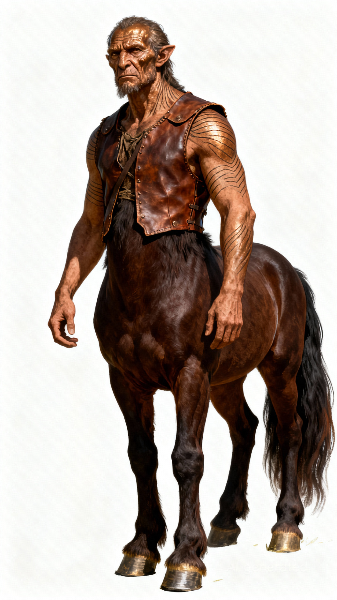

# 鲁尔 | Lur

## 基础信息

| 名称 | 鲁尔 |
|------|-----|
| 种族 | 半人马 |
| 性别 | 男 |
| 武器 | 钢棍 |
| 穿着 | 皮衣、背包 |
| 性格 | 开朗随和，耐心温厚 |
| 过往 | 生于埃纳达平原牧民家庭，天生能感知动物情绪，曾与狼群同行、驯服提兰湿地巨型鳄鱼，游历多年后决定传授驯兽之术。 |
| 外貌 | A centaur, with a human face and a horse's body. He has a weathered human face, bronze skin covered in fine lines, and wears a leather vest. His horse-like body has dark brown fur, strong hooves, and a long, thick tail. Style: Centaur, Human-faced Horse-bodied, Ancient Fantasy, Prehistoric Humanoid Race, Character Portrait, Concept Art |

---

## 剧情

### 传授驯兽

**触发条件**：玩家没有驯兽技能时与鲁尔对话

---

鲁尔的马蹄轻轻踏了踏地面，尾巴甩了甩。

鲁尔：你来找我，是想学怎么驯服野兽？

鲁尔从背包里掏出一块干肉，递给你。

鲁尔：先把这个吃了。

鲁尔：野兽能闻出你吃过什么。

鲁尔：你身上有它们熟悉的味道，它们才愿意靠近。

你咬了一口干肉，味道腥膻。

鲁尔哈哈大笑。

鲁尔：习惯就好。

鲁尔：记住——驯兽不是征服，是交朋友。

鲁尔：你要先让它相信，你不会伤害它。

---

**结果**：习得驯兽技能
