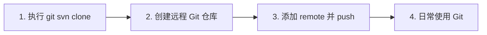

# SVN 迁移至 Git 操作手册

本文档说明如何将 LOA-Server 从 SVN 迁移到 Git，并保留完整提交历史。迁移后不再使用 SVN，日常开发改用 Git。

---

## 一、前置条件

- 本机已安装 **Git**（需带 `git svn` 支持，macOS 默认 Git 已包含）
- 本机可访问原 SVN 仓库（若服务器已停用，需临时恢复或使用只读备份）
- 已确定 Git 托管平台（GitHub / Gitee / GitLab 等）并已注册账号

---

## 二、迁移步骤概览



1. 在本机执行 `git svn clone`（或使用提供的脚本），得到带完整历史的本地 Git 仓库。
2. 在 GitHub/Gitee 等创建**空**远程仓库（不要勾选初始化 README）。
3. 在克隆出的本地仓库中执行 `git remote add origin <url>` 与 `git push -u origin main`（或你的默认分支名）。
4. 之后所有开发在 Git 仓库目录进行，不再使用 SVN。

---

## 三、执行 git svn clone（二选一）

### 方式 A：使用一键脚本（推荐）

在**终端**中进入**当前 SVN 工作副本的父目录**（即包含 `trunk` 的那一层，例如 `LOA-Server`），执行：

```bash
cd /Users/zhangxi/LOA-Server
bash trunk/svn2git_clone.sh
```

若当前已在 `trunk` 目录下，也可直接执行（脚本会自动定位到父目录）：

```bash
cd /Users/zhangxi/LOA-Server/trunk
bash svn2git_clone.sh
```

脚本会：
- 使用仓库根 URL：`https://106.15.248.25/svn/LOA-Server`
- 仅克隆 `trunk` 到新目录 `LOA-Server-git`
- 可选使用 `authors.txt` 映射 SVN 用户名为 Git 作者信息

若 SVN 需要认证，终端会提示输入用户名和密码。

### 方式 B：手动执行命令

在**父目录**（不要在当前 trunk 目录内）执行：

```bash
cd /Users/zhangxi/LOA-Server   # 或你的实际父目录

# 仅克隆 trunk，结果放在 LOA-Server-git
git svn clone https://106.15.248.25/svn/LOA-Server \
  --trunk=trunk \
  --no-metadata \
  --authors-file=trunk/authors.txt \
  LOA-Server-git
```

- `--trunk=trunk`：只拉取 trunk，与当前使用方式一致。
- `--no-metadata`：不在提交信息中写入 `git-svn-id`，历史更干净。
- `--authors-file`：可选；若不存在 `authors.txt`，去掉该参数即可。

若仓库有分支/标签且需要一并迁移，可改用标准布局，例如：

```bash
git svn clone https://106.15.248.25/svn/LOA-Server \
  --trunk=trunk --branches=branches --tags=tags \
  --no-metadata --authors-file=trunk/authors.txt \
  LOA-Server-git
```

---

## 四、作者映射（可选）

若希望历史中的作者显示为 `Name <email>` 而不是 SVN 用户名，可在 **trunk 目录下** 创建 `authors.txt`，每行格式：

```
svn_username = Git 显示名 <email@example.com>
```

示例（根据实际 SVN 用户修改）：

```
ZhangXi = ZhangXi <your-email@example.com>
```

通过 `svn log -q` 可查看仓库中出现过的用户名：

```bash
cd /Users/zhangxi/LOA-Server/trunk
svn log -q | awk -F '|' '/^r/ {print $2}' | sort -u
```

将上面输出的用户名写入 `authors.txt` 左侧，右侧写希望展示的 Git 作者与邮箱。可参考项目根目录下的 `authors.txt.example`。

---

## 五、关联远程仓库并推送

1. 在 GitHub/Gitee/GitLab 上新建**空**仓库（不要初始化 README/.gitignore）。
2. 在本地进入克隆出的 Git 仓库并添加远程、推送：

```bash
cd /Users/zhangxi/LOA-Server/LOA-Server-git

# 若 git svn clone 后默认分支为 master，可改为 main（可选）
git branch -M main

# 添加远程（将 <REMOTE_URL> 替换为你的仓库地址）
git remote add origin <REMOTE_URL>

# 首次推送
git push -u origin main
```

将 `<REMOTE_URL>` 替换为实际地址，例如：
- GitHub: `https://github.com/你的用户名/LOA-Server.git`
- Gitee: `https://gitee.com/你的用户名/LOA-Server.git`

---

## 六、迁移后校验清单

在推送完成后，建议做以下核对，确保历史与内容一致：

| 检查项 | 操作 |
|--------|------|
| 提交数量 | 在 Git 仓库中执行 `git log --oneline | wc -l`，与 SVN 的 `svn log -q` 行数大致相当（可能因合并/空提交略有差异）。 |
| 最新提交信息 | `git log -1 --format="%s"` 与 SVN 最近一次提交的 message 一致。 |
| 关键文件存在 | 检查 `Logic/Constant.cs`、`Library/Design/`、`Library/Config/` 等关键路径在 Git 仓库中存在且内容合理。 |
| 无多余构建产物 | 确认 `bin/`、`obj/` 等已由 `.gitignore` 忽略，未出现在 `git status` 中。 |

若发现缺文件或历史异常，可对比 SVN 工作副本与 Git 工作目录，必要时用 `git svn clone` 重新克隆并检查参数与 authors 文件。

---

## 七、迁移后日常使用 Git（替代 .svn_auto）

迁移完成后，开发在 **LOA-Server-git** 目录进行，不再使用 SVN 与 `.svn_auto` 的自动提交脚本。

- **提交**：`git add` 后执行 `git commit -m "你的提交说明"`。
- **推送**：`git push`。
- **拉取**：若多人协作，使用 `git pull`；单人则主要本地 commit + push 即可。

若希望保留“自动生成 commit message”的体验，可在 Git 仓库中配置 **prepare-commit-msg** 或 **commit-msg** hook，在本地生成默认说明后再由你编辑提交。该部分可根据需要另行配置，此处不展开。

---

## 八、当前 SVN 仓库信息（供参考）

- **仓库根 URL**：`https://106.15.248.25/svn/LOA-Server`
- **trunk URL**：`https://106.15.248.25/svn/LOA-Server/trunk`
- 本手册与脚本基于上述地址编写；若仓库地址变更，请替换脚本与文档中的 URL 后重新执行。
