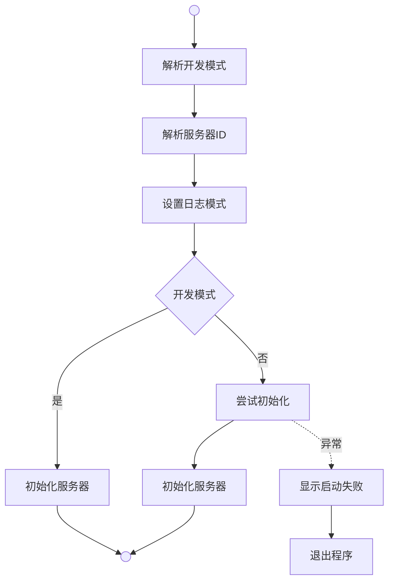
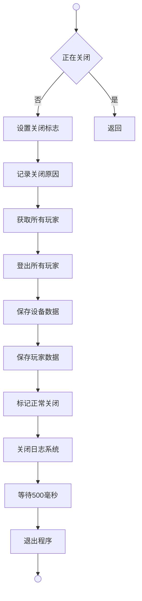
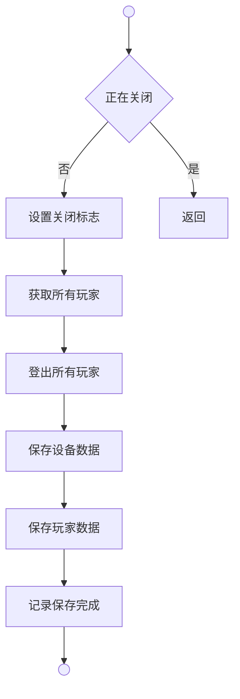

# 程序入口

## Main 函数流程

### 名词解释

**解析开发模式**（ParseIsDevelopment）是从命令行参数或配置文件中获取服务器运行模式的方法。

**解析服务器ID**（ParseServerId）是从命令行参数中获取服务器标识符的方法。

**设置日志模式**（Utils.Debug.Log.IsDevelopment）是配置日志系统是否处于开发模式。

**初始化服务器**（InitializeServer）是执行服务器完整初始化流程的方法。

**显示启动失败**（ShowStartupFailure）是在控制台输出启动错误信息和诊断建议的方法。

## 初始化服务器流程

```mermaid
graph TD
    Start((" "))
    DisableError[禁用Windows错误报告]
    SetCtrlHandler[设置控制台处理器]
    SetCancelKey[设置取消键事件]
    SetProcessExit[设置进程退出事件]
    SetUnhandled[设置未处理异常事件]
    SetDevelopment[设置开发模式]
    SetServerId[设置服务器ID]
    CheckMode{开发模式}
    InitValidation[初始化验证系统]
    LoadDesign[加载设计数据]
    RunValidation[执行数据验证]
    CheckValid{验证通过}
    FetchIP[获取外部IP]
    InitConfig[初始化配置系统]
    InitDatabase[初始化数据库]
    InitText[初始化多语言]
    InitCrash[初始化CrashGuard]
    InitNet[初始化Net.Manager]
    InitDomain[初始化Logic.Manager]
    StartKeyboard[启动键盘监听线程]
    CheckDev2{开发模式}
    ShowLog[输出启动完毕日志]
    SetOpen[设置服务器开放]
    Terminate[终止启动]
    End((" "))
    
    Start --> DisableError
    DisableError --> SetCtrlHandler
    SetCtrlHandler --> SetCancelKey
    SetCancelKey --> SetProcessExit
    SetProcessExit --> SetUnhandled
    SetUnhandled --> SetDevelopment
    SetDevelopment --> SetServerId
    SetServerId --> CheckMode
    CheckMode -->|是| InitValidation
    CheckMode -->|否| FetchIP
    InitValidation --> LoadDesign
    LoadDesign --> RunValidation
    RunValidation --> CheckValid
    CheckValid -->|否| Terminate
    CheckValid -->|是| InitConfig
    FetchIP --> InitConfig
    InitConfig --> InitDatabase
    InitDatabase --> InitText
    InitText --> InitCrash
    InitCrash --> InitNet
    InitNet --> InitDomain
    InitDomain --> StartKeyboard
    StartKeyboard --> CheckDev2
    CheckDev2 -->|是| ShowLog
    CheckDev2 -->|否| SetOpen
    ShowLog --> SetOpen
    SetOpen --> End
```

### 名词解释

**禁用Windows错误报告**（DisableWindowsErrorReporting）是通过系统API关闭Windows错误对话框的方法。

**设置控制台处理器**（SetConsoleCtrlHandler）是注册控制台事件处理函数的方法。

**设置取消键事件**（Console.CancelKeyPress）是注册Ctrl+C按键事件的方法。

**设置进程退出事件**（AppDomain.CurrentDomain.ProcessExit）是注册进程正常退出事件的方法。

**设置未处理异常事件**（AppDomain.CurrentDomain.UnhandledException）是注册全局异常捕获事件的方法。

**设置开发模式**（Data.Agent.Instance.IsDevelopment）是将命令行参数解析出的运行模式设置到逻辑层的操作。

**设置服务器ID**（Data.Agent.Instance.ServerId）是将命令行参数解析出的服务器标识设置到逻辑层的操作。

**初始化验证系统**（Validation.Agent.Instance.Init）是初始化数据验证框架的方法，仅在开发模式下执行。

**加载设计数据**（Design.Agent.Instance.Init）包含三个阶段：1）从Excel加载原始数据（LoadByRow）；2）执行数据验证（RunDesignValidation）；3）转换为运行时数据结构（Convert）。此方法确保只有验证通过的数据才会被转换。

**执行数据验证**（Validation.Agent.Instance.RunDesignValidation）是对加载的Excel原始数据进行完整性和一致性校验的方法。验证失败会阻止服务器启动，并一次性展示所有错误及缺失的多语言key，方便批量修复。

**终止启动** 即数据验证失败导致服务器无法启动，程序将抛出异常并终止。

**获取外部IP**（FetchExternalIpAsync）是从公网服务异步获取服务器外部IP地址的方法，仅在生产模式下执行。

**初始化配置系统**（Config.Agent.Instance.Init）是加载运行时配置数据的方法。

**初始化数据库**（Database.Agent.Instance.Init）是建立数据库连接并加载服务器配置的方法。

**初始化多语言**（Text.Instance.Init）是加载多语言文本系统的方法。

**初始化CrashGuard**（Logic.CrashGuard.Instance.Init）是初始化崩溃防护系统的方法。

**初始化Net.Manager**（Net.Manager.Instance.Init）是初始化网络层管理器的方法。

**初始化Logic.Manager**（Logic.Manager.Instance.Init）是初始化领域层管理器的方法。

**启动键盘监听线程**（KeyboardListener）是创建并启动监听ESC键退出的后台线程。

**输出启动完毕日志** 即在控制台打印服务器启动成功的提示信息，仅在开发模式下显示。

**设置服务器开放**（Data.Agent.Instance.Open）是将服务器状态设置为可接受玩家连接。

## 关闭服务器流程

### 名词解释

**设置关闭标志**（isShuttingDown）是通过线程安全的方式将全局关闭标志设为true，防止重复执行关闭流程。

**记录关闭原因**（Utils.Debug.Log.Fatal）是将触发关闭的原因（Ctrl+C、ESC键、控制台关闭等）写入日志的操作。

**获取所有玩家**（Data.Agent.Instance.Content.Gets<Data.Player>）是从内存中获取当前所有在线玩家列表的方法。

**登出所有玩家**（Logic.Authentication.Logout.Do）是将玩家数据从内存同步到数据库的方法。

**保存设备数据**（Data.Database.Agent.Instance.Save<Data.Database.Device>）是将设备表数据持久化到MySQL数据库的方法。

**保存玩家数据**（Data.Database.Agent.Instance.Save<Data.Database.Player>）是将玩家表数据持久化到MySQL数据库的方法。

**标记正常关闭**（Logic.CrashGuard.Instance.MarkNormalShutdown）是在崩溃防护系统中记录本次为正常关闭的方法。

**关闭日志系统**（Utils.Debug.Log.Shutdown）是刷新并关闭日志文件输出的方法。

**等待500毫秒**（Thread.Sleep）是给日志系统和其他异步操作留出完成时间的缓冲操作。

**退出程序**（Environment.Exit）是终止进程并返回退出码的系统调用。

## 紧急保存流程

### 名词解释

**紧急保存流程**（EmergencySave）是在进程退出或未处理异常时触发的数据抢救机制，与正常关闭流程类似但省略了日志关闭和进程退出步骤。

**设置关闭标志**（isShuttingDown）是通过线程安全的方式将全局关闭标志设为true，防止重复执行紧急保存。

**获取所有玩家**（Data.Agent.Instance.Content.Gets<Data.Player>）是从内存中获取当前所有在线玩家列表的方法。

**登出所有玩家**（Logic.Authentication.Logout.Do）是将玩家数据从内存同步到数据库的方法。

**保存设备数据**（Data.Database.Agent.Instance.Save<Data.Database.Device>）是将设备表数据持久化到MySQL数据库的方法。

**保存玩家数据**（Data.Database.Agent.Instance.Save<Data.Database.Player>）是将玩家表数据持久化到MySQL数据库的方法。

**记录保存完成**（Utils.Debug.Log.Fatal）是将紧急保存成功及保存的账号数量写入日志的操作。

