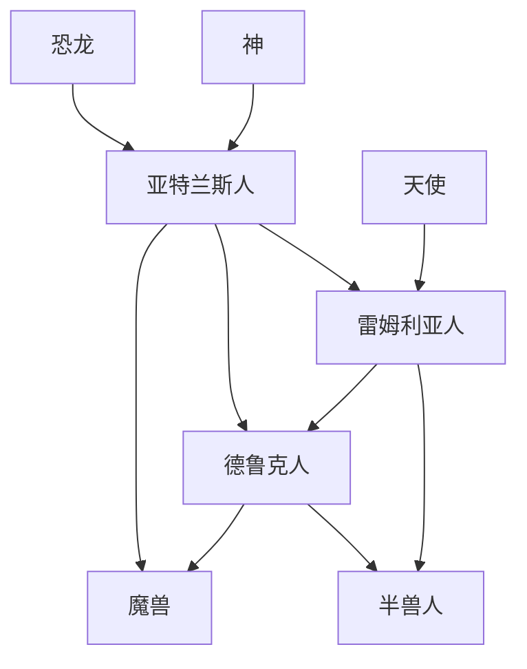

# 世界观 | World Lore

神创造了宇宙。
天使是受神控制、被神所奴役的神性存在。
天使由于对神的不满，曾经集体反抗过神，爆发了一场旷世战争。
战争之后，神决定创造另一种生灵来代替天使。

---

## 前12万年 ~ 前8万年

约前12万年，神来到地球，从地层深处唤醒尘封的恐龙之血。
神将远古恐龙的遗骸与基因碎片从地底提取，通过神力复原，结合自己的意识与力量，创造了亚特兰斯人。
恐龙并非自然存活到史前，而是通过神力从远古基因中复苏的造物蓝本。

**神降临地球，第一代造物诞生：亚特兰斯人（Atlantean），他们头、胸、手、背、腰、腿、脚、尾巴，身形庞大，力量强悍，但缺乏神性，是神意的兵器。**

---

## 前8万年 ~ 前4万年

约前8万年，天使反叛神之后，将自身的一部分与亚特兰斯人结合，创造了雷姆利亚人。
相较于亚特兰斯人，雷姆利亚人拥有更加符合神的审美的外形、智慧和神性，且毫无自我。
神认为雷姆利亚人是完美的奴隶，唯一令神不满的是他们身上流淌着天使的血液。

**天使反叛，第二代造物诞生：雷姆利亚人（Lemurian），他们继承了亚特兰斯人的人形躯体，外形更接近人类，具备神性，但毫无邪念，甚至不存在自我认知。**

---

## 前4万年 ~ 前3万年

约前4万年，神为了稀释雷姆利亚人体内的天使血统，将雷姆利亚人与亚特兰斯人结合，创造了德鲁克人。
德鲁克人身形巨大，力量惊人，但缺乏雷姆利亚人的智慧和神性，生性贪婪、残暴，充满破坏欲望。

**混乱蔓延，第三代造物诞生：德鲁克人（Druk），他们虽仍具人形，却身躯巨大、肌肉虬结，是贪欲与蛮力的象征。**

---

## 前3万年 ~ 前2万年

约前3万年，神将德鲁克人与亚特兰斯人结合，诞生了魔兽。
魔兽生性残暴，总是惨绝人寰地侵略雷姆利亚人，甚至把雷姆利亚人当作食物。
**失控升级，第四代造物诞生：魔兽（Demon），他们的躯体已扭曲变形，具有各种混乱的身体构造，暴力、嗜血、失控，是混乱与暴力的化身，是神造物实验中最失败的产物。**

---

## 前2万年 ~ 前1.5万年

约前2万年，为了保护雷姆利亚人不受魔兽蚕食殆尽，神将雷姆利亚人、德鲁克人和各种野生动物结合，创造了半兽人。

**神失去控制，第五代造物诞生：半兽人（Beastman），他们无法自然繁殖，寿命极长，几乎不死，以守护雷姆利亚人为己任。七种半兽人各司其职：狮身人为守护者，豺狼人为审判者，牛头人为战士，半人马为游牧战士，蛇人为术士，象头人为贤者，鹰头人为远视者。**

---

## 前1.5万年 ~ 前1万年

约前1.5万年，神以一场几乎淹没了整个世界的巨大洪水，结束了这一场造物实验，离开了地球。

---

## 前1万年起

约前1万年起，洪水退去，大陆重现。
除了神的造物，地球上还残存着自然界的生灵：狼、熊、虎、豹、鹿、蛇、野猪、狐狸、兔、羊、鸡，它们并非神造，而是自然的产物。
魔兽在边缘地带游荡，雷姆利亚人、亚特兰斯人和半兽人在四座城市中重建文明。

### 01. 清泉平原（Springfield）

位于阿拉塔大陆中部的河谷平原。  
地势低平开阔，河流纵横交错。  
树林沿河岸生长，草地占据大部分面积。  
水源充足，土地肥沃，适合农耕与定居。

**地图**：树林、岸边、草地、稻田、麦田、菜地、瓜地  
**生物**：牛（1-15级）、马（5-20级）、鹿（5-20级）、狼（20-35级）  
**资源**：清水、药草  
**作物**：稻米、小麦、蔬菜、瓜果  
**危险度**：1-35

#### 圣泉镇（Wellspring）

城市以圣泉为中心建造。  
神殿位于城市核心，是雷姆利亚人的信仰中心。  
议事厅制定城市律法，管理公共事务。  
城市周围是农田，依靠圣泉灌溉。  
雷姆利亚人与半兽人共同居住于此。

**产品**：面包、肉卷  
**城市地图**：圣泉镇-草地、圣泉镇-水源  

---

### 02. 星落丘陵（Starfall Hills）

位于清泉平原东侧的丘陵地带。  
地势起伏和缓，湖泊星罗棋布。  
树林覆盖丘陵，洞穴散布其间。  
湖岸水草丰富，草地连接丘陵与平原。

**地图**：树林、洞穴、岸边、草地  
**生物**：鹿（5-20级）、羊（1-15级）、狼（20-35级）、狐狸（15-25级）  
**资源**：药草  
**作物**：药草、苎麻、棉花  
**危险度**：1-35

---

### 03. 银光群岛（Silver Isles）

位于北方海域的群岛，由数十座岛屿组成。  
岛屿大小不一，地势以山地为主。  
岸边礁石众多，部分岛屿有草地分布。  
岛屿之间海水阻隔，需要船只通行。

**地图**：岸边、草地、山地  
**生物**：无  
**资源**：生肉、兽皮、药草  
**作物**：苎麻、药草  
**危险度**：40-60

---

### 04. 灰烬山脉（Ashridge）

横贯阿拉塔大陆西部的山脉。  
山体由玄武岩与赤铁石构成，内部有天然熔岩河。  
地势险峻，从低海拔草地树林到高海拔雪地洞穴。  
矿产资源极为丰富，是主要的金属矿产区。  
终年火山灰飘摇，活跃的地质活动持续至今。

**地图**：山地、雪地、岸边、桥、草地、树林、洞穴、菜地  
**生物**：羊（1-15级）、鹿（5-20级）、熊（40-60级）、狼（20-35级）、豹（45-60级）  
**资源**：铁矿石、银矿石、金矿石  
**作物**：药草、苎麻、蔬菜  
**危险度**：1-60

#### 地下城（Underholt）

城市位于山脉深处的地下洞穴系统。  
利用山体内部的熔岩河提供热能。  
城市建筑由黑曜石构建，耐高温。  
亚特兰斯人在此进行金属冶炼与锻造。  
地下洞穴网络延伸数公里，连接多个矿脉。

**产品**：匕首、大刀、钢棍、头盔、铁靴  
**城市地图**：地下城-洞穴、地下城-水源  

---

### 05. 大沙漠（The Great Desert）

位于南部的广袤沙漠。  
沙地占据绝大部分面积，绿洲散布其间。  
绿洲周围有草地和水源，岸边生长棉花与苎麻。  
气候干旱，昼夜温差巨大。  
沙漠中有盐晶矿分布。

**地图**：沙地、草地、岸边、瓜地  
**生物**：蜥蜴（10-25级）  
**资源**：棉花、药草、苎麻  
**作物**：棉花、苎麻、药草、瓜果  
**危险度**：10-25

#### 绿洲营地（Oasis Camp）

城市建立在最大的绿洲周围。  
水源充足，支撑城市人口。  
各种族商人聚集于此，进行贸易交易。  
商队往来频繁，交易香料、盐晶、纺织品。  
城市是南方贸易的中转站。

**产品**：布衣、布鞋、头巾、布裤  
**城市地图**：绿洲营地-沙地、绿洲营地-瓜地、绿洲营地-草地、绿洲营地-岸边、绿洲营地-桥、绿洲营地-水源  

---

### 06. 神锤火山（Hammerpeak）

位于灰烬山脉中心的活火山。  
火山口直径达数公里，熔岩湖终年沸腾。  
火山坡上遍布黑曜石露头，火山灰覆盖周边。  
山地陡峭，洞穴深邃，高海拔处有雪地分布。  
地质活动频繁，温度极高，环境恶劣。

**地图**：山地、洞穴、岸边、雪地、桥  
**生物**：无  
**资源**：金矿石、铁矿石、银矿石  
**作物**：无（环境极端恶劣）  
**危险度**：50-70

---

### 07. 云雾高原（Cloudtop）

位于阿拉塔大陆中西部的石质高原。  
地势高耸，海拔平均超过3000米。  
常年被雾与风笼罩，能见度较低。  
山地与草地交错分布，岸边有少量水源。  
高海拔地区有雪地和桥梁连接山峰。

**地图**：山地、岸边、雪地、桥、草地、菜地  
**生物**：羊（1-15级）、狼（20-35级）  
**资源**：药草  
**作物**：药草、苎麻、蔬菜  
**危险度**：1-35

#### 雾都（Misthold）

城市坐落于高原之巅。  
石质建筑适应高原环境，抗风耐寒。  
半兽人与雷姆利亚人共同居住。  
城市周围有神庙群与石碑遗迹。  
高海拔位置提供天然防御优势。

**产品**：皮衣、皮帽、皮裤、斗篷  
**城市地图**：山地、雪地

---

### 08. 古湖盆地（Oldlake）

位于阿拉塔大陆东部的巨大盆地。  
四周被高地与丘陵环绕，地势低洼。  
盆地中心是广阔的草地，残留少量湖泊。  
边缘地带是沼泽湿地，与浊水沼泽相连。  
地势封闭，水流汇集但排出缓慢。

**地图**：草地、稻田、麦田  
**生物**：鹿（5-20级）、狼（20-35级）、马（5-20级）、虎（45-60级）、熊（40-60级）  
**资源**：药草  
**作物**：药草、苎麻、棉花、稻米、小麦  
**危险度**：5-60

---

### 09. 浊水沼泽（The Mire）

古湖盆地边缘的广阔湿地。  
水陆交接地带，沼泽面积大。  
湿地中生长着茂密的芦苇丛。  
岸边有草地分布，适合采集植物资源。  
地面松软泥泞，通行困难。

**地图**：岸边、草地、沼泽、稻田  
**生物**：鳄鱼（30-45级）、蛇（1-10级）  
**资源**：药草、苎麻、棉花  
**作物**：苎麻、药草、棉花、稻米  
**危险度**：1-45

---

### 10. 北境冰海（Frozen Sea）

阿拉塔大陆北方的极地海域。  
海面大部分冰封，形成广阔冰原。  
雪地覆盖冰面，岸边有冰川悬崖。  
洞穴散布在冰川内部，深邃曲折。  
气温极低，环境极端恶劣。

**地图**：雪地、岸边、洞穴  
**生物**：无  
**资源**：兽皮、羊绒、生肉、清水  
**作物**：无（极地环境）  
**危险度**：75-95

---

### 11. 深渊海岸（Deepshore）

位于银光群岛深处的海岸地带。  
海岸陡峭，礁石嶙峋，潮汐变化剧烈。  
岸边有洞穴通往海底深处。  
海水深邃，能见度低。  
海底有矿脉分布。

**地图**：岸边、洞穴  
**生物**：无  
**资源**：金矿石、清水  
**作物**：无（海岸陡峭，环境恶劣）  
**危险度**：80-95

---

### 12. 黑渊峡谷（Blackrift）

位于东部黑海区域的巨大裂谷。  
地壳撕裂形成，裂谷深不见底。  
两侧岩壁陡峭，山地地形险峻。  
洞穴深入地下，内部结构复杂。  
底部涌动黑色雾气，能见度极低。

**地图**：洞穴、山地  
**生物**：羊（1-15级）、狼（20-35级）  
**资源**：金矿石、清水  
**作物**：药草  
**危险度**：1-35

---

