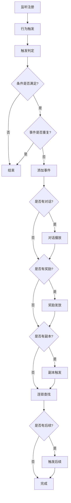

# 事件系统

事件系统是游戏的核心驱动机制，通过剧情事件的触发、依赖和连锁反应来推进游戏进程。系统基于条件判断和自动化触发实现复杂的事件网络。

**剧情事件**（Sign）是游戏世界中发生的具体事件，承载剧情推进、奖励发放、副本创建等功能。每个事件都有唯一ID、触发条件、执行后果。

**条件系统**（Condition）是事件触发的判断机制，支持等级、武学、物品、事件依赖等多种条件类型，实现复杂的逻辑判断。

**依赖链管理**（Forward）是事件间关联的核心机制，通过前置事件与后续事件的映射关系，实现事件的自动连锁触发。

**监听注册**（OnBundleElement）为每个游戏对象注册事件监听器，根据事件的Trigger字段确定监听的行为类型，自动建立事件与触发行为的绑定关系。

**触发判定**（OnTrigger）是核心触发机制，接收游戏行为的参数，检查事件的condition条件是否全部满足，验证事件是否已经触发过，条件满足时将事件添加到触发者身上。

**条件解析**基于"前缀·内容"格式支持多种条件：等级条件`等级>=30`、武学条件`武学·轻功>=5`、物品条件`物品·金钥匙>=1`、事件条件`事件·123`、身体条件`身体·Hand`、目标条件`目标·456`。

**依赖注册**（RegisterForwardDependency）解析condition中"事件·ID"格式的依赖条件，建立前置事件到后续事件的映射表，支持一对多和多对一的复杂依赖关系。

**连锁查找**（GetPossibleFollowups）基于forward依赖表快速查找当前事件的所有可能后续，返回潜在后续事件列表，支持界面显示事件进度。

**对话播放**（OnPlayerAddSign）根据dialogues配置播放剧情，单条对话直接通过Channel.Local广播，多条对话以Story协议发送完整剧情，支持多语言的动态文本替换。

**奖励发放**支持多种奖励类型的自动处理：物品奖励根据ID和数量创建，经验奖励调用GainExp方法增加经验，技能奖励调用LearnSkill方法学习技能。

**信息显示**（HandleSignInformation）提供事件的详细信息展示：事件名称描述、触发线索、完成条件、满足状态等，支持多语言显示。

**进度跟踪**显示当前事件和可能的后续事件列表，用不同颜色标识已完成和未完成状态，提供完整的事件进度可视化。

## 副本管理 | Replica

副本管理模块负责事件驱动的副本创建和生命周期管理，将副本视为特殊事件的执行后果。

**副本触发**（OnPlayerAddSign）检查事件的replica字段，当大于0时通过Scene.Create创建副本实例，传递玩家、副本ID和触发事件作为参数，实现事件到副本的无缝转换。

**生命周期管理**（OnBundleReplica）监听副本的创建和销毁，处理副本内玩家的进出事件，确保副本相关的事件状态正确同步和清理。

**角色传送**（OnAfterCharacterPosChanged）处理角色在副本间的移动，通过查找目标副本地图并调用AddAsParent实现角色的跨副本传送。