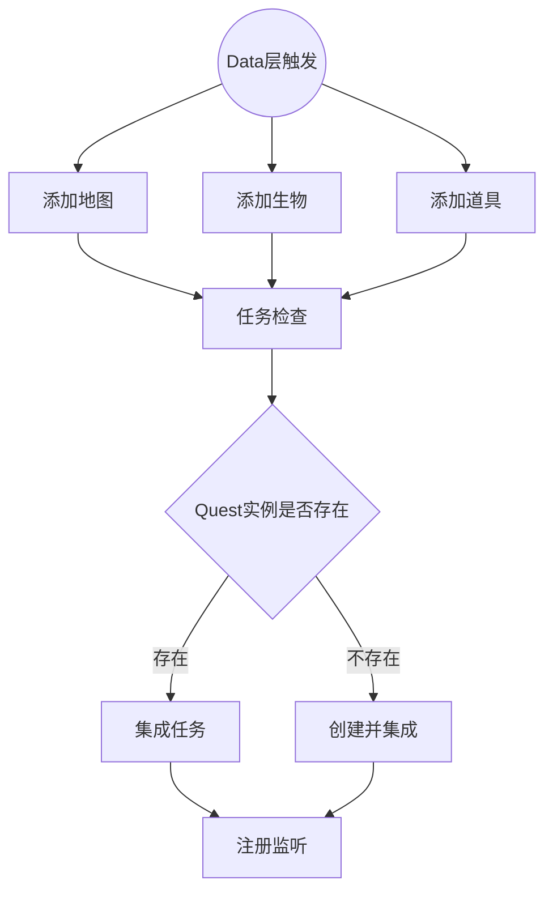
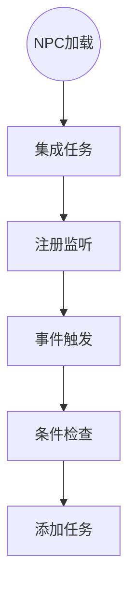
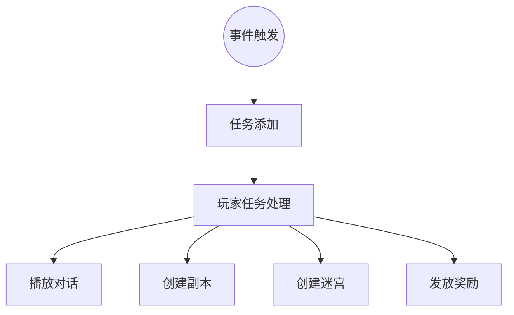

# 任务系统（Quest）

负责游戏内事件驱动的任务触发、条件检查和动作执行。

系统采用 **触发式** 设计：事件 → 条件检查 → 执行动作（对话、副本、迷宫、奖励）。

---

## 事件生成

**添加地图**（OnAddMap）是Logic.Quest监听Map添加事件的回调函数，提取Map的quests配置并调用Check处理。

**添加生物**（OnAddLife）是Logic.Quest监听Life添加事件的回调函数，提取Life的quests配置并调用Check处理。

**添加道具**（OnAddItem）是Logic.Quest监听Item添加事件的回调函数，提取Item的quests配置并调用Check处理。

**任务检查**（Check）是Logic.Quest中统一处理quests配置的核心函数，检查是否存在相同ID的Quest实例，进而调用Integrate或CreateAndIntegrate方法。

**Quest实例是否存在**（Exist）是检查Data.Agent.Instance.Content中是否已存在指定ID的Quest实例的方法。

**集成任务**（Integrate）是将已存在的Quest实例注册监听器并添加到对象Content中的方法。

**创建并集成**（CreateAndIntegrate）是创建新的Quest实例、注册监听器并添加到对象Content中的方法。

**注册监听**（Register）是Logic.Quest继承自Basic.Manager的函数，为Quest的Trigger事件注册OnTrigger回调监听器。

## NPC绑定

**集成任务**（Integrate）是将已存在的Quest实例注册监听器并添加到对象Content中的方法。

**注册监听**（Register）是为Quest的Trigger事件注册OnTrigger回调监听器的方法。

**事件触发**（OnTrigger）是Quest事件触发时的回调函数，通过CanAddQuest方法进行双重验证后才添加任务。

**条件验证**（CanAddQuest）是综合性的任务添加验证方法，检查条件满足度和重复性两个方面。

**条件评估**（condition.Evaluate）是使用ConditionNode树形结构进行复杂条件判断的方法，支持AND、OR、单一条件的组合逻辑。

**重复检查**验证对象是否已经拥有相同ID的Quest实例，避免重复添加相同的任务事件。

**添加任务**（ability.Add）是验证通过后将Quest实例添加到触发对象Content中的方法，触发后续的处理流程。

## Player触发

**任务添加**（player.Add）是玩家通过事件获得Quest实例时自动触发OnPlayerAddQuest的过程。

**玩家任务处理**（Do）是Logic.Quest中玩家获得Quest时的核心处理函数，按顺序执行对话播放、副本创建、迷宫创建和奖励发放。

**播放对话**（PlayDialogues）是Logic.Quest中处理Quest对话内容的方法，根据对话数量选择不同的播放方式。

**创建副本**（CreateCopy）是Logic.Quest中根据Quest配置创建战斗副本的方法。

**创建迷宫**（CreateMaze）是Logic.Quest中根据Quest配置创建迷宫副本的方法。

**发放奖励**（GrantRewards）是Logic.Quest中处理Quest奖励的方法，包括道具、经验和技能奖励。

## 对话播放（Dialogue）

对话播放模块负责任务中对话内容的展示和多语言处理。

### 对话检测

**对话存在检查**（HasDialogues）通过检查dialogues数组长度判断是否需要播放对话内容。

### 对话播放

**单条对话播放**使用Net.Tcp.Instance.Information方法通过Local频道向玩家广播单条对话内容。

**多条对话播放**通过Story协议发送完整的对话序列，支持复杂任务的连续对话展示。

**多语言支持**使用player.Lang方法将对话ID转换为玩家本地语言的文本内容。

## 迷宫创建（Maze）

迷宫创建模块负责任务触发的迷宫副本生成和管理。

### 创建条件

**迷宫配置检查**（CanCreateMaze）验证Quest配置中maze字段大于0且玩家当前位置的Scene对象存在。

### 迷宫生成

**迷宫实例创建**（CreateMaze）根据maze配置ID查找对应的迷宫配置，调用Data.Agent.Instance.Create方法生成Maze实例。

**玩家传送**生成成功后将玩家传送到迷宫的最后一个位置，实现无缝进入迷宫副本。

**配置管理**通过Data.Config.Agent查找迷宫配置，支持多种迷宫类型和生成参数的配置化管理。

## 副本创建（Copy）

副本创建模块负责任务触发的战斗副本生成和管理。

### 创建条件

**副本配置检查**（CanCreateCopy）验证Quest配置中copy对象非空、characters集合不为空且玩家当前位置的Scene对象存在。

### 副本生成

**副本实例创建**（CreateCopy）调用player.Map.Scene.Create方法生成Copy实例，传递玩家和触发任务作为参数。

**副本范围管理**根据copy.scope字段确定副本包含的地图范围，通过最短路径或坐标距离计算覆盖区域。

**角色生成**根据copy.characters配置在指定地图生成NPC，支持等级随机化和掉落物品配置。

**掉落生成**为配置了loot的容器角色生成随机掉落物品，支持概率控制和数量范围。

**生命周期管理**副本创建后自动管理角色传送、地图生成、NPC配置等完整生命周期。

### 副本任务管理

**位置变化监听**（OnBeforePlayerPosChanged）监听玩家位置变化，当玩家离开副本时自动清理相关任务。

**任务清理机制**对于非重复任务，玩家离开副本时移除最后获得的任务；对于可重复任务，移除所有相关的任务实例。

**副本关联检测**通过检查player.Map是否为Copy.Map类型来判断玩家是否在副本中，确保只在副本环境下执行清理逻辑。

### 掉落系统

**掉落配置**（Loot）定义物品掉落的ID、概率、最小数量和最大数量参数。

**概率计算**（GenerateLoot）使用累积概率算法从掉落池中随机选择物品和数量。

**容器填充**（GenerateLootForContainer）为配置了掉落的容器角色自动生成并添加掉落物品。

## 奖励发放（Reward）

奖励发放模块负责处理任务完成后的各种奖励类型。

### 奖励检测

**奖励存在检查**（HasRewards）通过检查rewards集合的Count属性判断是否需要发放奖励。

### 奖励类型

**物品奖励**（Item）根据物品配置ID和数量调用player.Create方法为玩家创建物品实例。

**经验奖励**（Exp）调用player.GainExp方法为玩家增加指定数量的经验值。

**技能奖励**（Skill）调用player.LearnSkill方法让玩家学习指定ID的技能。

### 奖励处理

**奖励遍历**（GrantRewards）使用foreach循环处理rewards集合中的每个奖励项，通过switch语句根据type字段分类处理。

**类型匹配**支持"Item"、"Exp"、"Skill"三种奖励类型的字符串匹配和相应的处理逻辑。

**配置验证**对于物品奖励，通过Data.Config.Agent查找对应的物品配置，确保配置存在后才创建物品。

**批量处理**支持在单个任务中配置多种类型的奖励，系统自动批量处理所有奖励项。

## 数据结构

### 副本配置

**Copy**是副本的完整配置结构，包含scope范围字段和characters角色字典。

**Character**是副本中单个角色的配置，包含ID、数量、等级范围和掉落配置。

**Loot**是掉落物品的配置，包含物品ID、掉落概率、最小数量和最大数量。

### 任务配置

**rewards**是奖励列表，每个奖励包含类型、ID和数量三个字段的元组结构。

**condition**是条件节点树，支持单一条件、AND条件、OR条件的复杂组合逻辑。

**repeatable**是可重复标志，标记任务是否可以多次触发和执行。

**maze**是迷宫配置ID，指定任务触发时创建的迷宫类型。

### 条件节点结构

**ConditionNode**是抽象条件节点，定义Evaluate方法进行条件判断。

**SingleCondition**是单一条件节点，包含具体的条件字符串和评估逻辑。

**AndCondition**是AND逻辑节点，要求左右两个子条件都满足才通过。

**OrCondition**是OR逻辑节点，只要左右任一子条件满足即可通过。

## 生命周期管理

### 玩家监听

**玩家加入监听**（OnAddPlayer）为新加入的玩家注册Quest添加事件的监听器，确保任务系统对所有玩家生效。

**玩家移除清理**（OnRemovePlayer）在玩家离开时清理相关的事件监听器，避免内存泄漏和错误触发。

### 对象监听

**生物监听管理**（OnAddLife/OnRemoveLife）为Life对象注册和清理Quest相关的监听器，支持NPC触发任务事件。

**地图监听管理**（OnAddMap/OnRemoveMap）为Map对象注册和清理Quest相关的监听器，支持地点触发任务事件。

### 系统初始化

**监听器注册**（Init）在系统启动时注册所有必要的事件监听器，建立完整的任务事件监听网络。

**自动集成**对现有的Life和Map对象自动调用Integrate方法，确保系统启动时所有对象的任务都能正常工作。

## Quest状态管理

### 全局存储

**Agent池**（Data.Agent Pool）是所有Quest实例的全局存储容器，支持通过ID快速查找和复用Quest实例。

**配置缓存**（Config Cache）是Quest配置对象的缓存机制，避免重复创建相同配置的实例。

### 实体关联

**多重绑定**（Multiple Binding）支持同一个Quest实例同时绑定到多个地图或角色，实现任务的复用。

**父子关系**（Parent-Child）Quest被添加到Ability对象的Content中，但Parent始终是Data.Agent。

### 状态追踪

**触发状态**（Trigger State）通过事件监听器的注册状态跟踪Quest是否处于可触发状态。

**完成状态**（Completion State）Quest执行完毕后自动移除监听器，标记为完成状态。

**持久化状态**（Persistent State）玩家拥有的Quest会保存到数据库的signs字段，支持跨会话持续。

**可重复机制**（Repeatable Mechanism）标记为repeatable的任务支持多次触发，系统在副本清理时会移除所有相关实例。
