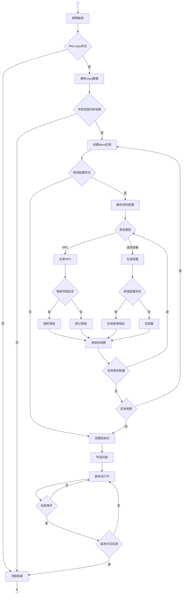

# 副本数据

副本数据系统通过剧情系统的copy字段管理游戏中临时副本实例的创建和运行，实现了剧情与副本的统一管理。

## 副本生命周期



**剧情触发**（OnPlayerAddPlot）是通过玩家获得Plot事件时检查copy字段触发副本创建的方法。

**Plot.copy存在**（HasCopyData）是通过检查Plot.Config.copy字段是否为空判断是否需要创建副本的条件。

**解析copy数据**（ParseAndConvertCopyData）是通过ParseAndConvertCopyData方法从Plot.copy字段解析scope和角色配置的方法。

**作用范围内有地图**（HasMapsInScope）是通过内联距离判断筛选玩家周围可用地图的条件。采用两层策略：优先使用预计算路径，回退到曼哈顿距离计算（适合网格世界移动）。

**创建Mara实例**（CreateMara）是通过Scene.Create为每个合适地图创建Copy.Map实例的方法。

**流程结束**（ProcessEnd）是副本创建失败或副本销毁时的统一结束处理方法。

**角色配置存在**（HasCharacterConfig）是检查当前地图在characters字典中是否有对应配置的判断。

**解析角色配置**（ParseCharacterConfig）是通过ParseCharacterConfig方法解析角色CID、等级范围、数量和掉落配置的方法。

**角色类型**（CharacterType）是通过Config.Ability类型判断是NPC还是道具容器的判断。

**生成NPC**（CreateNPC）是通过mara.Create<Life>方法创建NPC实例的方法。

**生成容器**（CreateContainer）是通过mara.Load<Item>方法创建道具容器实例的方法。

**等级范围设定**（HasLevelRange）是检查角色配置中min和max是否设定的判断。

**随机等级**（RandomLevel）是通过random.Next在min和max范围内随机生成NPC等级的方法。

**默认等级**（DefaultLevel）是使用NPC配置默认等级创建的方法。

**掉落配置存在**（HasLootConfig）是检查角色配置中loot列表是否存在的判断。

**生成掉落物品**（GenerateLootForContainer）是通过GenerateLoot方法为容器生成随机掉落物品的方法。

**空容器**（EmptyContainer）是创建不包含任何物品的空道具容器的状态。

**添加到地图**（AddToMap）是将生成的NPC或容器添加到对应副本地图的方法。

**还有角色配置**（HasMoreCharacters）是检查当前地图是否还有未处理的角色配置的判断。

**还有地图**（HasMoreMaps）是检查作用范围内是否还有未处理地图的判断。

**设置起始点**（SetStartPoint）是通过Content.Get<Copy.Map>查找与玩家当前位置匹配的起始地图的方法。

**传送玩家**（TransferPlayer）是通过Start.AddAsParent将玩家添加到副本起始点的方法。

**副本运行中**（ReplicaRunning）是副本正常运行，等待玩家操作的状态。

**玩家离开**（PlayerLeave）是检查玩家是否离开副本范围的判断。

**副本内无玩家**（NoPlayersInReplica）是通过Content.Has<Player>()检查副本是否为空的判断。

## 数据结构

### Data.Design.Plot.copy | 策划数据

剧情中的副本配置字段，使用文本格式描述副本信息。

#### copy字段格式

```text
【scope】地图CID=>角色配置
【0】埃利都-村长的家=>村长:5~10×1
【0】埃利都-客栈=>酒肆老板:2×1
【0】埃利都-村长的家=>酒架×1[尚清村的酒:100%×1]
```

#### 格式说明

- **scope**：副本作用范围，用【】包围的数字
- **地图CID**：目标地图的中文标识符
- **角色配置**：NPC或道具容器的配置信息

#### 角色配置格式

- **NPC格式**：`角色CID:等级范围×数量`
- **道具容器格式**：`容器CID×数量[掉落配置]`
- **等级范围**：`固定等级` 或 `最小~最大`
- **掉落配置**：`物品CID:概率%×数量范围`

### Data.Config.Plot.copy | 配置数据

运行时剧情配置中的副本字段，直接存储策划数据的原始字符串。

#### 属性定义

- **copy** (string)：副本配置的原始文本

### Data.Config.Plot.Copy | 解析数据

副本运行时解析后的数据结构。

#### 属性定义

- **scope** (int)：副本作用范围
- **characters** (Dictionary<int, List<Plot.CopyCharacter>>)：按地图ID分组的角色配置

### Data.Config.Plot.CopyCharacter | 角色数据

单个角色配置的解析结果。

#### 属性定义

- **id** (int)：角色或道具ID
- **count** (int)：生成数量
- **min** (int?)：最小等级（可选）
- **max** (int?)：最大等级（可选）
- **loot** (List<LootEntry>)：掉落配置列表（可选）

### Data.Copy.LootEntry | 掉落数据

道具掉落配置数据。

#### 属性定义

- **id** (int)：掉落物品ID
- **Probability** (double)：掉落概率（0.0-1.0）
- **MinCount** (int)：最小数量
- **MaxCount** (int)：最大数量

## 运行时处理

### 副本创建流程

1. **剧情触发**：玩家获得Plot时，Logic.Story检查copy字段
2. **数据解析**：Data.Design.Plot.ParseAndConvertCopyData解析copy字符串
3. **地图筛选**：根据scope范围筛选可用地图
4. **副本构建**：为每个地图创建Copy.Map实例
5. **角色生成**：根据配置在对应地图生成NPC和容器
6. **玩家传送**：将玩家添加到副本起始点

### 解析算法

#### Scope解析
- 提取【】内的数字作为作用范围
- 用于计算副本影响的地图距离

#### 地图匹配
- 通过地图CID查找Config.Map配置
- 建立地图名称到ID的映射关系

#### 角色解析
- 识别NPC和道具容器类型
- 解析等级范围和生成数量
- 处理可选的掉落配置

#### 掉落解析
- 解析概率百分比转换为小数
- 支持固定数量和范围数量
- 建立物品CID到ID的映射

## 配置示例

### 基础副本配置
```text
【2】埃利都-村长的家=>村长:10×1
【2】埃利都-客栈=>酒肆老板:8~12×1
```

### 带掉落的副本配置
```text
【1】埃利都-村长的家=>酒架×1[尚清村的酒:100%×1]
【1】埃利都-客栈=>宝箱×1[银两:50%×10~20,丹药:25%×1~3]
```

### 混合配置
```text
【3】埃利都-村长的家=>村长:15×1
【3】埃利都-村长的家=>酒架×1[尚清村的酒:80%×1~2]
【3】埃利都-客栈=>酒肆老板:10~15×2
【3】埃利都-后院=>守卫:12×1
```

## 优势特性

### 统一管理
- 剧情和副本数据统一存储在Plot中
- 消除了独立Replica表的维护成本
- 简化了数据关联和查询逻辑

### 灵活配置
- 支持文本格式的直观配置
- 允许复杂的角色和掉落组合
- 易于策划人员理解和编辑

### 运行时优化
- 延迟解析减少内存占用
- 按需创建副本实例
- 自动清理空副本资源