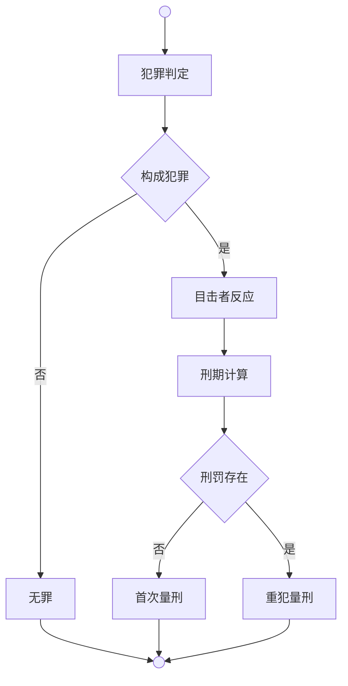
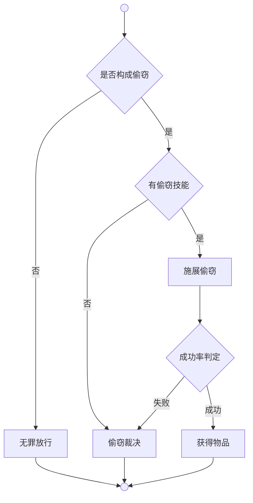

# 司法系统



**犯罪判定**是各犯罪模块通过Judge函数（偷窃）或Is函数（其他犯罪）判断行为是否构成对应犯罪的过程。

**目击者反应**（HasWitnesses）是检测周围目击者并触发仇恨增加和语音谴责的处理过程。

**刑期计算**（CalculateJailTime）是通过基础刑期范围、等级修正和随机调整得出最终刑期的计算方法。

**首次量刑**（ApplyFirstOffenderSentence）是为角色创建新刑罚对象的处理方法。

**重犯量刑**（ApplyRepeatOffenderSentence）是对现有刑罚累加新刑期及50%重犯加重的处理方法。

**刑罚适用**（ApplyPunishment）是根据刑期对角色适用首次量刑或重犯量刑的处理方法。

**目击者检测**（HasWitnesses）是获取犯罪现场所有有效目击者的检测方法。

**目击者有效性**（IsValidWitness）是排除犯罪者本人、昏迷状态、同势力、上下级关系得出的目击者有效性判断。

**刑期计算**（CalculateJailTime）是基于刑期范围、等级修正、随机调整得出最终刑期的通用计算方法。


## 偷窃 | Theft

### 判定规则

**构成偷窃**需满足全部条件：
- 物品在地图上（不在任何角色身上）
- 地图非公共区域
- 地图所属场景非拾取者出生场景

**不构成偷窃**情况：
- 拾取野外掉落物品（公共区域）
- 拾取本地场景物品（家乡物品）
- 拾取角色身上物品（触发其他犯罪判定）

### 执行流程



**是否构成偷窃**（Justice.Theft.Judgment）是判断拾取他人物品行为是否构成偷窃犯罪的判定方法。

**无罪放行**详见物易系统，不构成偷窃时执行正常拾取流程。

**有偷窃技能**（Cast.Steal.IsSkill）是判断角色是否拥有偷窃技能的判定方法。

**施展偷窃**（Cast.Steal.Do）详见施展系统，施展隐匿招式生成隐匿Buff。

**成功率判定**（Cast.Steal.Probability）是通过光线系数、隐匿系数、物品总价值计算偷窃成功概率的判定方法。

**获得物品**（Exchange.Receive.Do）详见物易系统，角色接收物品到背包的方法。

**偷窃裁决**（Justice.Theft.Sentence）是处理偷窃犯罪后果的执行方法，包括**目击者反应**和**刑罚适用**。

**成功率机制**：

```
成功率 = 光线系数 × Ratio(隐匿系数, 物品总价值)
```

**光线系数**基于时间段的环境修正：
- 中午（12-18点）：0（完全不可能）
- 夜晚（22-5点）：2（最佳时机）
- 其他时段：1（正常）

**隐匿系数**是所有激活的隐匿Buff效果值总和，效果值等于技能等级。

**物品总价值**是物品单价乘以偷窃数量。


## 攻击 | Assault

**攻击执行**（Do）是处理攻击犯罪后果的执行方法。

**攻击判定**（IsAssault）是判断攻击他人行为是否构成攻击犯罪的判断方法。

## 袭警 | AssaultOfficer

**袭警执行**（Do）是处理袭击执法人员犯罪后果的执行方法。

## 抢劫 | Robbery

**抢劫执行**（Do）是处理抢劫犯罪后果的执行方法，支持掠夺成功/失败的刑期修正。

**抢劫判定**（IsRobbery）是判断强取他人财物行为是否构成抢劫犯罪的判断方法。

## 越狱 | PrisonBreak

**越狱执行**（DoJailBreak）是处理越狱犯罪后果的执行方法。

## 劫狱 | JailBreak

**劫狱执行**（DoPrisonBreak）是处理劫狱犯罪后果的执行方法，支持被救援者刑期的难度修正。

## 谋杀 | Murder

**谋杀执行**（Do）是处理谋杀犯罪后果的执行方法，包括**目击者反应**和**刑罚适用**。

**谋杀判定**（IsMurder）是判断杀害他人行为是否构成谋杀犯罪的判断方法。

## 绑架 | Kidnap

**绑架执行**（Do）是处理绑架犯罪后果的执行方法。

**绑架判定**（IsKidnap）是判断强制控制他人人身自由是否构成绑架犯罪的判断方法。

## 量刑标准

| 中文 | 英文 | 刑期 | 真实时间 | 分钟 | 小时 | 系统接口 |
|------|------|------|----------|------|------|-----------|
| 偷窃 | Theft | 3-10天 | 720-2400秒 | 12-40分 | 0.2-0.7小时 | Domain.Exchange.Agent.Receive |
| 攻击 | Assault | 5-15天 | 1200-3600秒 | 20-60分 | 0.3-1小时 | Domain.Battle.Attack.Do |
| 袭警 | AssaultOfficer | 10-20天 | 2400-4800秒 | 40-80分 | 0.7-1.3小时 | Domain.Battle.Attack.Do |
| 抢劫 | Robbery | 15-30天 | 3600-7200秒 | 60-120分 | 1-2小时 | Domain.Battle.Attack.Do |
| 越狱 | PrisonBreak | 20-40天 | 4800-9600秒 | 80-160分 | 1.3-2.7小时 |  |
| 劫狱 | JailBreak | 25-50天 | 6000-12000秒 | 100-200分 | 1.7-3.3小时 |  |
| 谋杀 | Murder | 30-60天 | 7200-14400秒 | 120-240分 | 2-4小时 | Domain.Battle.Attack.Do |
| 绑架 | Kidnap | 40-80天 | 9600-19200秒 | 160-320分 | 2.7-5.3小时 |  |

**等级修正** - 每级增加1%刑期。

**随机调整** - ±2天浮动修正。

**重犯加重** - 新刑期50%的额外惩罚。

**执行机制** - 通过监听物品流转操作自动判定，在**物品归属**变更时实时处理**犯罪判定**与后果执行。

**目击者仇恨** - 偷窃+10，攻击+15，袭警+25，抢劫+20，越狱+35，劫狱+35，谋杀+30，绑架+40。
