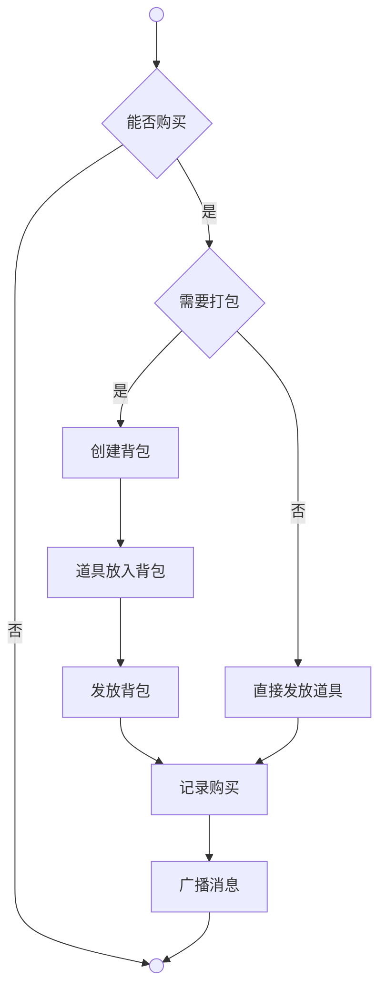

# 商城系统

商城是玩家使用充值币（Gem）购买商品的系统。与NPC商店不同，商城商品由配置表定义，不受游戏内物品流通影响。

**配置表**（`Logic.Config.Mall`）定义商城商品，字段包括：商品ID、道具列表（Dictionary<int,int>）、充值币价格、限购数量（0为不限购）。

**道具列表格式**：符合策划表格式规范，使用`道具名×数量`格式，多个道具用分号`;`分隔。例如：`火锅×1;特效药×1;神召×1`。

**购买记录**（`purchaseRecords`）是用于追踪每个玩家对每个限购商品已购买数量的字典。

**已购买数量**（`GetPurchasedCount`）是通过查询purchaseRecords，得出的玩家对指定商品的已购买数量。

**最大可购买数**（`GetMaxBuyable`）是通过计算玩家充值币可购买数量与剩余限购数量的较小值，得出的玩家当前能购买的最大数量。

**记录购买**（`RecordPurchase`）是用于更新purchaseRecords中玩家对该商品的已购买数量的方法。

## 购买 | Purchase

**能否购买**（`Can`）是通过检查购买数量有效性、最大可购买数限制、充值币余额充足性、能否接收，得出的是否允许购买的判断结果。

**能否接收**（`CanReceive`）是通过检查玩家手里是否为空，得出的是否能接收商品的判断结果。手里有东西时购买失败。

**需要打包**（`NeedPackage`）是通过检查道具种类数量是否大于1，得出的是否需要用背包打包的判断结果。

**创建背包**是用于创建临时背包道具的方法。

**道具放入背包**是用于将商品道具添加到背包内的方法。

**发放背包**（`Exchange.Receive`）详见物易系统，将背包发放到玩家手里。

**直接发放道具**（`Exchange.Receive`）详见物易系统，单种道具时直接发放到玩家手里。

**记录购买**（`RecordPurchase`）详见通用模块。

**广播消息**（`Broadcast.Instance.System`）详见广播系统，播放枚举为MallPurchase的动态多语言文本。
