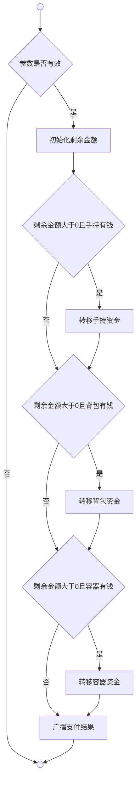

# 商店系统

**支付货币**（Pay）是用于从支付方向接收方转移指定数量货币的方法。

**转移手持资金**（TransferFromHand）是从支付方手持货币中转移尽可能多的资金给接收方，并返回剩余待支付金额的方法。

**转移背包资金**（TransferFromBag）是遍历支付方背包中的所有货币道具，转移尽可能多的资金给接收方，并返回剩余待支付金额的方法。

**转移容器资金**（TransferFromContainers）是双层遍历支付方容器和容器内货币道具，转移尽可能多的资金给接收方，并返回剩余待支付金额的方法。

**获取容器**（GetContainers）是通过检查商人标签和商店地图类型，得出的商店内所有容器物品列表。

**获取商品**（GetGoods）是通过遍历商店容器内的所有物品，得出的商店可售商品列表。

## 支付 | Pay

**参数是否有效**（IsValidPayment）是通过检查支付方、接收方和金额的有效性，得出的是否允许执行支付的判断结果。

**初始化剩余金额**是将请求支付金额赋值给剩余金额变量，用于追踪尚未支付的数量。

**剩余金额大于0且手持有钱**是通过检查剩余金额和手持货币状态，得出的是否需要从手持扣款的判断结果。

**转移手持资金**（TransferFromHand）是从手持货币中转移尽可能多的资金给接收方，并返回剩余待支付金额。

**剩余金额大于0且背包有钱**是通过检查剩余金额和背包货币状态，得出的是否需要从背包扣款的判断结果。

**转移背包资金**（TransferFromBag）是遍历背包中的所有货币道具，转移尽可能多的资金给接收方，并返回剩余待支付金额。

**剩余金额大于0且容器有钱**是通过检查剩余金额和容器货币状态，得出的是否需要从容器扣款的判断结果。

**转移容器资金**（TransferFromContainers）是双层遍历容器和容器内货币道具，转移尽可能多的资金给接收方，并返回剩余待支付金额。

**广播支付结果**（Local）详见广播系统，播放枚举为Pay的动态多语言文本："{sub}支付了{count}给{obj}。"其中count为实际支付金额（原始金额减去剩余金额）。

## 界面 | Interface

**商店界面**（BuildShopRightPanel）提供购买和出售两个操作选项，连接到物易系统的相应功能。
