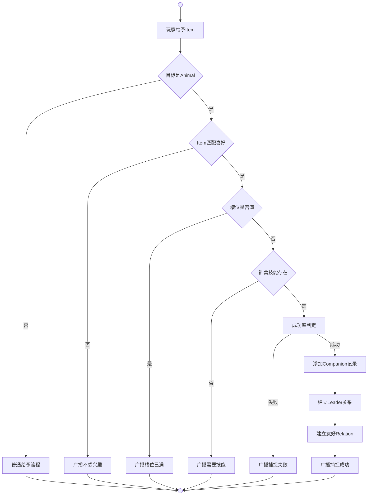

# 宠物系统

玩家可通过捕捉、驯化等方式收服Animal，使其成为同伴，与玩家建立长期关系。

宠物系统的通用模块（Agent.cs）负责系统的初始化与协调，为各模块提供统一的槽位管理、来源标识等基础能力。

**槽位管理** - 玩家可拥有的宠物数量受 `CompanionSlots` 限制（默认1）。宠物信息存储于 `player.Database.companions`，记录包含LifeConfigId、Level、Source、ExpireTime等字段。

**来源标识** - Source字段标识为 `Capture`（捕捉获得）。

**系统交互** - 各模块通过Logic.Pet命名空间访问，模块之间共享槽位限制与数据存储机制。

## 捕捉 | Capture

玩家通过给予Animal喜欢的Item来建立信任关系，成功后将Animal收为同伴。

### Animal喜好配置

| 动物 | 喜好 | 可捕捉物品 |
|------|---------|-----------|
| 鸡 | 稻米、小麦 | 稻米、小麦、饭团、面饼、面包 |
| 兔 | 蔬菜、瓜果 | 蔬菜、瓜果、沙拉、果盒 |
| 羊 | 蔬菜、治疗 | 蔬菜、药草、沙拉 |
| 鹿 | 蔬菜、治疗、瓜果 | 蔬菜、药草、瓜果、沙拉、果盒 |
| 蛇 | 肉 | 生肉、烤肉 |
| 狐狸 | 肉、瓜果 | 生肉、瓜果、烤肉、果盒 |
| 猴子 | 瓜果、稻米、蔬菜 | 瓜果、稻米、蔬菜、果盒、饭团、沙拉、三明治、炒饭、火锅 |
| 野猪 | 瓜果、蔬菜、稻米 | 瓜果、蔬菜、稻米、果盒、沙拉、饭团、炒饭、火锅 |
| 鳄鱼 | 肉 | 生肉、烤肉、三明治、炒饭、肉卷、火锅 |
| 狼 | 肉 | 生肉、烤肉、三明治、炒饭、肉卷、火锅 |
| 大象 | 瓜果、蔬菜、稻米 | 瓜果、蔬菜、稻米、果盒、沙拉、饭团 |
| 熊 | 肉、瓜果 | 生肉、瓜果、烤肉、果盒、三明治、炒饭、肉卷、火锅 |
| 豹 | 肉 | 生肉、烤肉、三明治、炒饭、肉卷、火锅 |
| 虎 | 肉 | 生肉、烤肉、三明治、炒饭、肉卷、火锅 |
| 牛 | 蔬菜、小麦 | 蔬菜、小麦、沙拉、面饼、面包 |
| 马 | 稻米、小麦、瓜果 | 稻米、小麦、瓜果、饭团、面饼、面包、果盒 |
| 蜥蜴 | 肉、治疗 | 生肉、药草、烤肉 |

**匹配逻辑** - 复用生产系统的材料标签体系，Animal使用 `喜好:xxx` 声明喜好，Item通过直接标签（Material类型的"肉"、"稻米"等）或 `料理:xxx`（Food类型）声明材料类型，匹配时提取"喜好:"后的值与Item标签或"料理:"后的值比对。

### 特性

| 特性 | 说明 |
|------|------|
| 触发方式 | 给予Item |
| 目标限制 | Animal类型 |
| 目标状态 | 清醒状态 |
| 成功率因素 | 驯兽技能等级、Animal等级 |
| 持续时间 | 永久 |
| 槽位占用 | CompanionSlots |

### 流程



**玩家给予Item**（Logic.Exchange.Give.Do）是玩家对Animal使用给予操作的触发入口。

**目标是Animal** 是检查目标 `Category == Life.Categories.Animal` 的判断结果。

**Item匹配喜好**（Logic.Pet.Capture.IsFavoriteItem）是通过标签系统检查Item和Animal喜好标签是否匹配的判断结果。

**槽位是否满** 是通过比较 `player.Database.companions.Count(c => c.Source == "Capture")` 与 `player.Database.record["CompanionSlots"]`（默认1）得出的判断结果。

**驯兽技能存在**（Logic.Pet.Capture.GetHuntSkill）是检查玩家是否拥有带Hunt效果的技能的判断结果。

**成功率判定**（Logic.Pet.Capture.CalculateSuccessRate）是通过极限比值函数 `Utils.Mathematics.Ratio(驯兽等级, Animal等级, 1.0)` 计算概率的随机判定。

**添加Companion记录** 是向 `player.Database.companions` 添加新记录的方法，Source字段为"Capture"。

**建立Leader关系** 是设置 `target.Leader = player` 的赋值操作。

**建立友好Relation**（Logic.Relation.Do）是调用关系系统建立双向友好关系的方法。

### 成功率计算

```
成功率 = Ratio(驯兽技能等级, Animal等级, 1.0)
```

### 多语言文本

| 标签 | 用途 |
|------|------|
| CaptureNotInterested | Animal对Item不感兴趣 |
| CompanionSlotFull | 捕捉槽位已满（复用） |
| CaptureNeedSkill | 缺少驯兽技能 |
| CaptureSuccess | 捕捉成功 |
| CaptureFail | 捕捉失败 |

文本示例：
```
CaptureNotInterested: "{obj}对{item}不感兴趣。"
CaptureNeedSkill: "你需要学习驯兽技能才能捕捉{obj}。"
CaptureSuccess: "你成功捕捉了{obj}！"
CaptureFail: "{obj}吃掉了{item}，但没有被驯服。"
```

