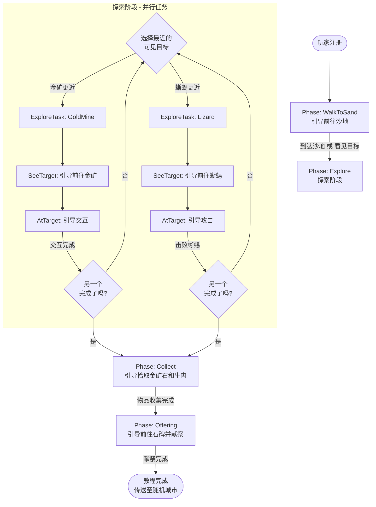

# Tutorial

**Tutorial**（引导系统）负责新玩家教程的状态管理、流程控制和 UI 提示。

系统采用 **Phase**（阶段）+ **ExploreTask**（探索子任务）的结构，支持探索阶段内的并行任务。

---

## Agent

通用模块 `Domain/Tutorial.cs` 提供以下核心能力：

- **状态管理**：跟踪每个玩家的教程阶段和子任务完成情况
- **事件响应**：监听玩家移动、视野变化、交互等事件
- **UI 提示**：通过 `Net.Protocol.Tutorial` 发送引导信息到客户端
- **持久化**：将进度保存到 `Database.Player.record`

### 核心 API

| 方法 | 说明 |
|------|------|
| `Start(Player)` | 开始教程 |
| `Complete(Player)` | 完成教程，传送到随机城市 |
| `GetCurrentPhase(Player)` | 获取当前阶段 |
| `IsInTutorial(Player)` | 是否在教程中 |
| `LoadProgress(Player)` | 从数据库加载进度（用于分析） |

### 事件回调

| 方法 | 触发时机 |
|------|----------|
| `OnInteractGoldMine(Player)` | 玩家与金矿交互 |
| `OnDefeatLizard(Player)` | 玩家击败蜥蜴 |
| `OnPickupItem(Player, Item)` | 玩家拾取物品 |
| `OnGiveToStele(Player, Item, Item)` | 玩家给予石碑物品 |
| `OnPlayerGoTo(Player, Character)` | 玩家点击"前往"按钮 |

---

## Phase

**Phase**（阶段）定义教程的线性进程：

```
WalkToSand → Explore → Collect → Offering → Completed
```

| Phase | 值 | 说明 | 完成条件 |
|-------|-----|------|----------|
| None | 0 | 未开始 | - |
| WalkToSand | 1 | 引导前往沙地 | 到达沙地 或 看见目标 |
| Explore | 2 | 探索阶段（并行） | GoldMine + Lizard 都完成 |
| Collect | 3 | 收集物品 | 背包有金矿石和生肉 |
| Offering | 4 | 献祭阶段 | 给予石碑所需物品 |
| Completed | 100 | 教程完成 | - |

---

## ExploreTask

**ExploreTask**（探索子任务）定义 **Explore** 阶段内的并行任务：

```csharp
[Flags]
public enum ExploreTask
{
    None = 0,
    GoldMine = 1 << 0,   // 采集金矿
    Lizard = 1 << 1,     // 击败蜥蜴
    All = GoldMine | Lizard
}
```

玩家可按任意顺序完成这两个任务。系统通过 `SelectNearestExploreTarget` 选择引导目标：

1. 只看到一个 → 引导该目标
2. 同时看到两个 → 优先引导在同一地图的目标
3. 都在同一地图 → 默认金矿（对新手更安全）
4. 完成一个后 → 自动引导另一个

---

## ExploreAction

**ExploreAction**（探索动作）定义每个子任务的交互阶段：

| ExploreAction | 值 | 说明 | UI 引导 |
|---------------|-----|------|---------|
| None | 0 | 无 | - |
| SeeTarget | 1 | 看到目标，不在同一地图 | 高亮目标 + "前往"按钮 |
| AtTarget | 2 | 到达目标所在地图 | 高亮"交互"或"攻击"按钮 |

---

## 流程图



---

## 持久化

教程进度存储在 `Database.Player.record` 中：

| Key | 类型 | 说明 |
|-----|------|------|
| `TutorialPhase` | int | 当前阶段（Phase 枚举值） |
| `TutorialExplore` | int | 已完成的探索任务（ExploreTask bitmask） |

### 断线处理

玩家断线后重新登录，**不恢复教程**，直接进入正常游戏世界。

理由：
- 教程时间短，断线概率低
- 能进行到一半的玩家已具备基本操作能力
- 恢复逻辑复杂度高，收益低

教程进度数据保留用于数据分析（流失节点、完成率等）。

---

## Legacy API

为保持向后兼容，保留了 `Step` 枚举和 `GetCurrentStep` 方法：

```csharp
public enum Step
{
    None = 0,
    WalkToSand = 1,
    SeeGoldMine = 2,
    InteractGoldMine = 3,
    SeeLizard = 4,
    AttackLizard = 5,
    PickupItems = 6,
    SeeStele = 7,
    WalkToTower = 8,
    GiveToStele = 9,
    Completed = 100
}
```

`GetCurrentStep` 会将新的 Phase + ExploreTask 映射为对应的 Step 值。
