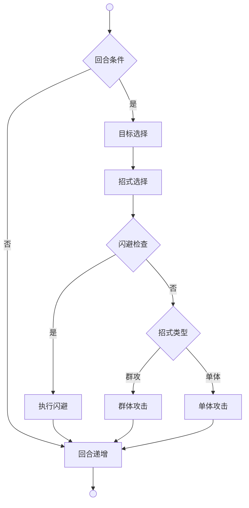
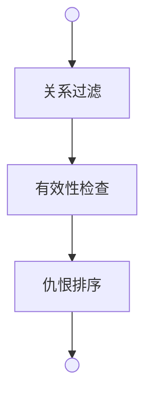
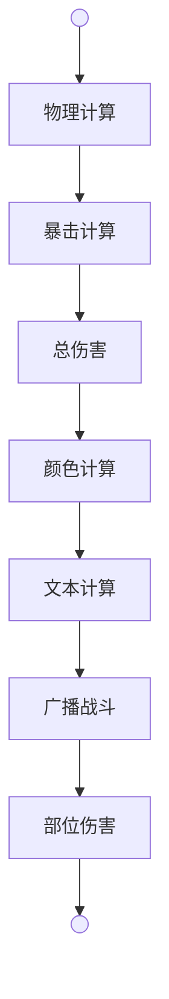

# 战斗系统

角色积累行动值，达到阈值触发回合，执行完整战斗业务。

**回合模块** 即执行战斗回合的业务模块。

**目标模块** 即选择攻击目标和瞄准部位的业务模块。

**战斗时长目标**：10秒/敌人，确保在日均2小时游戏时间内平衡战斗、生产、社交等玩法。详见《商业化》1.3节。

---

## 回合 | Round



**回合条件**（Round.Can）是检查角色是否满足执行回合的条件（未昏迷、有敌对目标、有可用招式）。

**目标选择**（Target.Get）是从场景中获取所有敌对目标，按仇恨值排序。

**招式选择**（SelectMovement）是根据角色技能和招式条件选择可用招式的方法。

**闪避检查**（CheckDodge）是检查防御者是否触发闪避的判断（当前未实现）。

**执行闪避**（ExecuteDodge）是执行闪避动作的方法（当前未实现）。

**招式类型** 是判断招式是否包含Cleave（群攻）效果的条件。

**群体攻击**（ExecuteAttack with Cleave）是对多个目标执行攻击的方法。

**单体攻击**（ExecuteAttack）是对单个目标执行攻击的方法。

**回合递增**（life.Round++）是将生物的回合数加一的操作。

## 目标 | Target



**关系过滤** 是筛选出与角色关系值为负的生物（敌对关系）。

**有效性检查** 是检查目标是否有效（未昏迷、在同一地图）。

**仇恨排序** 是按关系值从低到高排序，关系值越低优先级越高。

### 瞄准 | Aim

**瞄准**（Target.Aim）是根据招式目标配置选择攻击部位的方法：
- 优先选择有血量的匹配部位
- 如无有血量部位，选择任意匹配部位
- 如无匹配部位，返回null

### 回合类型

**完整回合**（Round.Do）：
- 执行完整的战斗回合流程
- 包含目标选择、招式选择、闪避检查、攻击执行
- 自动递增回合数

**直接攻击**（Round.DoAttack）：
- 用于特殊场景（如肢解无意识猎物）
- 跳过目标选择，直接对指定目标攻击
- 不递增回合数

### 攻击模式

**单体攻击**：
- 对单个目标造成伤害
- 适用于大部分招式

**群体攻击**（Cleave）：
- 对多个目标造成伤害
- 适用于刀法（横斩、旋风斩）

**多段连击**（MultiHit）：
- 连续打击模式
- 支持不同目标模式和伤害修正
- 适用于剑术

### 多段连击系统

**目标模式**：
- **SingleTarget**：所有段数攻击同一目标
- **RandomTarget**：每段随机选择目标

**段数规则**：
- **固定段数**：`MultiHit:N`，例如 `MultiHit:3` 表示固定3段
- **随机段数**：`MultiHit:Min~Max`，例如 `MultiHit:3~6` 表示3到6段随机
- **等级公式**：`MultiHit:Level/10`，段数随技能等级动态计算（向下取整）

**伤害修正**：
- **None**：无修正，每段100%伤害
- **Decay**：递减修正，每段伤害衰减，公式 `伤害 × 系数^击数`
- **Ratio**：固定比例，每段伤害为基础伤害的固定比例
- **Total**：总伤控制，所有段数的总伤害等于基础伤害的倍数

**配置格式**：
```
MultiHit:[段数]:[目标模式]:[伤害修正类型]:[修正值]
```

**示例**：
- `MultiHit:2:SingleTarget:Ratio:0.6` → 2段，同一目标，每段60%伤害
- `MultiHit:3~6:SingleTarget:Total:1.5` → 3~6段随机，同一目标，总伤150%
- `MultiHit:Level/10:SingleTarget:Decay:0.85` → 段数=技能等级/10，同一目标，每段85%衰减

### Cleave群体攻击系统

**目标数量规则**：
- **固定数量**：`Cleave:N`，例如 `Cleave:2` 表示攻击2个目标
- **随机数量**：`Cleave:Min~Max`，例如 `Cleave:3~6` 表示攻击3到6个目标
- **等级公式**：`Cleave:Level/10`，目标数随技能等级动态计算

**伤害修正**：
- **None**：无修正，每个目标100%伤害
- **Ratio**：固定比例，每个目标受到固定比例的伤害
- **Total**：总伤控制，所有目标的总伤害等于基础伤害的倍数

**配置格式**：
```
Cleave:[目标数]:[伤害修正类型]:[修正值]
```

**示例**：
- `Cleave:2:Ratio:0.6` → 2个目标，每个60%伤害
- `Cleave:3~6:Total:1.5` → 3~6个目标，总伤150%
- `Cleave:Level/10:Ratio:0.4` → 目标数=技能等级/10，每个40%伤害

## 施展 | Cast



施展系统负责招式的实际执行，包括伤害计算、效果应用、广播表演等。详见**施展系统**文档。

---

## 战斗修正

### 暴击系统

- `CriticalIncrease` 暴击增幅
- `CriticalFix` 暴击固定值

### 判定系统

- `BuffDetermineIncrease` Buff判定增幅
- `BuffDetermineFix` Buff判定固定值

### 伤害系统

- `DamageIncrease` 伤害增幅
- `DamageFix` 伤害固定值

### 消耗系统

- `CostIncrease` 消耗增幅
- `CostFix` 消耗固定值

---

## 战斗数据

- `Action` 行动值（读条进度）
- `Round` 回合数
- `BattleKillCount` 战斗击杀数
- `CompeteInitialHp` 竞技初始气血
- `CompeteInitialMp` 竞技初始内力

---

## 生存机制

### 断肢机制

**断肢** 即部位Hp≤-MaxHp时从生物身上移除。

**触发条件** 即部位Hp≤-MaxHp

**负值缓冲** 即部位Hp可为负值，提供抢救时间

**关键部位** 即头部Hp≤0时昏迷，Hp≤-MaxHp时断肢

**治疗方式** 即正常Hp恢复，包括负值

### 昏迷判定

**昏迷判定公式**：

$$
\text{Head.Hp} \leq 0 \text{ OR } \text{Chest.Hp} \leq 0 \rightarrow \text{States.Unconscious}
$$

头部或胸部Hp≤0时立即触发昏迷状态。
