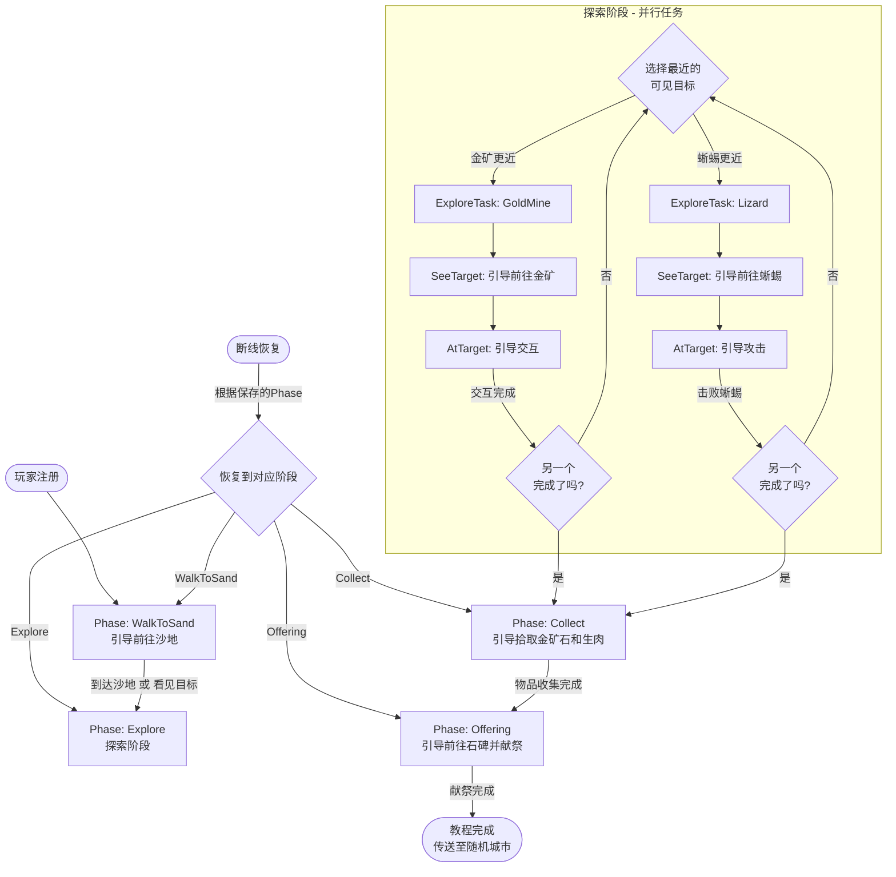

# 教程系统（Tutorial）

**Tutorial**（教程系统）负责新玩家教程的状态管理、流程控制和 UI 引导。

系统采用 **Phase**（阶段）+ **ExploreTask**（探索子任务）的结构，支持探索阶段内的并行任务。

核心设计理念：**零强制暂停、零遮罩、零弹窗**——玩家在"需要"的时刻自然学会操作，走出区域后无缝进入大世界。

| 术语 | 英文 | 层级 | 含义 |
|------|------|------|------|
| 教程 | Tutorial | 系统 | 完整的新手引导流程，有开始和结束 |
| 引导 | Guidance | 动作 | 具体的提示行为，如引导前往、引导点击 |

---

## Tutorial（教程）

模块文件：`Domain/Tutorial.cs`

**Tutorial** 模块是教程系统的唯一模块，提供完整的新手引导功能。

核心职责：

- **状态管理**：跟踪每个玩家的 **Phase** 和 **ExploreTask** 完成情况
- **事件响应**：监听玩家移动、视野变化、交互等事件
- **UI 提示**：通过 `Net.Protocol.Tutorial` 发送 **Guidance** 信息到客户端
- **持久化**：将进度保存到 `Database.Player.record`

核心 API：

| 方法 | 说明 |
|------|------|
| `Start(Player)` | 开始教程 |
| `Complete(Player)` | 完成教程，传送到随机城市 |
| `GetCurrentPhase(Player)` | 获取当前阶段 |
| `IsInTutorial(Player)` | 是否在教程中 |
| `LoadProgress(Player)` | 从数据库加载进度（用于分析） |

事件回调：

| 方法 | 触发时机 |
|------|----------|
| `OnInteractGoldMine(Player)` | 玩家与金矿交互 |
| `OnDefeatLizard(Player)` | 玩家击败蜥蜴 |
| `OnPickupItem(Player, Item)` | 玩家拾取物品 |
| `OnGiveToStele(Player, Item, Item)` | 玩家给予石碑物品 |
| `OnPlayerGoTo(Player, Character)` | 玩家点击"前往"按钮 |

### 阶段（Phase）

**Phase**（阶段）定义教程的线性进程：

```
WalkToSand → Explore → Collect → Offering → Completed
```

| Phase | 值 | 说明 | 完成条件 |
|-------|-----|------|----------|
| None | 0 | 未开始 | - |
| WalkToSand | 1 | 引导前往沙地 | 到达沙地 或 看见目标 |
| Explore | 2 | 探索阶段（并行） | GoldMine + Lizard 都完成 |
| Collect | 3 | 收集物品 | 背包有金矿石和生肉 |
| Offering | 4 | 献祭阶段 | 给予石碑所需物品 |
| Completed | 100 | 教程完成 | - |

#### 探索子任务（ExploreTask）

**ExploreTask**（探索子任务）定义 **Explore** 阶段内的并行任务：

```csharp
[Flags]
public enum ExploreTask
{
    None = 0,
    GoldMine = 1 << 0,   // Interact with gold mine
    Lizard = 1 << 1,     // Defeat lizard
    All = GoldMine | Lizard
}
```

玩家可按任意顺序完成这两个任务。系统通过 `SelectNearestExploreTarget` 选择引导目标：

1. 只看到一个 → 引导该目标
2. 同时看到两个 → 优先引导在同一地图的目标
3. 都在同一地图 → 默认金矿（对新手更安全）
4. 完成一个后 → 自动引导另一个

#### 探索动作（ExploreAction）

**ExploreAction**（探索动作）定义每个子任务的交互阶段：

| ExploreAction | 值 | 说明 | UI 引导 |
|---------------|-----|------|---------|
| None | 0 | 无 | - |
| SeeTarget | 1 | 看到目标，不在同一地图 | 高亮目标 + "前往"按钮 |
| AtTarget | 2 | 到达目标所在地图 | 高亮"交互"或"攻击"按钮 |

#### 流程图（Flowchart）



#### 持久化（Persistence）

教程进度存储在 `Database.Player.record` 中：

| Key | 类型 | 说明 |
|-----|------|------|
| `TutorialPhase` | int | 当前阶段（**Phase** 枚举值） |
| `TutorialExplore` | int | 已完成的探索任务（**ExploreTask** bitmask） |

玩家断线后重新登录，**恢复教程进度**：

1. **检测进度**：Login 时检查 `TutorialPhase`，若未完成则触发恢复
2. **重建副本**：创建新的教程副本
3. **定位玩家**：根据保存的坐标，在副本中找到对应地图并放入玩家
4. **恢复引导**：根据 **Phase** 和 **ExploreCompleted** 发送对应的 **Guidance**

设计理由：
- 教程副本提供隔离环境，避免新手被其他玩家干扰
- 保存的坐标与副本地图坐标一致，可直接用于定位
- 统一入口：`Tutorial.Instance.Start()` 同时处理新玩家和断线恢复

#### 遗留兼容（Legacy）

为保持向后兼容，保留了 `Step` 枚举和 `GetCurrentStep` 方法：

```csharp
public enum Step
{
    None = 0,
    WalkToSand = 1,
    SeeGoldMine = 2,
    InteractGoldMine = 3,
    SeeLizard = 4,
    AttackLizard = 5,
    PickupItems = 6,
    SeeStele = 7,
    WalkToTower = 8,
    GiveToStele = 9,
    Completed = 100
}
```

`GetCurrentStep` 会将新的 **Phase** + **ExploreTask** 映射为对应的 Step 值。

### 引导（Guidance）

**Guidance**（引导）分为两种类型：**ImplicitGuidance**（隐性引导）和 **ExplicitGuidance**（显性引导）。

#### 隐性引导（ImplicitGuidance）

**ImplicitGuidance**（隐性引导）通过空间和情境设计，让玩家自然发现操作方式，无需任何提示。

设计方式：
- **唯一路径**：只有一个方向可走，玩家自然移动
- **障碍驱动**：必须解决障碍才能前进
- **资源诱导**：看到物品，自然拾取
- **视觉引导**：目标物明显、醒目

#### 显性引导（ExplicitGuidance）

**ExplicitGuidance**（显性引导）通过视觉提示，主动告知玩家信息或引导玩家注意。第一次触发后不再重复。

表现形式：
- **文本提示**：机制说明文字，玩家第一次遇到某机制时出现
- **视觉聚焦**：按钮光圈、元素高亮，引导玩家注意特定UI

#### 可见性（Visibility）

由于视野系统的存在，玩家可能在不同地图格子上就能在 Characters 面板看到目标角色。当玩家首次"看见"一个重要目标时，应触发以下 **ExplicitGuidance**：

1. **高亮目标角色**：在 Characters 面板中高亮该目标
2. **引导前往操作**：高亮"前往"按钮，引导玩家点击
3. **到达后引导交互**：玩家到达目标所在地图后，引导具体操作

#### 引导内容（Content）

需要引导的内容清单：

| 层次 | 内容 | 引导方式 | 触发条件 | 设计说明 |
|------|------|----------|----------|----------|
| 操作 | 移动 | Implicit | - | 唯一路径：起点只有2格，出口在另一端 |
| 操作 | 前往 | Explicit | 首次看见目标角色 | 视觉聚焦：高亮 characters 面板中的目标，然后高亮"前往"按钮 |
| 操作 | 交互 | Explicit | 到达目标位置 | 视觉聚焦：高亮操作按钮（如攻击） |
| 操作 | 战斗 | Implicit | - | 障碍驱动：敌人在路径上，需要击败才能继续 |
| 操作 | 拾取 | Explicit | 击败敌人后 | 视觉聚焦：高亮掉落物品和拾取按钮 |
| 操作 | 进食 | Implicit | - | 资源诱导：获得食物时Lp刚好较低，屏幕有视觉提示 |
| 操作 | 装备 | Explicit | 首次获得装备 | 文本提示：提示穿戴 |
| 操作 | 背包 | Explicit | 首次获得物品 | 文本提示：提示查看背包 |
| 系统 | Lp机制 | Explicit | Lp < 50%（首次） | 文本提示：解释Lp是饥饿值 |
| 系统 | Lp危险 | Explicit | Lp < 30%（首次） | 文本提示：警告即将死亡 |
| 系统 | 死亡 | Explicit | 首次死亡 | 文本提示：解释死亡原因和复活机制 |
| 系统 | 升级 | Explicit | 首次升级 | 文本提示：解释经验和等级机制 |
| 系统 | 商店 | Explicit | 首次访问商店 | 文本提示：介绍商店功能 |
| 系统 | 背包满 | Explicit | 背包容量 >= 80% | 文本提示：提示清理或出售 |

### 新手区域（Area）

**Area**（新手区域）位于某个城市场景的角落，通过地形形成封闭结构：

- **单出口**：区域只有一个出口通向城市主区域
- **线性路径**：内部地图排列成单向通道，玩家只能沿唯一方向前进
- **无缝衔接**：走出新手区即进入城市，无加载、无过场
- **可回访**：完成教程后随时可以回来，但没有额外奖励

新玩家出生在新手区最深处，沿路完成教程内容后自然走入城市。

### 转化（Conversion）

**Conversion**（转化）在玩家理解核心玩法后，适时展示付费价值，促进首充和订阅转化。

| 触发条件 | 内容 | 说明 |
|----------|------|------|
| 达到5级 或 游玩2小时 | 首充优惠 | 展示首充礼包 |
| 达到10级 或 游玩8小时 | 月卡价值 | 介绍月卡权益（行为树等） |
| 月卡激活 | 行为树引导 | 引导使用付费功能 |
