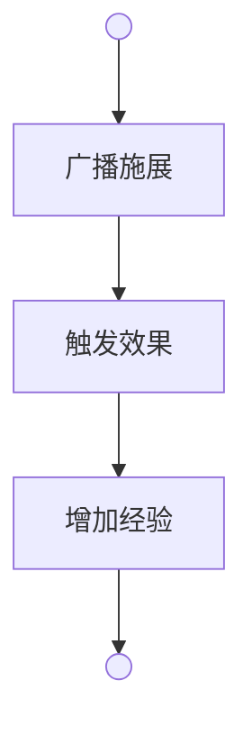
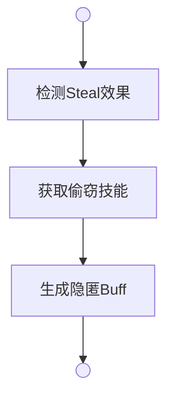
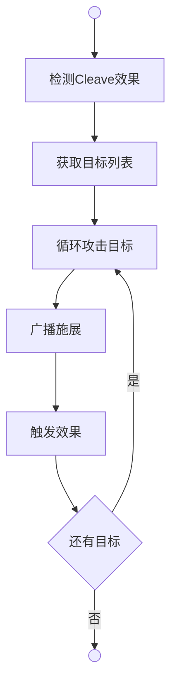
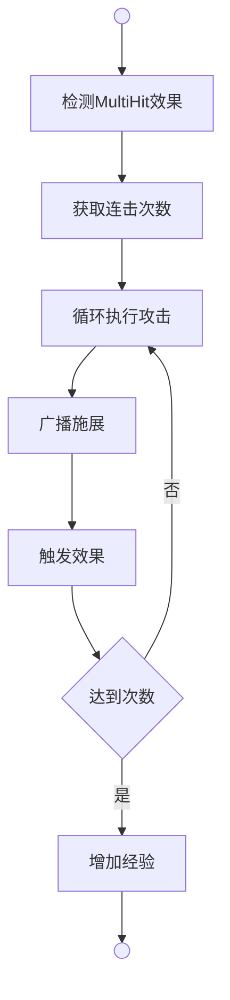

# 施展系统

角色施展技能下的招式，触发对应效果。

## 招式字段

**cd**（double）是招式冷却时间（秒）。配置为0时无冷却限制。招式施展后进入冷却，冷却期间无法被选中施展。

## 招式效果分类

**战斗效果**：
- **基础伤害**：锐伤（Incise）、钝伤（Contuse），对目标造成伤害
- **防御效果**：闪避（Dodge）、格挡（Block），抵挡攻击
- **群体攻击**：横扫（Cleave），单次攻击命中多个敌人
- **多段连击**：连击（MultiHit），单次攻击对同一敌人连续打击

**生产效果**：烹饪、制药、炼金、锻造、缝纫，施展招式触发生产系统制作。

**特殊效果**：偷窃、魅惑、狩猎，施展招式触发特殊系统判定。

## 施展流程



**广播施展**（Broadcast.Battle）详见广播系统，播放招式描述文本。

**触发效果**（handlers）是根据招式效果类型调用对应处理器的分发方法。

**增加经验**（Gain）是根据目标等级和招式所属技能增加技能经验的方法。

## 偷窃 | Steal



**检测Steal效果**是判断招式是否包含Steal效果的验证方法。

**获取偷窃技能**是从角色技能列表中按等级降序获取偷窃技能的方法。

**生成隐匿Buff**（Cast.Steal.Do）是根据Steal效果自动创建隐匿Buff实例的方法，效果值等于技能等级，持续时间等于技能等级秒。

### 隐匿机制

**Buff生成**：施展带Steal效果的招式，生成隐匿Buff。

**效果值**：等于技能等级。

**持续时间**：等于技能等级（秒）。

**叠加效果**：多次施展生成多个buff实例，隐匿系数累加。

**示例**：
```
10级偷窃技能：
1. 施展"隐匿" → 隐匿Buff(效果值=10, 持续10秒)
2. 再施展"隐匿" → 新增隐匿Buff(效果值=10, 持续10秒)
3. 隐匿系数 = 10 + 10 = 20
4. 10秒后第一个buff消失，隐匿系数降为10
```

## 群体攻击 | Cleave



**检测Cleave效果** 是判断招式是否包含Cleave效果的验证方法。

**获取目标列表**（Attack.Targets）是从场景中获取所有敌对角色的方法，最多取3个目标。

**循环攻击目标** 是遍历目标列表，对每个目标执行攻击的循环方法。

**广播施展**（Broadcast.Battle）是播放招式描述文本的方法。

**触发效果** 是调用对应伤害效果处理器的方法。

### 群攻机制

**目标数量**：最多命中3个敌对目标。

**目标选择**：按仇恨值排序，优先攻击仇恨最高的敌人。

**伤害计算**：每个目标独立计算伤害，不分摊。

**适用技能**：刀法（横斩、旋风斩）。

**示例**：
```
场景中有5个敌人：
1. 施展"横斩" → 对仇恨最高的3个敌人造成伤害
2. 每个敌人独立触发伤害计算
3. 每次攻击独立广播战斗文本
```

## 多段连击 | MultiHit



**检测MultiHit效果** 是判断招式是否包含MultiHit效果的验证方法。

**获取连击次数**（movement.HitCount）是从招式配置中读取连击次数的属性。

**循环执行攻击** 是根据连击次数重复执行攻击的循环方法。

**广播施展**（Broadcast.Battle）是播放招式描述文本的方法。

**触发效果** 是调用对应伤害效果处理器的方法。

**增加经验** 是根据目标等级增加技能经验的方法。

### 连击机制

**配置格式**：
```
MultiHit:[段数]:[目标模式]:[伤害修正类型]:[修正值]
```

**段数规则**：
- **固定段数**：`N`，例如 `3` 表示固定3段
- **随机段数**：`Min~Max`，例如 `3~6` 表示3到6段随机

**目标模式**（可选，默认SingleTarget）：
- **SingleTarget**：所有段数攻击同一目标
- **RandomTarget**：每段随机选择场景内的敌对目标

**伤害修正**（可选，默认None）：
- **None**：无修正，每段100%伤害
- **Decay**：递减修正，每段伤害按系数衰减（公式：`伤害 × 系数^击数`）
- **Ratio**：固定比例，每段伤害为基础伤害的固定比例
- **Total**：总伤控制，所有段数的总伤害等于基础伤害×倍数，平均分配到各段

**适用技能**：剑术

**配置示例**：
```
二连斩：effects = "Incise,MultiHit:2:SingleTarget:Ratio:0.4"
三连斩：effects = "Incise,MultiHit:3:SingleTarget:Decay:0.8"
乱舞斩：effects = "Incise,MultiHit:3~6:RandomTarget:Ratio:0.5"
```

**实战示例**：
```
1. 二连斩（MultiHit:2:SingleTarget:Ratio:0.4）
   - 对同一目标连续攻击2次
   - 每次造成基础伤害的40%

2. 三连斩（MultiHit:3:SingleTarget:Decay:0.8）
   - 对同一目标连续攻击3次
   - 第1击：100%伤害
   - 第2击：80%伤害（100% × 0.8^1）
   - 第3击：64%伤害（100% × 0.8^2）

3. 乱舞斩（MultiHit:3~6:RandomTarget:Ratio:0.5）
   - 随机攻击3到6次
   - 每次随机选择场景内的敌人
   - 每次造成基础伤害的50%
```
