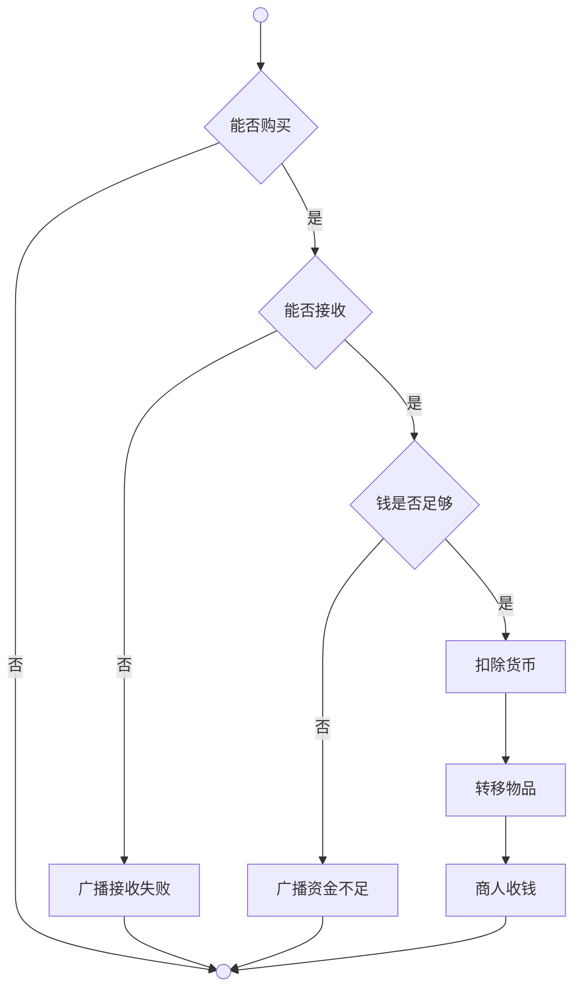
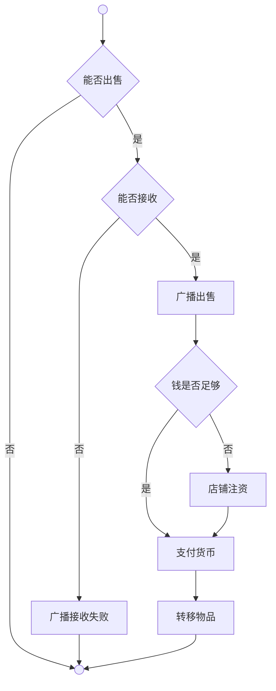
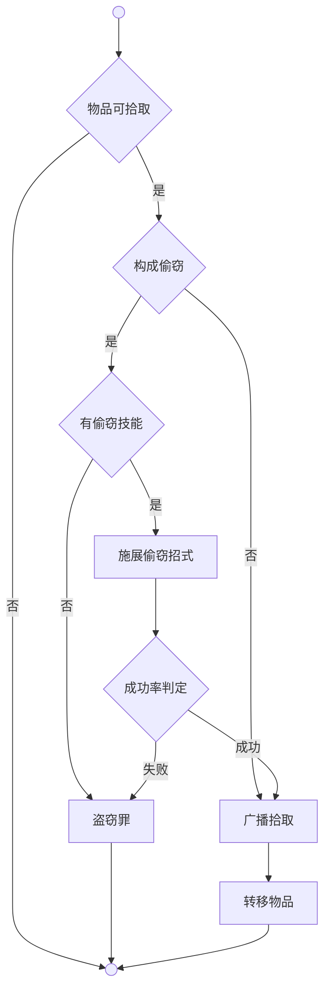

# 物易系统


**能否接收**（CanReceive）是通过检查接收方容器空间和物品兼容性，得出的是否能够接收物品的判断结果。

**转移物品**（Receive）是用于将物品从给予方转移到接收方容器中的方法。


## 购买 | Buy



**能否购买**（Can）是通过检查买方存在性、卖方商人标签、物品有效性、数量合理性和物品库存充足性，得出的是否允许购买的判断结果。

**能否接收**（CanReceive）详见通用模块。

**广播接收失败**（Local）详见广播系统，播放枚举为ReceiveFail的动态多语言文本："{sub}已经无法再拿下{item}了。"。

**钱是否足够**（HasEnoughMoney）是通过计算物品价格、检查买方货币余额，得出的是否具备支付能力的判断结果。

**广播资金不足**（Local）详见广播系统，播放枚举为ReceiveFail的动态多语言文本："{sub}已经无法再拿下{item}了。"。

**扣除货币**（DeductMoney）是用于从买方账户中减少相应购买金额的方法。

**转移物品**（Receive）详见通用模块。

**商人收钱**（GiveMoney）是用于向商人转移购买货币的方法。

## 出售 | Sell



**能否出售**（Can）是通过检查卖方存在性、买方商人标签、物品有效性、数量合理性和物品归属性，得出的是否允许出售的判断结果。

**能否接收**（CanReceive）详见通用模块。

**广播接收失败**（Local）详见广播系统，播放枚举为ReceiveFail的动态多语言文本："{sub}已经无法再拿下{item}了。"。

**广播出售**（Local）详见广播系统，播放枚举为Sell的动态多语言文本："{sub}拿出{item}卖给{obj}。"。

**钱是否足够**（HasEnoughMoney）是通过计算物品价格、检查接收方货币余额，得出的是否具备支付能力的判断结果。

**店铺注资**（Fund）是通过向店铺地图注入货币，确保店铺有足够资金完成交易的方法。

**支付货币**（Pay）详见商店系统。

**转移物品**（Receive）详见通用模块。


## 拾取 | Pick



**物品可拾取**（Exchange.Pick.Can）是通过检查物品配置的重量值是否大于等于0，得出的物品是否可被拾取的判断结果。

**构成偷窃**（Justice.Theft.Judgment）详见司法系统，通过检查物品在地图上、地图非公共区域、地图所属场景非拾取者出生场景，得出的是否构成盗窃行为的判断结果。

**有偷窃技能**（Cast.Steal.IsSkill）是通过检查角色是否拥有带Steal效果的技能，得出的是否具备偷窃能力的判断结果。

**施展偷窃招式**（Cast.Agent.Do）详见施展系统，随机选择偷窃招式施展，生成隐匿Buff。

**成功率判定**（Cast.Steal.Probability）是通过光线系数、隐匿系数、物品总价值计算偷窃成功概率的判定方法。

**盗窃罪**（Justice.Theft.Sentence）详见司法系统，用于判定目击者、扣除关系、判刑入狱的方法。

**广播拾取**（Broadcast.Instance.Local）详见广播系统，播放枚举为Pick的动态多语言文本。

**转移物品**（Exchange.Receive.Do）详见通用模块。

### 成功率机制

```
成功率 = 光线系数 × Ratio(隐匿系数, 物品总价值)
```

**光线系数**（Cast.Steal.LightFactor）是基于时间段影响偷窃成功率的环境修正值：
- 中午（12-18点）：0（完全不可能）
- 夜晚（22-5点）：2（最佳时机）
- 其他时段：1（正常）

**隐匿系数**（Buff.Agent.GetConcealmentValue）是所有隐匿Buff效果值的总和，详见Buff系统。

**物品总价值**是物品单价乘以偷窃数量的计算值。

**极限比值函数**（Utils.Mathematics.Ratio）是 `x/(x+f)` 形式的概率归一化函数。

## 丢弃 | Drop

### 丢弃范围

- 手持物品
- 已装备物品
- 背包物品
- 背包容器本身

### 丢弃规则

- 物品出现在当前地图
- 保持物品属性和数量
- 可被其他角色拾取
- 广播丢弃信息

## 装备 | Equip

### 装备规则

- 万物皆可武器：无装备部位限制的物品默认装备到手部
- 部位匹配：物品装备到对应身体部位
- 唯一装备：每个部位只能装备一个物品
- 自动卸下：装备新物品时自动卸下旧物品

### 装备流程

1. 检查装备条件
2. 卸下原有装备(如有)
3. 将物品装备到对应部位
4. 更新角色属性
5. 广播装备信息

## 给予 | Give

### 给予条件

- 给予者拥有目标物品
- 接收者在相同地图
- 接收者容器有足够空间(给予角色时)
- 物品数量充足

### 给予类型

| 接收目标 | 处理方式 | 限制条件 |
|---------|---------|---------|
| 其他角色 | 转移到对方背包 | 容器空间检查 |
| 容器物品 | 转移到容器内 | 容器容量检查 |
| 地面 | 等同于丢弃 | 无限制 |

### 给予流程

1. 选择给予物品和数量
2. 选择接收目标
3. 检查接收条件
4. 转移物品
5. 广播给予信息

## 超载 | Overload

**物品放入** 即Item添加Item。

**物品移除** 即Item移除Item。


### 破损机制

超载后容器有概率破掉，破掉时所有物品静默散落到地图，**容器本身被销毁**。

**概率公式：** `破损概率 = (超载率 - 1)² / 0.25`


```text
概率(%)
100 |                    ●
    |                 ···
 64 |              ●
    |           ···
 36 |        ●
    |     ···
 16 |   ●
    | ··
  4 |●
    |
  0 +----+----+----+----+----
   100% 110% 120% 130% 140% 150%
        超载程度
```
