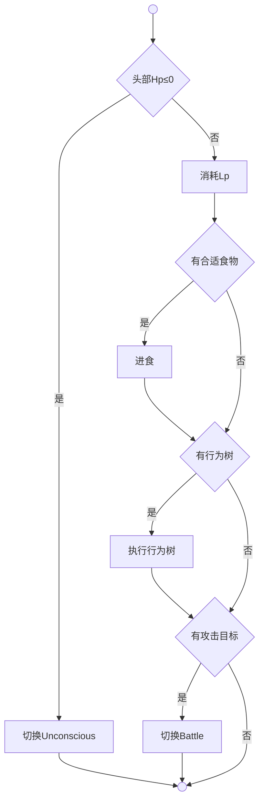
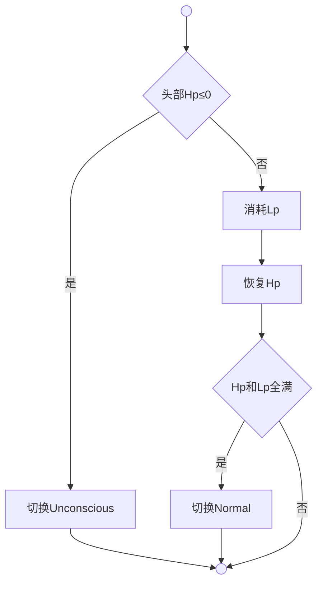
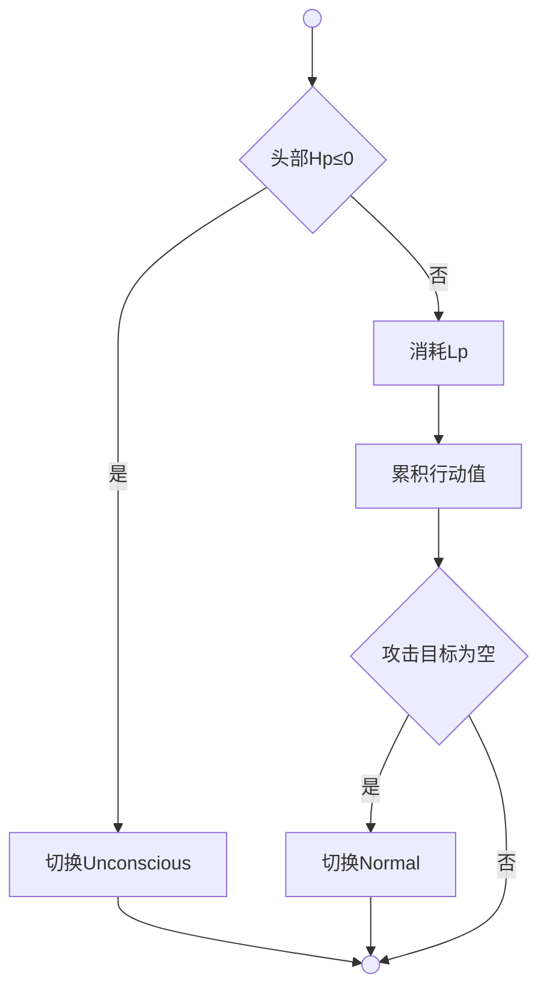
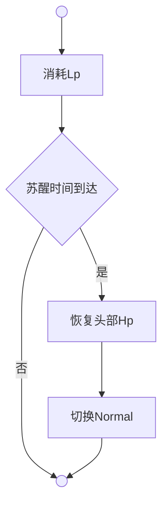

# 状态机系统

每个生物拥有独立的状态机实例，时间系统作为调度器，将所有生物按当前状态分类到Battle、Normal、Default三个列表，定时批量调用各生物的状态更新方法。

**通用参数**：

| 参数 | 数值 | 说明 |
|------|------|------|
| Lp消耗速度 | 0.0139点/秒 | 所有状态统一，满Lp(100)耗尽需7200秒(120分钟) |
| 饥饿伤害 | max(1, 100 - 体质/10) | Lp耗尽后每次刷新造成的伤害 |
| Hp恢复 | 仅Rest状态 | 只有休息状态恢复Hp，其他状态不恢复 |
| 昏迷触发 | 头部Hp ≤ 0 | 任意状态检测到后立即切换Unconscious |

**伤势系统**：

| 参数 | 数值 | 说明 |
|------|------|------|
| 伤势范围 | 0-10 | Life属性，最小0，最大10 |
| 昏迷增加 | +1 | 每次进入昏迷时伤势+1 |
| 自然恢复 | -1/游戏日 | 每个游戏日伤势-1（每日更新时处理） |
| 苏醒时间 | 伤势² 游戏小时 | 伤势1=10秒，伤势5=4分10秒，伤势10=16分40秒 |

**状态总览**：

| 状态 | 刷新频率 | Hp恢复 | 特有逻辑 |
|------|----------|--------|----------|
| Rest | 1000ms | MaxHp/70 点/秒 | 唯一恢复Hp的状态 |
| Normal | 300ms | ❌ | 行为树、自动进食 |
| Battle | 100ms | ❌ | 行动值累积 |
| Unconscious | 1000ms | ❌ | 伤势²游戏小时后苏醒 |

**通用方法**：

**DrainLp**（`Agent.DrainLp`）是用于消耗生物Lp的通用方法。所有状态统一调用，每次刷新消耗`LpDrainPerSecond × 刷新间隔`点Lp。当Lp耗尽时，调用DamageFromHunger造成饥饿伤害。

**DamageFromHunger**（`Agent.DamageFromHunger`）是用于Lp耗尽后对生物造成饥饿伤害的方法。伤害值为`max(1, 100 - 体质/10)`，随机选择一个未失去的部位造成伤害。

**StartBehaviorTree**（`Agent.StartBehaviorTree`）是用于启动生物行为树的方法。在Normal状态OnEnter时调用，执行间隔基于敏捷属性动态计算。

**StopBehaviorTree**（`Agent.StopBehaviorTree`）是用于停止生物行为树的方法。在Normal状态OnExit时调用，取消行为树的定时任务。

## 普通状态 | Normal

**设计目标**：日常活动，不恢复Hp

### 特有参数

| 参数 | 数值 | 说明 |
|------|------|------|
| 刷新频率 | 300ms | 时间系统每300ms调用一次Update |

### 特有逻辑

**自动进食**（`HasSuitableFood + Use.Agent.Do`）：检查背包有无合适食物（价值≤Lp缺失值），有则自动使用。

**行为树**（`Agent.StartBehaviorTree/StopBehaviorTree`）：OnEnter时启动，OnExit时停止，执行间隔基于敏捷动态计算。

**战斗检查**（`Logic.Battle.Target.Get`）：检查攻击目标列表，非空则切换Battle。

### 进入条件

**生物创建**：`Logic.State.Agent.OnAddLife` 初始化时默认进入。

**战斗结束**：`Battle.Update` 攻击目标清空时自动切换。

**恢复完毕**：`Rest.Update` 所有部位Hp满且Lp满时切换。

**苏醒**：`Unconscious.Update` 满足苏醒条件时切换。

### 退出条件

**战斗目标出现**：`Normal.Update` 检测到攻击目标列表非空。

**头部重创**：`Normal.Update` 头部Hp≤0强制切换Unconscious。

## 休息状态 | Rest

**设计目标**：一个晚上（游戏7小时，真实70秒）回满全部Hp

### 特有参数

| 参数 | 数值 | 说明 |
|------|------|------|
| 刷新频率 | 1000ms | 时间系统每1秒调用一次Update |
| Hp恢复速度 | MaxHp/70 点/秒 | 70秒回满设计（一个晚上） |

### 特有逻辑

**自动退出**：检查所有部位Hp全满且Lp全满，满足则切换Normal。

### 进入条件

**玩家操作**：玩家点击休息按钮，通过`Operation.Execute.Rest`主动进入。

### 退出条件

**恢复完毕**：所有部位Hp全满且Lp全满时自动退出。

**头部重创**：头部Hp≤0强制切换Unconscious。

**玩家取消**：玩家主动停止休息（待实现）。

## 战斗状态 | Battle

**设计目标**：战斗中不恢复Hp

### 特有参数

| 参数 | 数值 | 说明 |
|------|------|------|
| 刷新频率 | 100ms | 时间系统每100ms调用一次Update |
| 行动值累积 | ln(Agi) | 每次刷新累积，决定出招顺序 |

### 特有逻辑

**累积行动值**：每次刷新`Action += ln(Agi)`，决定出招顺序。

**退出检查**（`ShouldExitBattle`）：检查攻击目标列表，为空则切换Normal。

### 进入条件

**战斗目标出现**：`Normal.Update` 检测到攻击目标列表非空时切换。

### 退出条件

**战斗目标清空**：`Battle.Update` 攻击目标列表为空时自动退出。

**头部重创**：`Battle.Update` 头部Hp≤0强制切换Unconscious。

### 设计说明

**不恢复Hp**：战斗中不恢复Hp，彻底避免"无敌回血"问题。

**不执行行为树**：战斗状态下不执行AI行为树，由战斗系统接管。

## 昏迷状态 | Unconscious

**设计目标**：濒死保命，确定时间后苏醒

### 特有参数

| 参数 | 数值 | 说明 |
|------|------|------|
| 刷新频率 | 1000ms | 时间系统每1秒调用一次Update |
| 苏醒时间 | 伤势² 游戏小时 | 伤势越重，昏迷越久（真实秒=伤势²×10） |

### 伤势系统

| 参数 | 数值 | 说明 |
|------|------|------|
| 范围 | 0-10 | 最小0，最大10 |
| 昏迷增加 | +1 | 每次进入昏迷时伤势+1 |
| 自然恢复 | -1/游戏日 | 每个游戏日伤势-1 |
| 苏醒时间公式 | 伤势² 游戏小时 | 换算为真实秒：伤势² × 10 |

| 伤势 | 游戏时间 | 真实时间 |
|------|----------|----------|
| 1 | 1小时 | 10秒 |
| 2 | 4小时 | 40秒 |
| 3 | 9小时 | 1分30秒 |
| 5 | 25小时 | 4分10秒 |
| 10 | 100小时 | 16分40秒 |

### 特有逻辑

**进入昏迷**（OnEnter）：
1. 伤势+1（上限10）
2. 计算苏醒时间 = 伤势²
3. 记录苏醒目标时间 = 当前时间 + 苏醒时间

**苏醒判定**（Update）：
- 条件：当前时间 ≥ 苏醒目标时间
- 结果：头部Hp恢复至1，切换Normal

**恢复头部Hp**（OnExit）：苏醒时将头部Hp恢复至1，确保不会立即再次触发昏迷。

**状态文本显示**：在Description.Life中，当状态为Unconscious时，显示剩余苏醒时间。使用多语言模板`Text.Labels.UnconsciousWithTime`，格式如`{state}（{time}）`。

### 进入条件

**头部重创**：任意状态Update中检测到头部Hp≤0时切换。

### 退出条件

**时间到达**：苏醒目标时间到达后自动苏醒。

### 设计说明

**无法行动**：昏迷状态下不执行行为树，不能进行任何主动行为。

**广播通知**：进入昏迷时广播"昏倒"，退出时广播"苏醒"。

**战斗经验**：进入昏迷时，所有敌对的Life获得战斗经验。

**不再恢复Hp**：昏迷状态不恢复Hp，只有Rest状态恢复Hp。

