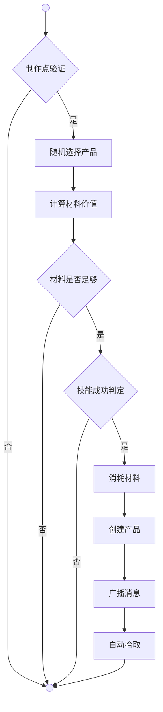

# 生产系统

基于标签驱动的通用生产框架，包含**制造**和**采集**两大核心。

## 采集 | Gather

采集是指从资源点（Item）获取材料，资源点产出材料的方式有**生成**、**掉落**和**转化**三种方式。

### 生成 | Generate

**资源点标识**：包含`生成:材料ID列表`标签的Item

**触发方式**：每个游戏日（4分钟真实时间）由`Logic.Time.Daily.Resource()`自动刷新

**生成规则**：
1. 遍历全世界所有包含`生成`标签的Item
2. 解析标签获取可生成的材料ID列表
3. 使用加权随机选择材料：`权重 = 1000/(材料价值 + 50)`，低价值材料生成概率更高
4. 容量限制：资源点容器内现有材料总价值 + 新材料价值 ≤ 资源点价值
5. 每个资源点每天最多生成1个材料
6. 相同材料自动叠加Count，不同材料分别存储

**采集方式**：NPC通过`IsCrop(Item)`判断资源点（HasPrefix("Generate") && 有内容物），从资源点容器中拾取材料

**标签格式**：
```
生成:材料CID1,材料CID2,材料CID3
```

### 破坏 | Drop

**资源点标识**：包含`掉落:材料CID:概率%×数量`标签的Item

**触发方式**：玩家或NPC对资源点使用攻击招式，造成伤害导致耐久度归零

**掉落流程**：
1. `Cast.Helper.ApplyDamageToItem`处理Item受到伤害
2. 检测Item的`掉落`标签
3. 解析掉落配置：`掉落:材料CID:概率%×最小数量~最大数量`
4. 按概率判定是否掉落
5. 随机数量范围内的掉落数量
6. 在地图上创建材料Item
7. 资源点Item被销毁，容器内容物掉落到地图

**采集方式**：
1. NPC通过`IsOre(Item)`判断资源点（HasPrefix("Drop")）
2. 移动到资源点所在地图
3. 使用有伤害的Movement攻击资源点
4. 资源点掉落材料后被销毁
5. NPC通过`IsOreStone(Item)`判断材料（Type==Material && 含坚硬/导电/神性）
6. 拾取地图上的材料

**标签格式**：
```
掉落:材料CID:概率%×最小数量~最大数量
```

### 狩猎 | Dismember

**资源点标识**：Life（生物）包含`断肢:材料CID:概率%×数量`标签

**触发方式**：Life死亡后进入断肢流程

**掉落流程**：
1. Life死亡触发断肢
2. 检测Life的`断肢`标签
3. 解析掉落配置格式同掉落标签
4. 按概率判定每个标签的掉落
5. 在死亡位置创建材料Item

**采集方式**：NPC通过狩猎行为树寻找和攻击动物Life

**标签格式**：
```
断肢:材料CID:概率%×最小数量~最大数量
```

**配置示例**：
```csv
羊,断肢:生肉:100%×1~3;兽皮:60%×1;羊绒:40%×1
鹿,断肢:生肉:80%×2~3;兽皮:70%×1~2;羊绒:50%×1
熊,断肢:生肉:85%×2~4;兽皮:75%×2~3
```

---


## 制造 | Craft
制造是指利用材料制作产品。
基于`制作:模块名`标签的制作系统，统一处理料理、祈祷、制药、缝纫、锻造五大制作模块。



**制作点验证**（IsPoint）是判断目标Item是否包含`制作:模块名`标签得出的可用性判断。

**随机选择产品**（SelectProduct）是从该模块的所有产品中随机选择一个候选产品。

**计算材料价值**（CalcMaterial）是统计制作点容器内所有材料的标签价值总和，每个标签的价值等于材料价值×数量通过Utils.Mathematics.DescendingWeight分配得出的权重。

**材料是否足够**（CheckMaterial）是将计算出的可用标签价值与产品需求标签价值逐一对比，所有需求标签的价值都满足时返回真。

**技能成功判定**（CheckSkill）是通过Utils.Mathematics.Ratio(技能等级, 产品价值)计算成功率，再通过Utils.Mathematics.Probability判定是否成功。

**消耗材料**（Consume）是遍历制作点容器内的材料，按照标签匹配规则智能消耗材料Count，优先消耗能提供所需标签的材料。

**创建产品**（Create）是在制作点容器内创建1个产品Item实例。

**广播消息**（Broadcast）是向当前地图的所有玩家广播制作成功的多语言文本。

**自动拾取**（Pickup）是调用Exchange.Pick.Do让制作者拾取产品。

### 料理 | Cook

模块名为`料理`，制作点标签为`制作:料理`。

| 产品 | 价值 | 需求标签 |
|------|------|----------|
| 沙拉 | 10 | 料理:蔬菜 |
| 果盒 | 20 | 料理:瓜果 |
| 面饼 | 30 | 料理:小麦 |
| 饭团 | 40 | 料理:稻米 |
| 面包 | 50 | 料理:小麦 |
| 烤肉 | 60 | 料理:肉 |
| 三明治 | 70 | 料理:小麦,料理:肉,料理:蔬菜 |
| 炒饭 | 80 | 料理:稻米,料理:肉,料理:蔬菜 |
| 肉卷 | 90 | 料理:小麦,料理:肉,料理:蔬菜 |
| 火锅 | 100 | 料理:稻米,料理:肉,料理:蔬菜,料理:瓜果 |

| 材料 | 价值 | 提供标签 | 资源点 | 地图 | 场景 |
|------|------|----------|----------|------|------|
| 稻米 | 3 | 稻米 | 稻穗 | 稻田 | 埃纳达平原、提兰湿地、古湖盆地 |
| 小麦 | 3 | 小麦 | 麦穗 | 麦田 | 埃纳达平原、古湖盆地 |
| 生肉 | 2 | 肉 |  |  |  |
| 瓜果 | 4 | 瓜果 | 瓜藤 | 瓜地 | 埃纳达平原、卡拉姆沙漠 |
| 蔬菜 | 4 | 蔬菜 | 菜垄 | 菜地 | 埃纳达平原、阿什卡尔山脉、卡玛尔高原 |

### 祈祷 | Brew

模块名为`祈祷`，制作点标签为`制作:祈祷`。

| 产品 | 价值 | 需求标签 |
|------|------|----------|
| 基础铭文碎片 | 10 | 祈祷:神性 |
| 标准铭文碎片 | 20 | 祈祷:神性 |
| 高级铭文碎片 | 30 | 祈祷:神性 |
| 基础铭文 | 40 | 祈祷:神性 |
| 标准铭文 | 50 | 祈祷:神性 |
| 高级铭文 | 60 | 祈祷:神性 |
| 基础圣召 | 70 | 祈祷:神性 |
| 标准圣召 | 80 | 祈祷:神性 |
| 高级圣召 | 90 | 祈祷:神性 |
| 神召 | 100 | 祈祷:神性 |

| 材料 | 价值 | 提供标签 | 资源点 | 地图 | 场景 |
|------|------|----------|----------|------|------|
| 金矿石 | 10 | 神性 | 金矿 | 洞穴 | 阿什卡尔山脉、神锤火山、深渊海岸、黑渊裂谷 | 

### 制药 | Alchemy

模块名为`制药`，制作点标签为`制作:制药`。

| 产品 | 价值 | 需求标签 |
|------|------|----------|
| 基础药粉 | 10 | 制药:治疗 |
| 标准药粉 | 20 | 制药:治疗 |
| 高级药粉 | 30 | 制药:治疗 |
| 基础药膏 | 40 | 制药:液体,制药:治疗 |
| 标准药膏 | 50 | 制药:液体,制药:治疗 |
| 高级药膏 | 60 | 制药:液体,制药:治疗 |
| 基础药剂 | 70 | 制药:液体,制药:治疗 |
| 标准药剂 | 80 | 制药:液体,制药:治疗 |
| 高级药剂 | 90 | 制药:液体,制药:治疗 |
| 特效药 | 100 | 制药:液体,制药:治疗 |

| 材料 | 价值 | 提供标签 | 资源点 | 地图 | 场景 |
|------|------|----------|----------|------|------|
| 清水 | 1 | 液体 | 泉、井 | 埃利都-水源、杜尔甘-水源、夏尔库拉-水源、阿鲁沙-水源 | 城市 |
| 药草 | 8 | 治疗 | 草丛 | 草地 | 埃纳达平原、星湖丘陵、银月群岛、阿什卡尔山脉、卡拉姆沙漠、卡玛尔高原、古湖盆地、提兰湿地、黑渊裂谷 |  

### 缝纫 | Sew

模块名为`缝纫`，制作点标签为`制作:缝纫`。

| 产品 | 价值 | 需求标签 |
|------|------|----------|
| 布鞋 | 20 | 缝纫:薄 |
| 头巾 | 25 | 缝纫:薄 |
| 皮帽 | 25 | 缝纫:柔软 |
| 布衣 | 30 | 缝纫:粗糙 |
| 皮衣 | 30 | 缝纫:柔软 |
| 布裤 | 30 | 缝纫:粗糙 |
| 皮裤 | 30 | 缝纫:柔软 |
| 腰带 | 35 | 缝纫:粗糙 |
| 皮带 | 35 | 缝纫:韧 |
| 斗篷 | 55 | 缝纫:厚 |
| 背包 | 60 | 缝纫:韧,缝纫:粗糙 |

| 材料 | 价值 | 提供标签 | 资源点 | 地图 | 场景 |
|------|------|----------|----------|------|------|
| 兽皮 | 8 | 柔软 | 狐狸、狼、熊、豹、虎、鹿、野猪、猴子 |  |  |
| 皮革 | 6 | 韧 | 牛、马、大象、蛇、鳄鱼、蜥蜴 |  |  |
| 苎麻 | 4 | 粗糙 | 草丛 | 草地 | 星湖丘陵、银月群岛、阿什卡尔山脉、卡拉姆沙漠、卡玛尔高原、古湖盆地、提兰湿地 |
| 棉花 | 5 | 薄 | 灌木丛 | 草地 | 星湖丘陵、卡拉姆沙漠、古湖盆地、提兰湿地 |
| 羊绒 | 10 | 厚 | 羊 |  |  |

### 锻造 | Smith

模块名为`锻造`，制作点标签为`制作:锻造`。

| 产品 | 价值 | 需求标签 |
|------|------|----------|
| 匕首 | 50 | 锻造:坚硬 |
| 头盔 | 65 | 锻造:坚硬 |
| 铁靴 | 70 | 锻造:坚硬 |
| 钢棍 | 75 | 锻造:坚硬 |
| 大刀 | 80 | 锻造:坚硬 |
| 长剑 | 90 | 锻造:坚硬 |
| 铠甲 | 100 | 锻造:坚硬 |

| 材料 | 价值 | 提供标签 | 资源点 | 地图 | 场景 |
|------|------|----------|----------|------|------|
| 铁矿石 | 5 | 坚硬 | 铁矿 | 洞穴 | 阿什卡尔山脉、神锤火山 |
| 银矿石 | 8 | 导电 | 银矿 | 洞穴 | 阿什卡尔山脉、神锤火山 |

---

## 生活技能等级

- `Gather` 采集技能等级
- `Hunt` 狩猎技能等级
- `Cook` 料理技能等级
- `Sew` 缝纫技能等级
- `Forge` 锻造技能等级
- `Alchemy` 制药技能等级
- `Brew` 祈祷技能等级

---

