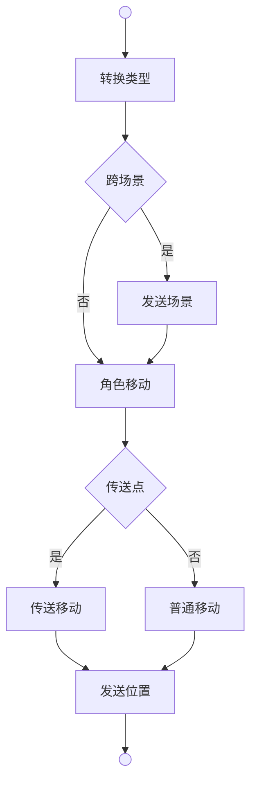
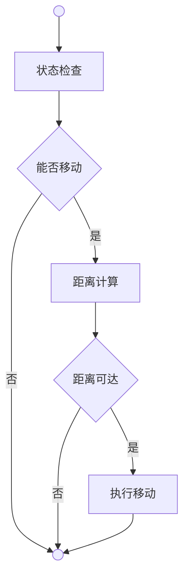
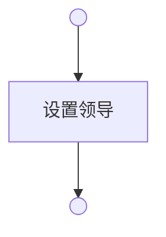

# 移动系统

移动系统负责角色在地图间的位置变更，包括玩家移动、生物行走和跟随机制。系统由三个核心模块构成：**通用移动**（Agent）处理基础移动逻辑，**行走模块**（Walk）处理受限移动，**跟随模块**（Follow）处理角色间的跟随关系。

## 通用移动 | Agent

**转换类型**（Character）是将Player转换为Character的类型适配。

**跨场景**（Scene）是检查玩家当前地图场景与目标地图场景是否不同的判断。

**发送场景**（Scene）是向玩家发送场景切换协议的网络同步。

**角色移动**（Do）是调用角色版本移动方法的委托执行。

**传送点**（Teleport）是检查目标地图是否具有传送属性的条件判断。

**传送移动**（GetMapByPos）是获取传送目标位置地图并将角色加入的特殊移动。

**普通移动**（AddAsParent）是将角色直接加入目标地图的常规移动。

**发送位置**（Pos）是向玩家发送新位置和可移动区域的位置同步。

## 行走 | Walk

**状态检查**（Can）是检查生物是否处于昏迷状态的移动前提判断。

**能否移动**（Unconscious）是判断生物当前状态是否允许移动的条件。

**距离计算**（Distance）是计算当前位置到目标位置实际距离的测量。

**距离可达**（Reachable）是判断目标距离是否在生物步数范围内的可达性检查。

**执行移动**（Do）是调用通用移动模块执行实际移动的委托。

## 跟随 | Follow

**设置领导**（Leader）是将跟随者的领导字段指向目标生物的关系建立。

---

## 视野数值

### 视野范围公式

视野范围（ViewScale）决定玩家能看到的地图格子范围。

$$
\text{ViewScale} = \text{BaseViewScale} + \text{Bonus}
$$

- \( \text{BaseViewScale} = 3 \)（固定常量）
- \( \text{Bonus} \) 为装备加成

### 装备加成

手持望远镜时，视野 +5：

| 装备标签 | 效果 |
|----------|------|
| `ViewBonus:5` | 视野 +5 |

### 数值表

| 状态 | ViewScale | 说明 |
|------|-----------|------|
| 无装备 | 3 | 基础视野 |
| 持望远镜 | 8 | 基础 + 望远镜加成 |

### 与移动倍率的关系

| 属性 | 用途 | 决定因素 |
|------|------|----------|
| **ViewScale** | 可见区域（格子高亮） | 固定常量 + 装备 |
| **WalkScale** | 单次移动范围 | 敏捷属性 |

- 视野范围内的格子会高亮显示
- 只有距离 ≤ WalkScale 的格子才能直接移动
- 超出 WalkScale 但在 ViewScale 内的格子，点击后触发自动寻路
