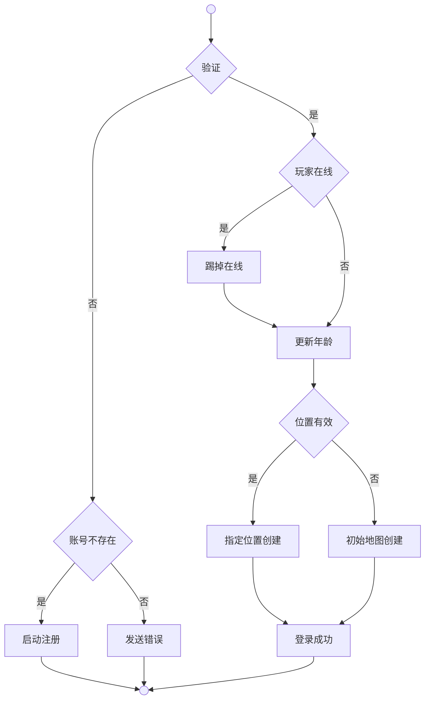
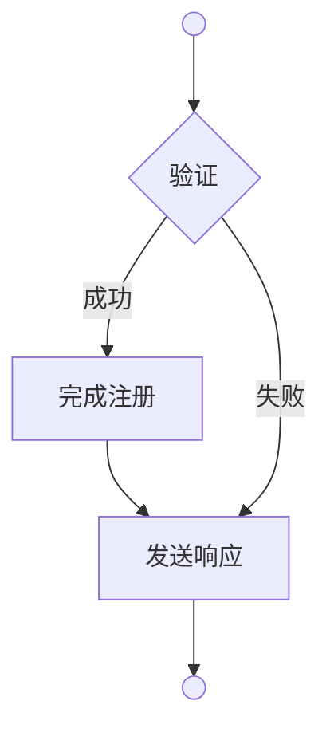

# 认证系统

**用户认证**是游戏服务器管理用户身份验证、账号注册、设备绑定的核心系统。

## 登录 | Login

### 登录流程

### 名词解释

**验证**（Can）是综合验证版本兼容性、账号存在性和密码正确性并返回错误码的方法。

**账号不存在**（AccountNotFound）是判断错误码是否为账号不存在的方法。

**发送错误**（Send）是根据错误码发送相应登录失败响应的方法。

**玩家在线**（IsPlayerOnline）是判断账号是否已在游戏中登录的方法。

**踢掉在线**（KickExistingPlayer）是强制下线已登录账号的方法。

**更新年龄**（UpdatePlayerAge）是根据离线时间计算并更新角色年龄的方法。

**位置有效**（IsValidPlayerPosition）是验证角色上次位置是否仍然有效的方法。

**指定位置创建**（CreatePlayerAtPosition）是在角色上次位置创建玩家实例的方法。

**初始地图创建**（CreatePlayerAtInitialMap）是在默认初始地图创建玩家实例的方法。

**登录成功**（Success）是执行登录成功后续处理并发送成功响应的方法。

**完成登录**（CompleteLogin）是执行登录后续处理的方法，包含设备绑定和发送Home协议。

**发送版本错误**（SendVersionError）是返回版本不兼容错误的方法。

**发送密码错误**（SendPasswordError）是返回密码错误响应的方法。

**启动注册**（Register.Satart）是详见注册系统的方法。

## 注册 | Register

### 确认流程

### 名词解释

**验证**（Can）是综合验证名字格式、安全性、重复性和客户端数据存在性并返回错误码的方法。

**完成注册**（CompleteRegistration）是执行角色创建完整流程的方法，包含更新名字、设置时间、保存数据、创建角色、分配血量、填满属性，并完成登录后续处理。

**发送响应**（Send）是根据错误码发送相应注册结果响应的方法。

## 设备管理 | Device

**设备绑定**（Bind）是将设备标识与用户账号关联的方法。

**设备验证**（ProcessRegister）是处理HTTP设备注册请求的方法。

## 通用模块

**服务状态**（DetermineServerStatus）是根据CPU、内存、连接数评估服务器负载的方法。

**清理资源**（CleanupResources）是释放性能计数器等系统资源的方法。