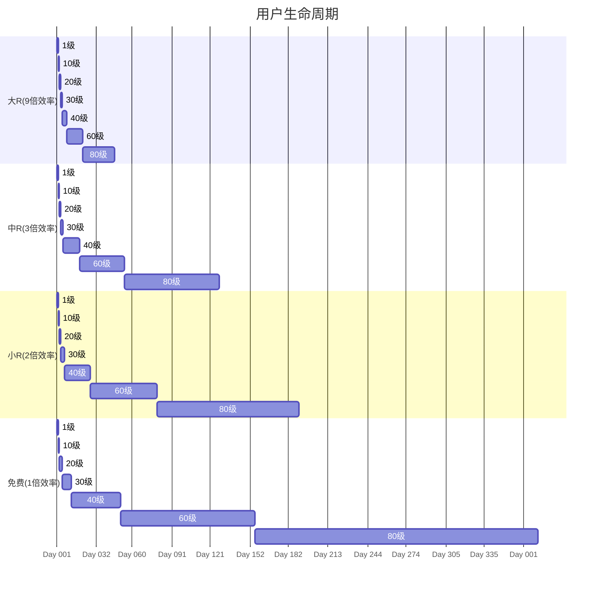
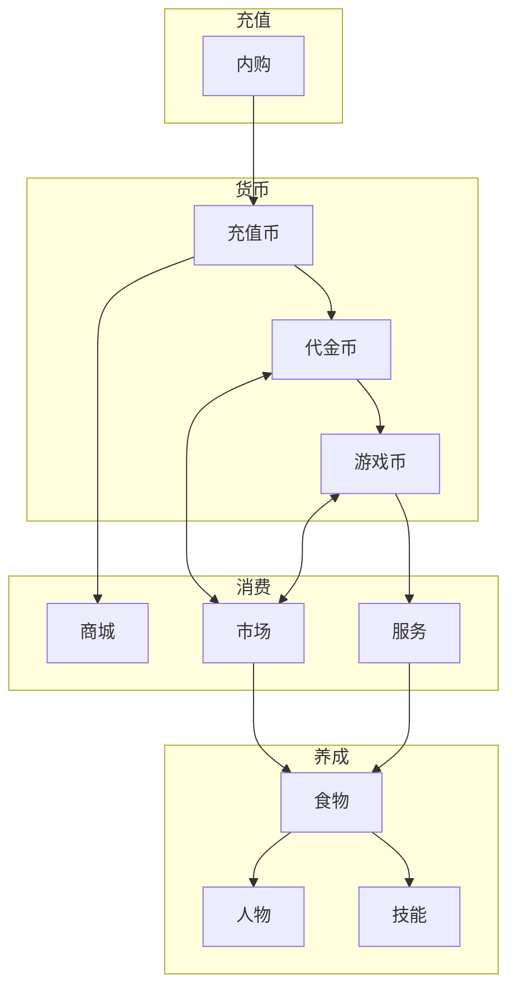
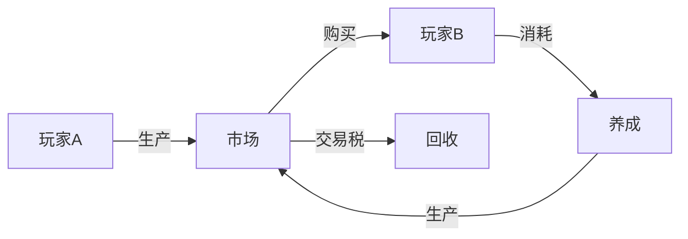
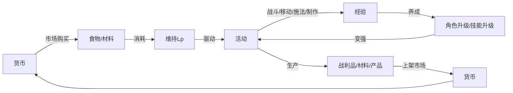
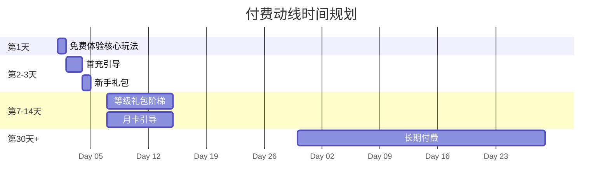
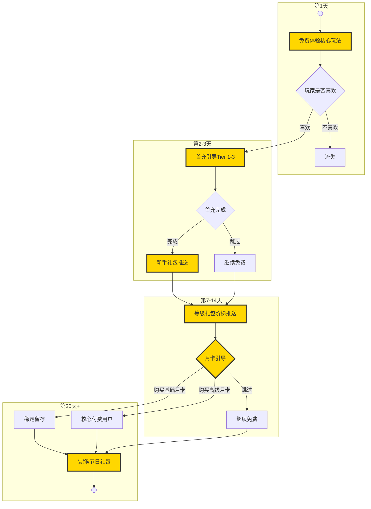

# 商业方案书

本游戏采用F2P（Free to Play）+ 月卡 + 商城的商业模式，定位为长线养成型文字MMORPG。设计坚持P2C（Pay to Convenience）而非P2W（Pay to Win）原则：免费玩家能完整体验核心玩法，付费玩家获得便利性与扩展性，以锦上添花而非雪中送炭的方式实现商业化，杜绝强制付费、碾压优势与玩法封锁。

## 1. 目标

### 1.1 运营指标

本项目为独立开发，核心目标是**月收入≥¥20,000（实际到手）**，即：**Monthly Revenue** = **MAU** × **Payment Rate** × **ARPPU** = 500 × 30% × ¥200 = ¥30,000（扣除渠道分成后约¥21,000）


<table>
<thead>
<tr>
<th>类别</th>
<th>指标</th>
<th>说明</th>
<th>目标值</th>
<th>优化方向</th>
</tr>
</thead>
<tbody>
<tr style="background-color: #ffe6e6;">
<td rowspan="3"><strong>付费</strong></td>
<td>Payment Rate</td>
<td>付费率，付费用户占MAU比例</td>
<td>≥30%</td>
<td>持续挂机价值感知、肝帝理性转化</td>
</tr>
<tr style="background-color: #ffe6e6;">
<td>ARPPU</td>
<td>付费用户月均消费（Average Revenue Per Paying User）</td>
<td>≥¥200</td>
<td>倍率道具习惯养成、大R消费提升</td>
</tr>
<tr style="background-color: #fff4e6;">
<td>First Purchase Rate</td>
<td>首充率，首周内完成首次充值的玩家占比</td>
<td>≥15%</td>
<td>首充引导优化、低门槛礼包</td>
</tr>
<tr style="background-color: #ffe6e6;">
<td rowspan="2"><strong>活跃</strong></td>
<td>MAU</td>
<td>月活跃用户数（Monthly Active Users）</td>
<td>≥500</td>
<td>口碑传播、社区运营</td>
</tr>
<tr style="background-color: #e8f5e9;">
<td>Daily Playtime</td>
<td>日均在线时长</td>
<td>上线后观察</td>
<td>判断内容消耗速度</td>
</tr>
<tr style="background-color: #fff4e6;">
<td rowspan="3"><strong>留存</strong></td>
<td>D7 Retention</td>
<td>7日留存，新用户第7天回来的比例</td>
<td>≥30%</td>
<td>新手引导优化、核心循环验证</td>
</tr>
<tr style="background-color: #fff4e6;">
<td>D30 Retention</td>
<td>30日留存，新用户第30天回来的比例</td>
<td>≥15%</td>
<td>长线养成吸引力、社交粘性</td>
</tr>
<tr style="background-color: #e8f5e9;">
<td>Churn Rate</td>
<td>流失率，各阶段玩家流失比例</td>
<td>上线后观察</td>
<td>定位流失节点</td>
</tr>
<tr style="background-color: #e8f5e9;">
<td><strong>新增</strong></td>
<td>-</td>
<td>独立开发者无推广预算，新增取决于口碑与运气</td>
<td>不设目标</td>
<td>专注产品质量，自然增长</td>
</tr>
</tbody>
</table>


---

### 1.2 用户画像

**用户分层**

| 层级 |  需求 | 月消费 | 付费内容 |
|---------|---------|--------|----------|
| 免费玩家 |  完整体验 | ¥0 | 无 |
| 小R玩家 |  省时省力 | ¥30 | [基础月卡](#231-商城) |
| 中R玩家 | 快速成长 | ¥98 | [高级月卡](#231-商城) |
| 大R玩家 |  极致体验 | ¥128+ | [基础+高级月卡](#231-商城)、[经验倍率](#231-商城) |



### 1.3 付费深度

付费深度指大R玩家全程使用经验倍率达成养成目标的理论最大付费额，按极限效率计算：倍率次数 = Ceiling(100) ÷ Duration，付费深度 = 倍率次数 × 至尊包单价（¥0.013/次）。

| 养成目标 | 极限效率 | Ceiling(100) | 倍率次数 | 付费深度 |
|---------|:-------:|-------------:|---------:|---------:|
| 人物满级（100级） | ×9 | 3,600,000秒 | 360,000 | ¥4,680 |
| 单技能满级（100级） | ×9 | 3,600,000秒 | 360,000 | ¥4,680 |
| 单宠物满级（100级） | ×90 | 360,000秒 | 36,000 | ¥468 |
| 全套传说装备 | - | - | - | 待定 |

*注：宠物极限效率 = 人物极限效率(9) × 驯兽技能加成(10) = 90，养成速度是人物的10倍。装备通过迷宫自动寻路道具加速附魔材料获取，付费深度待迷宫系统参数确定后计算。*

---

## 2. 经济循环



### 2.1 充值

#### 2.1.1 内购

玩家通过IAP（In-App Purchase）购买充值币（Gem），这是唯一的真钱入口。

**档位**

| Tier | Gem | CNY | USD | JPY |
|------|-----|-----|-----|-----|
| 1 | 6 | ¥6 | $0.99 | ¥160 |
| 3 | 18 | ¥12 | $1.99 | ¥320 |
| 5 | 30 | ¥30 | $4.99 | ¥800 |
| 10 | 68 | ¥68 | $9.99 | ¥1600 |
| 20 | 128 | ¥98 | $14.99 | ¥2400 |
| 50 | 328 | ¥328 | $49.99 | ¥7900 |
| 60 | 648 | ¥648 | $99.99 | ¥15800 |
| 87 | 1298 | ¥1298 | $199.99 | ¥31600 |

*注：Tier为Apple/Google统一的Price Tier档位。各地区价格由平台自动换算，表中价格为参考值。*

**档位收益率**：高档位提供约5%~10%的额外充值币奖励，激励大额充值。

**配置**

每个充值商品对应唯一SKU，由Apple/Google Price Tier自动换算当地货币价格，无需手动配置汇率。

SKU命名规范

| 格式 | 示例 | 说明 |
|------|------|------|
| `com.{bundle}.gem.t{tier}` | com.loa.gem.t4 | 充值币档位 |
| `com.{bundle}.monthly.basic` | com.loa.monthly.basic | 基础月卡 |
| `com.{bundle}.monthly.premium` | com.loa.monthly.premium | 高级月卡 |
| `com.{bundle}.bp.s{season}` | com.loa.bp.s01 | 战令 |
| `com.{bundle}.pack.{name}` | com.loa.pack.newbie | 礼包 |
| `com.{bundle}.deco.{type}` | com.loa.deco.title | 装饰道具 |

### 2.2 货币

游戏内存在三种货币，形成完整的流转体系：

- **充值币（Gem）**：通过IAP充值获得，用于商城购买，不可交易；
- **代金币（Credit）**：通过充值币兑换或玩家交易获得，用于玩家市场，可交易；
- **游戏币（Gold）**：通过游戏产出获得，用于NPC服务，可交易；

#### 2.2.1 兑换

**充值币 → 代金币**

玩家可将充值币兑换为代金币，用于玩家市场交易。

| 参数 | 数值 | 说明 |
|------|-----|------|
| 兑换比例 | 1:100 | 1充值币 = 100代金币（固定比例） |
| 每日上限 | 200 | 单玩家每日最多兑换200充值币，防止单日大额兑换冲击市场 |

**代金币 → 游戏币**

玩家可将代金币兑换为游戏币，用于NPC服务和玩家市场交易。

| 参数 | 数值 | 说明 |
|------|-----|------|
| 兑换比例 | 1:10 | 1代金币 = 10游戏币（固定比例） |
| 每日上限 | 2000 | 单玩家每日最多兑换2000代金币，防止过度冲击经济 |


**设计原则**：货币只能单向从付费货币流向游戏货币，确保游戏货币无法逆向兑现，杜绝工作室套利。采用固定比例而非动态调节，降低系统复杂度和运营成本。

### 2.3 消费

#### 2.3.1 商城

玩家使用充值币（Gem）在商城购买各类虚拟商品。

**月卡**

月卡为30天时长商品，不使用平台订阅机制。基础月卡与高级月卡可同时持有，各自独立计时，权益叠加。

| 权益 | 免费玩家 | 基础月卡 | 高级月卡 | 基础+高级 |
|:-------:|:-------:|:-------:|:-------:|:-------:|
| 月卡经验 | - | 100% | 100% | 200% |
| 行为树 | - | - | √ | √ |
| 经验加成 | - | +15% | +35% | +50% |
| 每日经验倍率 | - | 人物/技能/宠物各1次 | 人物/技能/宠物各1次 | 人物/技能/宠物各2次 |
| 每日代金币 | 0 | 2 | 4 | 6 |
| 交易税减免 | - | -2% | -4% | -6% |
| 寄售上限 | 5个 | +5个 | +10个 | 15个 |
| 价格 | - | Tier 5（¥30） | Tier 20（¥98） | ¥128 |

*注：经验加成适用于全部经验（人物经验、技能经验、月卡经验），与经验倍率可叠加。当高级月卡到期而基础月卡仍有效时，自动降级为基础月卡权益。*


**经验倍率**

经验倍率采用次数型设计，按实际击杀/使用次数消耗，消除时间焦虑。

购买流程：玩家点击倍率商品后进入确认面板，自行选择购买数量（100的倍数），系统按固定单价计算总价。

| 类型 | 效果 | 单价 | 说明 |
|------|------|------|------|
| 人物经验倍率 | 随机2~6倍，期望4倍 | 6充值币/100次 | 仅对击杀经验生效 |
| 技能经验倍率 | 随机2~10倍，期望6倍 | 6充值币/100次 | 仅对技能使用经验生效 |
| 宠物经验倍率 | 随机2~6倍，期望4倍 | 6充值币/100次 | 仅对宠物击杀经验生效 |

*设计说明：统一单价简化决策，玩家按需购买任意数量，无需比较档位折扣。*

*迷宫自动寻路（每层迷宫消耗1次，自动寻找最优路径）*

| 次数 | 档位 | 金额 | 单价 | 折扣 |
|------|------|-----|------|------|
| 10 | 1 | ¥6 | ¥0.60 | - |
| 30 | 3 | ¥12 | ¥0.40 | 33% |
| 100 | 5 | ¥30 | ¥0.30 | 50% |
| 300 | 10 | ¥68 | ¥0.23 | 62% |
| 1000 | 20 | ¥128 | ¥0.13 | 78% |

**技能栏扩展**

永久性道具，扩展玩家可装备的技能栏数量（默认4格，上限10格）。每次扩展消耗递增，采用指数增长曲线。

| 次数 | 技能栏 | 消耗（美金） | 累计 |
|:----:|:------:|:------------:|:----:|
| 1 | 4→5 | 1 | 1 |
| 2 | 5→6 | 4 | 5 |
| 3 | 6→7 | 15 | 20 |
| 4 | 7→8 | 55 | 75 |
| 5 | 8→9 | 200 | 275 |
| 6 | 9→10 | 725 | 1000 |

*设计目标：首次扩展低门槛（1美金）鼓励尝试，后期高消耗（累计1000美金）作为长期付费目标。*

**礼包**

| 礼包类型 | 触发条件 | 限购 | 折扣 | 价格档位 |
|---------|---------|------|------|---------|
| 首充双倍 | 首次充值 | 1次/档位 | 200% | 全档位 |
| 新手礼包 | 角色等级≤10 | 1次 | 80% | Tier 3 |
| 等级礼包 | 达到指定等级 | 1次/等级 | 70% | Tier 5 |
| 节日礼包 | 节日期间 | 限时 | 50% | Tier 10-50 |
| 每日特惠 | 每日刷新 | 3次/日 | 随机折扣 | Tier 3-10 |

#### 2.3.2 市场

市场是玩家之间自由交易的系统，区别于NPC服务。玩家通过寄售方式在商会挂单出售物品，其他玩家可到商会浏览购买。

**商会（Guild）**

- 每个城市都有商会，由商人NPC经营
- 玩家到商会将物品寄售挂单
- 商人NPC会将商品从商会运送到对应店铺（食物→餐馆，轻甲/背包→轻装店，武器/重甲→重装店）
- 其他玩家可到商会或对应店铺浏览购买

**寄售机制**

玩家在上架物品时，可自主决定使用代金币或游戏币标价和结算。

寄售流程：

- 玩家到商会将物品寄售挂单
- 设定售价和货币单位（代金币或游戏币）
- 寄售期间物品不在卖家背包中
- 售出后货币自动转入卖家账户
- 其他玩家需到商会或对应店铺才能浏览购买

**寄售数量上限**

| 玩家类型 | 寄售槽位 |
|---------|---------|
| 免费玩家 | 5个 |
| 基础月卡 | 10个 |
| 高级月卡 | 15个 |
| 基础+高级 | 15个 |

**设计目标**：防止玩家把市场当仓库，减少服务器和数据库压力。

**注**：当面直接交易属于独立系统，不在市场范畴内。拍卖功能暂不开放。

#### 2.3.3 服务

服务是指使用游戏币在NPC商店购买商品，以及使用NPC提供的功能性服务。

**NPC商店**

游戏内存在三种NPC商店，由店主经营，商品来自玩家和NPC的制作与供应：

| 商店类型 | 商品类型 | 商品来源 | 说明 |
|---------|---------|---------|------|
| 餐馆 | 食物 | 玩家制作+NPC制作 | 沙拉、饭团、面包、烤肉等 |
| 轻装店 | 轻甲、背包 | 玩家制作+NPC制作 | 布衣、皮衣、背包、斗篷等 |
| 重装店 | 武器、重甲 | 玩家制作+NPC制作 | 大刀、长剑、铠甲、头盔等 |

**商店运作机制**：
- 商店不自动生成商品，完全依赖玩家和NPC的供应
- 玩家可将制作的产品出售给商店（使用游戏币结算）
- NPC（农夫、矿工、猎人等）会将材料运送到商店，并制作产品
- 其他玩家可从商店购买这些商品（使用游戏币支付）
- 商店是玩家-NPC间物资流通的中介平台

**功能性服务**

| 服务类型 | 说明 | 计费方式 |
|---------|------|---------|
| 装备修理 | 恢复装备耐久度 | 按损失耐久度和装备价值计费 |
| 传送服务 | 跨场景快速移动 | 按距离计费 |

### 2.4 回收

#### 2.4.1 交易税

市场交易收取固定比例的交易税，作为主要货币回收渠道。

**交易税率**

| 玩家类型 | 税率 | 说明 |
|---------|------|------|
| 免费玩家 | 8% | 标准税率 |
| 基础月卡 | 6% | 减免2% |
| 高级月卡 | 4% | 减免4% |
| 基础+高级 | 2% | 减免6% |

**税收机制**：
- 交易完成时，从交易金额中扣除交易税
- 卖家实际收到：售价 × (1 - 税率)
- 交易税直接回收，不进入任何玩家账户

#### 2.4.2 服务费

NPC提供的各类服务收取固定服务费，游戏币直接回收。

| 服务类型 | 费用计算 | 说明 |
|---------|---------|------|
| 装备修理 | 按耐久度损失 | 根据装备价值和损失比例 |
| 传送服务 | 按距离计算 | 跨场景传送费用 |

#### 2.4.3 养成循环

养成循环是游戏币最大的回收渠道，通过生存刚需驱动玩家市场自循环，在养成过程中实现货币的流转与回收。



**市场驱动模型**：



**循环驱动力**：

| 参数 | 数值 | 说明 |
|------|------|------|
| Lp消耗速度 | 0.0139点/秒 | 满Lp(100)需120分钟耗尽 |
| 饥饿伤害 | max(1, 100-体质/10) | Lp耗尽后持续受伤，无法活动 |
| 食物刚需 | 120分钟/次 | 所有玩家的硬性消耗 |
| 每日食物需求 | 约12次 | 驱动市场持续交易 |

**市场供需关系**：

| 物资层级 | NPC供应 | 市场供应 | 主要来源 |
|---------|---------|---------|---------|
| 低阶（1-10级） | ✅ 基础食物/材料 | ✅ 玩家产出 | NPC兜底+玩家供应 |
| 中阶（11-30级） | ❌ 不提供 | ✅ 玩家产出 | 完全依赖玩家市场 |
| 高阶（31-50级） | ❌ 不提供 | ✅ 玩家产出 | 完全依赖玩家市场 |
| 顶级（51级+） | ❌ 不提供 | ✅ 玩家产出 | 完全依赖玩家市场 |

**经验获取途径**：

| 活动类型 | 经验类型 | 获取公式 | 游戏币关联 |
|---------|---------|---------|-----------|
| 战斗 | 角色经验 | 高斯分布(敌人等级) | 需食物维持Lp |
| 移动 | 角色经验 | +1/次 | 需食物维持Lp |
| 施法 | 技能经验 | 高斯分布(技能等级,目标等级) | 需食物维持Lp |
| 制作 | 技能经验 | 高斯分布(技能等级,产品价值) | 需购买材料 |

**养成生产**：

| 生产类型 | 来源 | 价值范围 | 流通方式 |
|---------|------|---------|---------|
| 战利品 | 击杀敌人 | 敌人掉落 | 上架市场 |
| 材料 | 采集/狩猎 | 2-10游戏币 | 上架市场或自用制作 |
| 产品 | 制作 | 10-100游戏币 | 上架市场 |
| 装备 | 制作/掉落 | 50-100游戏币 | 上架市场 |

**NPC角色定位**：

| 功能 | 说明 | 回收效果 |
|------|------|---------|
| 基础物资供应 | 仅提供1-10级基础食物/材料 | 防止新手饿死，非主要回收 |
| 修理服务 | 装备耐久度恢复 | 固定服务费回收 |
| 传送服务 | 跨场景快速移动 | 固定服务费回收 |
| 技能学习 | 配方/图纸购买 | 一次性费用回收 |

**回收机制**：

1. **交易税回收**（主要回收渠道）
   - 所有市场交易收取5%-12%手续费
   - 食物、材料、产品、装备全覆盖
   - 交易频次高，累计回收量大
   - 等级越高，交易单价越高，税收越多

2. **服务费回收**（辅助回收渠道）
   - 修理装备（按损失耐久度计费）
   - 传送服务（按距离计费）
   - 技能学习（固定价格）
   - 交易频次中等，稳定回收

3. **食物消耗驱动**（循环引擎）
   - 每个玩家每日必须消耗食物维持Lp
   - 无食物则无法活动、无法养成
   - 驱动玩家持续参与市场交易
   - 刚需推动整个经济循环

**循环特点**：

- **市场驱动**：玩家生产→市场交易→玩家消费，形成自循环
- **生存刚需**：食物是活动前提，驱动所有玩家参与市场
- **养成驱动**：经验获取需持续活动，活动需消耗市场购买的食物
- **正反馈**：养成变强→生产高阶物资→市场高价出售→购买更多资源→更快养成
- **供需平衡**：高阶物资只能玩家生产，形成真实供需关系
- **长期留存**：角色等级100级、技能等级100级，养成周期长
- **税收回收**：每笔交易抽取5%-12%税费，交易量越大回收越多

**数值示例（市场交易视角）**：

| 等级阶段 | 日均市场购买 | 日均市场出售 | 日均交易税(8%) | 净收支 |
|---------|-------------|-------------|---------------|-------|
| 1-10级 | 800 | 500 | 104 | -300 |
| 11-30级 | 1100 | 1500 | 208 | +400 |
| 31-50级 | 1600 | 3000 | 368 | +1400 |
| 51级+ | 2600 | 5000 | 608 | +2400 |

*说明：购买包含食物+材料，出售为生产的战利品/材料/产品/装备*

**回收效率**：

养成循环是货币最大回收渠道：
1. **交易税基数**：每个活跃玩家日均贡献100-600代金币/游戏币税收
2. **刚需驱动**：食物消耗无法绕过，市场交易必然发生
3. **规模效应**：1000活跃玩家×日均300币税收 = 30万币/日回收
4. **持续稳定**：伴随整个游戏生命周期，越高级交易量越大

### 2.5 养成

#### 2.5.1 食物

食物是维持角色Lp的消耗品，驱动玩家持续参与市场交易。

**Lp机制**：

| 参数 | 数值 | 说明 |
|------|------|------|
| Lp上限 | 100 | 所有角色统一 |
| Lp消耗速度 | 0.0139点/秒 | 满Lp耗尽需120分钟 |
| 饥饿伤害 | max(1, 100-体质/10) | Lp耗尽后每次刷新造成伤害 |

**食物获取**：

| 来源 | 说明 |
|------|------|
| 市场购买 | 主要来源，玩家间交易 |
| 自行制作 | 通过料理技能制作 |
| NPC购买 | 仅1-10级基础食物，兜底保障 |

**食物消耗**：

- 角色Lp不足时自动消耗背包中的食物
- 食物价值对应恢复Lp数值
- 无食物且Lp耗尽则持续受伤，无法活动

#### 2.5.2 活动

活动是指角色在游戏中的所有行为，包括战斗、移动、施法、制作等，是获取经验的途径。

**活动类型**：

| 活动 | 经验类型 | 获取公式 |
|------|---------|---------|
| 战斗 | 角色经验 | 高斯分布(敌人等级) |
| 移动 | 角色经验 | +1/次（仅1-9级） |
| 施法 | 技能经验 | 高斯分布(技能等级,目标等级) |
| 制作 | 技能经验 | 高斯分布(技能等级,产品价值) |

**活动前提**：

- 所有活动都需要Lp支撑
- Lp耗尽后角色持续受伤
- 受伤严重（头部Hp≤0）进入昏迷，无法活动

#### 2.5.3 成长

成长是指角色等级和技能等级的提升，通过活动获取经验实现。

**角色等级**：

| 参数 | 公式 |
|------|------|
| 等级上限 | 100级 |
| 属性提升 | 每级提升基础属性 |

**技能等级**：

| 参数 | 公式 |
|------|------|
| 等级上限 | 100级 |
| 升级经验 | n³（n为目标等级） |
| 成功率提升 | 影响制作/施法成功率 |

**成长收益**：

- 属性提升：战斗能力增强
- 解锁内容：更高级地图、副本、配方
- 效率提升：更高成功率、更快移动

### 2.6 生产

#### 2.6.1 产出

产出是指玩家通过活动获得的战利品、材料、产品等物资，可通过市场交易变现。

**产出类型**：

| 类型 | 来源 | 价值范围 | 流通方式 |
|------|------|---------|---------|
| 战利品 | 击杀敌人掉落 | 敌人等级相关 | 上架市场 |
| 材料 | 采集/狩猎 | 2-10游戏币 | 上架市场或自用制作 |
| 产品 | 料理/锻造/制药等制作 | 10-100游戏币 | 上架市场 |
| 装备 | 制作/掉落 | 50-100游戏币 | 上架市场 |

**产出价值**：

- 低阶产出：价值低，获取容易，供应充足
- 中阶产出：价值中等，需要一定技能等级
- 高阶产出：价值高，需要高技能等级，供不应求
- 顶级产出：稀缺物资，市场溢价明显

**产出闭环**：

生产者（采集/制作）→ 市场上架 → 消费者购买 → 消耗使用 → 继续生产

---

## 3. 付费动线





### 3.1 免费体验期

**时长设定**：2-5小时核心玩法体验

**核心价值展示**：
- 完整战斗循环：探索→战斗→成长→挑战BOSS
- 生产系统体验：采集→制作→装备提升
- 社交互动体验：组队、聊天、交易

**引导埋点**：
- 第1次背包满：提示"月卡玩家享有+50%容量"
- 第1次死亡：提示"月卡玩家死亡惩罚减半"
- 第3次传送：提示"月卡玩家传送无限制"

**核心原则**：让玩家体验到游戏好玩，同时感知到"付费能更舒服"而非"不付费玩不了"。

### 3.2 首充转化

**触发时机**：
- 玩家等级达到5级（约2小时游玩）
- 或完成新手引导后首次打开商城

**推荐档位**：Tier 1-3（¥6-¥12）

**首充双倍设计**：
- Tier 1：6币 → 12币（双倍）
- Tier 3：18币 → 36币（双倍）
- 所有档位首次购买均享受双倍，降低决策门槛

**话术设计**：
```
【首充奖励】
首次充值任意金额，立享双倍充值币！
最低¥6即可获得12充值币
用于购买月卡、礼包、装饰品等
```

**预期转化率**：15%-20%（首充是关键付费门槛）

### 3.3 月卡引导

**推送时机**：
- 首充完成后24小时内
- 或玩家等级达到10级
- 或累计游玩时长达到8小时
- 或第3次手动挂机时（引导自动化）

**价值对比展示（核心：月卡经验）**：

| 对比项 | 免费玩家 | 基础月卡（¥30） | 高级月卡（¥98） | 基础+高级（¥128） |
|--------|---------|----------------|----------------|------------------|
| **月卡经验** | - | ✅ 100% | ✅ 100% | ✅ 200%（双倍） |
| **行为树自动化** | - | - | ✅ 完全解放双手 | ✅ 完全解放双手 |
| 每日代金币 | 0 | 2 | 4 | 6 |
| 每日倍率赠送 | 无 | 人物/技能/宠物各1次 | 人物/技能/宠物各1次 | 人物/技能/宠物各2次 |
| 经验加成 | - | +15% | +35% | +50% |
| 市场交易税 | 8% | 6% | 4% | 2% |
| 寄售槽位 | 5个 | 10个 | 15个 | 15个 |

**选择引导策略**：
- **轻度玩家**：推荐基础月卡，强调"睡觉也在玩游戏，每天只需¥1"
- **重度玩家**：推荐高级月卡，强调"24小时全自动，解放双手达到人类极限"
- **肝帝玩家**：直接展示时间价值对比，强调"24小时手动仅能追平月卡经验，实际做不到"

**话术设计（强化时间价值）**：
```
【时间就是金钱】
您已经游玩了XX小时，喜欢这款游戏吗？

高级月卡玩家每天只需¥3.3，即可享受：
  ✓ 24小时持续挂机（睡觉也在养成）
  ✓ 行为树全自动（完全解放双手）
  ✓ 到80级节省570小时（相当于¥0.5/小时）
  ✓ 月卡经验 = 人类24小时极限，无需亲自操作

理性选择：让时间更值钱！
```

**预期转化率**：15%-20%（从免费玩家转化，含被迫转化的肝帝）

### 3.4 深度付费

**倍率道具推送策略（消耗品，高ARPPU）**：

| 推送时机 | 道具类型 | 推送理由 | 预期购买率 |
|---------|---------|---------|-----------|
| 冲级期（30-40级） | 人物倍率×1000次 | 快速突破瓶颈 | 中R：60% |
| 刷装备期（50-60级） | 掉落倍率（规划中） | 提高产出效率 | 中R：40% |
| 周末集中游玩 | 人物倍率×3000次 | 最大化效率 | 大R：80% |
| 生产技能冲级 | 技能倍率×1000次 | 快速提升技能 | 生产玩家：30% |

**礼包推送策略**：

| 礼包类型 | 推送时机 | 核心价值 | 价格档位 |
|---------|---------|---------|---------|
| 新手礼包 | 首充后立即 | 快速成长资源 | Tier 3 |
| 等级礼包 | 每10级解锁 | 阶段性奖励+倍率道具 | Tier 5 |
| 节日礼包 | 节日期间 | 限定外观+大量倍率 | Tier 10-50 |
| 每日特惠 | 每日刷新 | 随机折扣惊喜 | Tier 3-10 |

**装饰品价值塑造（社交驱动）**：
- **解锁机制**：完成图鉴/成就 → 获得购买资格 → 付费购买
- **稀缺性**：限定称号（图鉴50%+）、赛季专属外观
- **社交价值**：聊天频道展示、排行榜标识、图鉴大师称号
- **成就象征**：不是"纯付费"，而是"完成挑战后的奖励"

**行为树方案扩展（小额高频）**：
- **触发时机**：高级月卡玩家使用行为树7天后
- **推送理由**：多场景需要不同方案（战斗/生产/交易）
- **价格**：¥30/槽位，可叠加购买
- **预期购买**：高级月卡玩家中30%购买1-2个额外槽位

**图鉴扩展包（收集驱动）**：
- **触发时机**：免费玩家图鉴收集度≥80%
- **推送理由**：解锁更多收集目标+奖励加成
- **价格**：Tier 10-20
- **预期购买**：收集向玩家15%转化

**长期留存设计**：
- **战令系统**：90天赛季，包含倍率道具+外观+代金币
- **每日登录**：月卡玩家每日领取代金币+高级月卡赠送倍率
- **限时活动**：节日礼包、返利活动、图鉴竞赛

**核心原则**：
- 月卡是基础（稳定订阅收入）
- 倍率道具是ARPPU增长引擎（消耗品，可重复购买）
- 装饰外观是社交价值（成就驱动，避免纯付费碾压）
- 每一步付费都是"锦上添花"，让玩家因"想要"而付费

---

## 4. 经济平衡

### 4.1 数值平衡

#### 4.1.1 免费玩家 vs 付费玩家

| 维度 | 免费玩家 | 基础月卡 | 高级月卡 |
|------|---------|---------|---------|
| 核心玩法 | ✅ 完全开放 | ✅ 完全开放 | ✅ 完全开放 |
| 成长速度 | 标准（1.0x） | 快（1.3x） | 很快（1.5x） |
| 便利性 | 基础 | 便利 | 非常便利 |
| 深度内容 | 基础 | 基础 | 扩展（宠物系统） |
| 社交价值 | 标准 | 标准 | VIP身份 |

**关键原则**：

- 免费玩家能玩通全部主线内容
- 付费玩家体验更好，但不形成碾压
- 高级月卡的扩展内容是"更多玩法"而非"必须玩法"

#### 4.1.2 代金币获取对比（30天）

| 来源 | 免费玩家 | 基础月卡 | 高级月卡 | 基础+高级 |
|------|---------|---------|---------|---------|
| 每日领取 | 0 | 60 | 120 | 180 |
| 游戏产出 | 1000 | 1000 | 1000 | 1000 |
| 市场交易税节省 | 0 | 40 | 80 | 120 |
| **月总计** | **1000** | **1100** | **1200** | **1300** |

**结论**：月卡的代金币权益已大幅精简，核心收益来自游戏产出而非付费特权，符合P2C原则。

#### 4.1.3 设计原则

| 原则 | 说明 |
|------|------|
| 时间效率 | 所有玩法都应保证合理的产出/时间比，避免无效劳动 |
| 选择自由 | 玩家可自主分配时间，无强制玩法，尊重不同游戏风格 |
| 刚需驱动 | 通过Lp消耗驱动玩家参与经济循环，形成自然市场 |
| 长期价值 | 所有时间投入都有养成积累，无浪费感 |

### 4.2 生命周期控制设计

#### 4.2.1 设计理念：软限制而非硬上限

本游戏不采用"每日收益上限"机制，原因如下：

**为什么不用每日上限？**

| 对比维度 | 每日上限（手游常见） | 软限制（本游戏） |
|---------|-------------------|----------------|
| 控制方式 | 强制限制收益 | 自然限制节奏 |
| 玩家感受 | 被强制下线的挫败感 | 自由选择的掌控感 |
| 与P2C原则 | 冲突（买上限=必须付费） | 一致（买效率=便利付费） |
| 付费点转化率 | 5-10%（买次数） | 20-35%（买效率/拓展） |
| 适用场景 | PVP竞技为核心 | PVE养成为核心 |
| 对经济影响 | 限制市场活跃度 | 促进市场繁荣 |

**本游戏的特殊性**：

1. **PVE为主**：玩家A快速升级不影响玩家B体验，无需强制拉平进度
2. **玩家经济驱动**：活跃度越高，市场交易越繁荣，税收回收越多
3. **内容深度充足**：角色100级+多技能100级+宠物培养+图鉴收集，自然周期6-12个月
4. **社交粘性强**：市场交易、组队战斗、公会系统驱动长期留存

#### 4.2.2 软限制机制

**核心理念**：不限制玩家能玩多久，但通过自然机制控制成长节奏

**1. Lp+食物机制（生理限制）**

| 参数 | 数值 | 控制效果 |
|------|------|---------|
| Lp消耗速度 | 0.0139点/秒（120分钟耗尽） | 自然限制活动节奏 |
| 食物获取 | 市场购买/自行制作 | 获取需要时间 |
| 高级食物 | 需高技能等级制作 | 前期无法快速囤积 |
| 饥饿惩罚 | Lp耗尽持续受伤 | 强制玩家关注食物 |

**效果**：玩家可以一直玩，但需要持续获取食物，高级内容需要高级食物（获取困难）

**2. 经验曲线（数学限制）**

| 参数 | 公式 | 控制效果 |
|------|------|---------|
| 角色升级经验 | n⁴ | 后期升级指数级变慢 |
| 技能升级经验 | n³ | 多技能养成周期长 |
| 高斯分布收益 | 同级怪经验最优 | 防止低级刷高级怪 |

**效果**：前期快速，后期自然放缓，无需人为限制

**3. 资源稀缺度递增（经济限制）**

| 等级阶段 | 资源可得性 | 控制效果 |
|---------|-----------|---------|
| 1-10级 | NPC供应充足 | 新手无门槛 |
| 11-30级 | 依赖玩家市场 | 市场供需平衡 |
| 31-50级 | 高级物资稀缺 | 获取需要时间 |
| 51-80级 | 顶级物资极稀缺 | 供不应求 |

**效果**：高级资源本身就难以获取，自然限制快速推进

**4. 内容解锁节奏（设计限制）**

| 限制类型 | 示例 | 控制效果 |
|---------|------|---------|
| 等级门槛 | 20级解锁副本 | 必须先升级 |
| 主线任务 | 完成任务才解锁地图 | 必须按顺序推进 |
| 技能等级 | 50级技能才能做高级装备 | 多线养成耗时 |
| 前置条件 | 击败BOSS才能进入下一章 | 无法跳过内容 |

**效果**：玩家可以一天玩很久，但解锁下一阶段内容需要满足条件

**5. 多线养成（时间限制）**

| 养成线 | 周期 | 控制效果 |
|--------|------|---------|
| 角色等级 | 200-360天到80级 | 主线进度 |
| 技能等级 | 每个技能50-120天到80级 | 多技能需要更久 |
| 装备收集 | 持续收集 | 套装、稀有属性 |
| 宠物培养 | 每只30-60天 | 多只宠物需要更久 |

**效果**：单线可以快速推进，但所有线完成需要很长时间

#### 4.2.3 为什么这样设计更好？

| 优势 | 说明 |
|------|------|
| **更高留存** | 玩家感受自由而非被限制，D7留存+10-15% |
| **更多付费点** | 效率/拓展付费点转化率20-35% vs 买上限5-10% |
| **经济繁荣** | 不限制活跃度，市场交易量越大税收越多 |
| **社交驱动** | 玩家自由组织活动，社交粘性强 |
| **内容深度** | 养成周期足够长，无需人为延长 |
| **P2C一致** | 付费买效率而非买必须，符合设计原则 |

### 4.3 时间价值模型（核心商业逻辑）

这是本游戏商业模式的理论基础：通过量化时间成本，让"付费买时间"成为理性选择。

#### 4.3.1 时间价值的定义

**玩家时间价值**：玩家1小时的机会成本，包括工作收入、学习价值、娱乐价值等。

**游戏付费节省时间成本**：通过付费节省的游戏时间，换算为等价金额。

**付费性价比**：玩家主观时间价值 ÷ 游戏付费节省时间成本的比值。

#### 4.3.2 时间价值计算公式

**基础公式：**

```
付费节省时间 = 免费玩家总时长 - 付费玩家总时长
游戏付费时间成本 = 付费金额 ÷ 付费节省时间
付费性价比 = 玩家主观时间价值 ÷ 游戏付费时间成本
```

**具体计算（到80级为例）：**

| 玩家类型 | 总投入时间 | 付费金额 | 节省时间 | 时间成本 | 性价比（¥15/h基准） |
|---------|-----------|---------|---------|---------|-------------------|
| 免费玩家（日均3h） | 810小时（270天×3h） | ¥0 | - | - | - |
| 免费肝帝（日均12h） | 1080小时（90天×12h） | ¥0 | - | - | - |
| 基础月卡 | 360小时（120天×3h） | ¥120（4月） | 450小时 | ¥0.27/h | 56倍 |
| 高级月卡 | 240小时（80天×3h） | ¥294（3月） | 570小时 | ¥0.52/h | 29倍 |
| 高级月卡+倍率 | 180小时（60天×3h） | ¥390（3月+倍率） | 630小时 | ¥0.62/h | 24倍 |

**关键洞察：**

1. **免费肝帝的时间陷阱**：
   - 月卡经验（100%）= 人类24小时有效最优手动的理论极限
   - 实际上人类无法做到24小时不休息、零失误、最优操作
   - 因此免费玩家的实际效率永远低于月卡经验
   - 付费的价值 = 让玩家达到"人类不可能达到的极限"

2. **时间价值阈值**：
   - 如果玩家时间价值 > ¥0.52/h，购买高级月卡就是理性选择
   - 即使按最低工资¥15/h计算，性价比高达29倍
   - 即使是学生兼职¥20/h，性价比也有38倍

3. **肝帝的理性选择**：
   - 即使24小时有效最优手动，也只能等于100%月卡经验
   - 高级月卡200%月卡经验，效率翻倍
   - 人类实际效率 < 月卡经验，付费成为追赶进度的唯一途径

#### 4.3.3 不同人群的时间价值

| 人群 | 时间价值估算 | 到80级最优选择 | 性价比 |
|------|-------------|--------------|-------|
| 学生党 | ¥10-20/h（兼职工资） | 高级月卡 | 19-38倍 |
| 上班族 | ¥30-100/h（工资÷8h） | 高级月卡+倍率 | 48-161倍 |
| 高收入人群 | ¥200+/h | 高级月卡+大量倍率 | 320倍+ |
| 时间充裕低收入 | ≈¥5/h | 基础月卡 | 9倍 |

**结论**：除了极少数"时间无限但完全没钱"的玩家，绝大多数人购买月卡都是理性选择。

#### 4.3.4 设计验证

**设计目标：让肝不经济**

验证1：月卡经验 = 人类理论极限
- 月卡经验（100%）= 人类24小时有效最优手动的理论产出
- 人类实际效率 < 理论极限（需休息、会失误、非最优）
- 结果：免费玩家永远无法达到月卡经验的效率 ✅

验证2：时间成本对比
- 游戏付费：¥0.52/小时
- 最低工资：¥15/小时
- 性价比：29倍 ✅

验证3：肝帝的隐性成本
- 90天×12小时 = 1080小时
- 按最低工资¥15/h = ¥16,200机会成本
- 省下的付费：¥294
- 亏损：¥15,906 ✅

**设计成功：肝已经不经济了！**

#### 4.3.5 付费心理突破

传统付费设计的问题：
- 玩家觉得"付费=被坑"
- 觉得"免费+努力"是聪明选择
- 不愿意承认自己的时间有价值

本设计的突破：
- 清晰量化时间成本
- 让玩家意识到"肝的成本远高于氪"
- 付费不是"买能力"，而是"买时间"
- 理性计算后，付费成为显而易见的最优解

**关键话术设计：**

```
【时间价值提示】
您已经游玩了XX小时，到达80级还需XX小时。
如果购买高级月卡：
  ✓ 节省XX小时游戏时间
  ✓ 相当于每小时只需¥0.5
  ✓ 您XX小时的时间价值远高于此

理性选择：让游戏更轻松，让时间更值钱
```

---

## 5. 规划预估

### 5.1 未来扩展

| 方向 | 说明 | 预估价格 |
|------|------|---------|
| 季度订阅 | 90天高级月卡优惠 | Tier 50 |
| 年度订阅 | 365天高级月卡优惠 | Tier 87 |
| 限时返利 | 充值返利活动 | 首充3倍等 |
| 公会系统 | 公会专属福利 | 公会捐献换福利 |
| 行为树方案扩展 | 额外行为树配置槽位 | Tier 5（每槽位） |
| 图鉴扩展包 | 解锁更多图鉴页和奖励 | Tier 10-20 |
| 终身VIP | 一次性购买永久高级月卡 | Tier 87 |

### 5.2 营收预估

#### 5.2.1 ARPPU分层（优化后）

**基于持续挂机+倍率道具的新付费模型：**

| 玩家类型 | 比例 | 月消费 | 主要付费点 | 消费构成 |
|---------|------|--------|-----------|---------|
| 免费玩家 | 65% | ¥0 | 无 | 纯免费 |
| 小R玩家 | 20% | ¥30 | 基础月卡 | 月卡¥30 |
| 中R玩家 | 12% | ¥98-¥400 | 高级月卡 | 月卡¥98（或+倍率¥0-300） |
| 大R玩家 | 3% | ¥500-¥1500 | 基础+高级月卡+倍率 | 月卡¥128 + 倍率¥300-1000 + 其他¥100-400 |

**付费结构分析：**

| 付费类型 | 贡献占比 | 特点 | 增长潜力 |
|---------|---------|------|---------|
| 月卡（订阅） | 45% | 稳定基础收入 | 低（依赖付费率） |
| 倍率道具（消耗） | 40% | ARPPU增长引擎 | 高（可重复购买） |
| 装饰外观 | 10% | 社交价值 | 中（成就驱动） |
| 其他（槽位/图鉴） | 5% | 小额高频 | 中（扩展需求） |

**ARPPU增长路径：**

```
第1个月：
- 小R：¥30（基础月卡）
- 中R：¥98-200（高级月卡，或+少量倍率）
- 大R：¥500-800（基础+高级月卡+中量倍率）

第3个月：
- 小R：¥30（基础月卡续费）
- 中R：¥98-400（高级月卡+倍率增多，形成习惯）
- 大R：¥800-1500（基础+高级月卡+大量倍率+装饰）

第6个月+：
- 小R：¥30（稳定基础月卡用户）
- 中R：¥98-400（高级月卡+倍率消费习惯养成）
- 大R：¥1000-1500（基础+高级月卡+全部内容+炫耀性消费）
```

#### 5.2.2 付费率目标（优化后）

**基于持续挂机的强付费驱动：**

| 阶段 | First Purchase Rate | Payment Rate | 说明 |
|------|---------------------|--------------|------|
| 第1周 | 18-22% | - | 首充双倍+月卡试用引导 |
| 第1个月 | - | 28-32% | 持续挂机价值感知 |
| 第3个月 | - | 32-38% | 肝帝被迫转化 |
| 第6个月+ | - | 35-40% | 稳定付费生态 |

**付费率提升的核心驱动：**
1. **持续挂机的刚需性**：不付费=浪费21小时/天
2. **肝帝理性转化**：24小时手动仅能追平月卡经验，实际做不到
3. **时间价值认知**：理性计算后付费成为最优解
4. **倍率道具的重复购买**：提升ARPPU而非付费率

#### 5.2.3 营收模型测算

**假设前提：**
- MAU（月活跃用户）：10,000人
- 付费率：35%（稳定期）
- 付费用户：3,500人

**收入构成测算：**

| 付费类型 | 人数 | 月均消费 | 月总收入 | 占比 |
|---------|------|---------|---------|------|
| 小R（基础月卡） | 2,000人（57%） | ¥30 | ¥60,000 | 9% |
| 中R（高级月卡） | 1,200人（34%） | ¥249（平均） | ¥298,800 | 44% |
| 大R（基础+高级月卡+倍率） | 300人（9%） | ¥1000（平均） | ¥300,000 | 47% |
| **总计** | **3,500人** | **¥188（ARPPU）** | **¥658,800** | **100%** |

**关键指标：**
- **ARPU**（Average Revenue Per User）：¥658,800 ÷ 10,000 = ¥66/人
- **ARPPU**（Average Revenue Per Paying User）：¥658,800 ÷ 3,500 = ¥188/人
- **LTV估算**（12个月生命周期）：¥66 × 12 = ¥792/人
- **LTV/CAC**（假设CAC=¥150）：¥792 ÷ ¥150 = 5.3倍 ✅

**与原目标对比：**

| 指标 | 原目标 | 新模型 | 达成情况 |
|------|-------|--------|---------|
| Payment Rate | 30-35% | 35% | ✅ 达成 |
| ARPPU | ¥500-2000/月 | ¥188/月 | ⚠️ 偏保守但合理 |
| Average LTV | ¥300-600 | ¥792 | ✅ 超额达成 |
| LTV/CAC | >3 | 5.3 | ✅ 超额达成 |

**ARPPU说明：**
- 原目标¥500-2000是"付费用户月均"，实际包含了从¥30到¥1500的宽泛区间
- 新模型¥188是加权平均值，考虑了57%的小R只买基础月卡（¥30）的真实情况
- 大R（9%）的¥1000月消费已经很高，符合长线MMO的ARPPU特征
- LTV指标更重要，新模型LTV=¥792仍超过目标值（¥300-600）

**增长空间：**
1. **提高中R占比**：通过倍率道具习惯养成，中R占比从34%提升到40%
2. **提高大R ARPPU**：战令系统、限定外观等高价值内容
3. **降低CAC**：社交裂变、口碑传播

---

