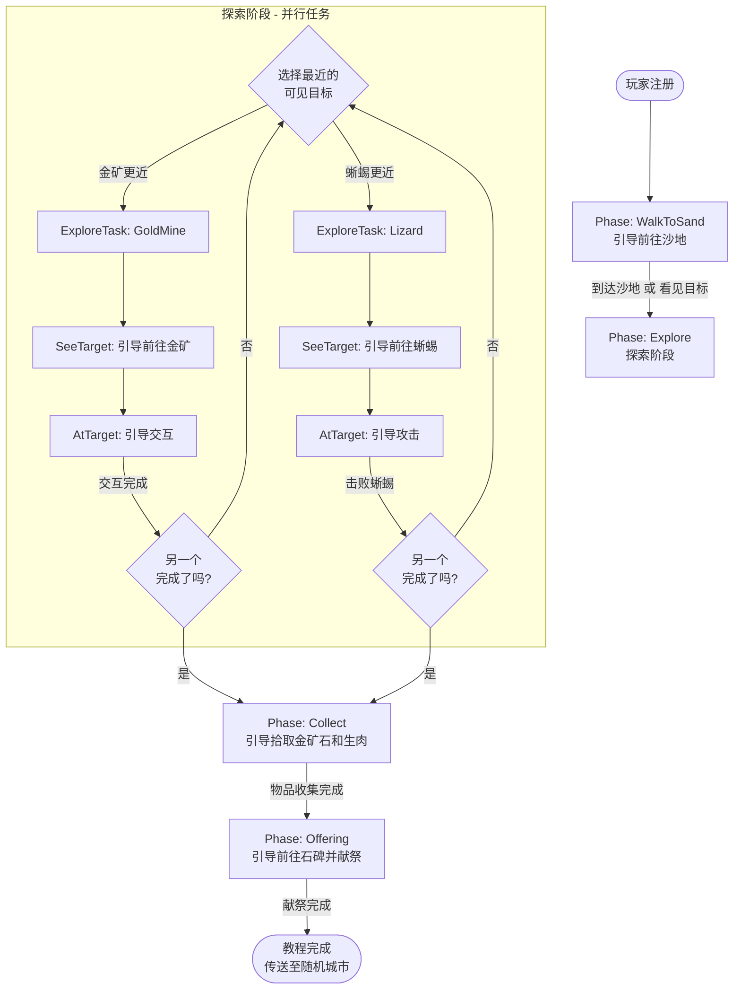

# 新手体验

---

## 引导

玩家在一个封闭的新手引导区域完成核心操作的教学，整个过程不打断游戏体验——零强制暂停、零遮罩、零教程弹窗，玩家在"需要"的时刻自然学会操作，走出区域后无缝进入大世界。

### 流程概览

### 阶段说明

| Phase | 说明 | 完成条件 |
|-------|------|----------|
| **WalkToSand** | 引导玩家前往沙地地图 | 到达沙地 或 看见金矿/蜥蜴 |
| **Explore** | 并行完成采集和战斗任务（顺序不限） | GoldMine 和 Lizard 都完成 |
| **Collect** | 引导拾取掉落物品 | 背包中有金矿石和生肉 |
| **Offering** | 引导找到石碑并献上物品 | 给予石碑所需物品 |
| **Completed** | 播放剧情，传送至随机城市 | - |

### 探索阶段详解

**Explore** 阶段包含两个并行子任务（**ExploreTask**）：

| ExploreTask | 目标 | 操作 |
|-------------|------|------|
| **GoldMine** | 金矿 | 交互（Interact） |
| **Lizard** | 蜥蜴 | 攻击（Attack） |

玩家可以按任意顺序完成这两个任务。系统会根据玩家的视野自动选择引导目标：

1. 如果只看到一个目标 → 引导该目标
2. 如果同时看到两个目标 → 引导更近的（在同一地图优先）
3. 完成一个后，自动引导另一个

每个子任务有两个动作阶段（**ExploreAction**）：

| ExploreAction | 说明 | UI 引导 |
|---------------|------|---------|
| **SeeTarget** | 玩家看到目标，但不在同一地图 | 高亮目标 + "前往"按钮 |
| **AtTarget** | 玩家到达目标所在地图 | 高亮"交互"或"攻击"按钮 |

### 数据持久化

教程进度存储在 `Database.Player.record` 中：

| Key | 类型 | 说明 |
|-----|------|------|
| `TutorialPhase` | int | 当前阶段（1-4, 100=完成） |
| `TutorialExplore` | int | 已完成的探索任务（bitmask: 1=GoldMine, 2=Lizard） |

**断线处理**：玩家断线后重新登录，不恢复教程，直接进入正常游戏世界。教程进度数据保留用于分析。

### 区域设计

新手区域位于某个城市场景（如圣泉镇）的角落，通过地形形成封闭结构：

- **单出口**：区域只有一个出口通向城市主区域
- **线性路径**：内部地图排列成单向通道，玩家只能沿唯一方向前进
- **无缝衔接**：走出新手区即进入城市，无加载、无过场
- **可回访**：完成引导后随时可以回来，但没有额外奖励

新玩家出生在新手区最深处，沿路完成引导内容后自然走入城市。

### 隐性引导

**隐性引导**是指通过空间和情境设计，让玩家自然发现操作方式，无需任何提示。

**设计方式**：
- **唯一路径**：只有一个方向可走，玩家自然移动
- **障碍驱动**：必须解决障碍才能前进
- **资源诱导**：看到物品，自然拾取
- **视觉引导**：目标物明显、醒目

### 显性引导

**显性引导**是指通过视觉提示，主动告知玩家信息或引导玩家注意。第一次触发后不再重复。

**表现形式**：
- **文本提示**：机制说明文字，玩家第一次遇到某机制时出现
- **视觉聚焦**：按钮光圈、元素高亮，引导玩家注意特定UI

### 内容

需要引导的内容：

| 层次 | 内容 | 引导方式 | 触发条件 | 设计说明 |
|------|------|----------|----------|----------|
| 操作 | 移动 | 隐性 | - | 唯一路径：起点只有2格，出口在另一端 |
| 操作 | 前往 | 显性 | 首次看见目标角色 | 视觉聚焦：高亮 characters 面板中的目标，然后高亮"前往"按钮 |
| 操作 | 交互 | 显性 | 到达目标位置 | 视觉聚焦：高亮操作按钮（如攻击） |
| 操作 | 战斗 | 隐性 | - | 障碍驱动：敌人在路径上，需要击败才能继续 |
| 操作 | 拾取 | 显性 | 击败敌人后 | 视觉聚焦：高亮掉落物品和拾取按钮 |
| 操作 | 进食 | 隐性 | - | 资源诱导：获得食物时Lp刚好较低，屏幕有视觉提示 |
| 操作 | 装备 | 显性 | 首次获得装备 | 文本提示：提示穿戴 |
| 操作 | 背包 | 显性 | 首次获得物品 | 文本提示：提示查看背包 |
| 系统 | Lp机制 | 显性 | Lp < 50%（首次） | 文本提示：解释Lp是饥饿值 |
| 系统 | Lp危险 | 显性 | Lp < 30%（首次） | 文本提示：警告即将死亡 |
| 系统 | 死亡 | 显性 | 首次死亡 | 文本提示：解释死亡原因和复活机制 |
| 系统 | 升级 | 显性 | 首次升级 | 文本提示：解释经验和等级机制 |
| 系统 | 商店 | 显性 | 首次访问商店 | 文本提示：介绍商店功能 |
| 系统 | 背包满 | 显性 | 背包容量 >= 80% | 文本提示：提示清理或出售 |

### 视野与前往

由于视野系统的存在，玩家可能在不同地图格子上就能在 **Characters 面板** 看到目标角色。当玩家首次"看见"一个重要目标时（如金矿、蜥蜴、石碑），应触发以下显性引导：

1. **高亮目标角色**：在 Characters 面板中高亮该目标
2. **引导前往操作**：高亮"前往"按钮，引导玩家点击
3. **到达后引导交互**：玩家到达目标所在地图后，引导具体操作（如攻击、给予等）

这套流程确保玩家学会：
- 使用 Characters 面板发现周围的角色
- 使用"前往"功能移动到目标位置
- 到达后执行具体操作

---

## 转化

在玩家理解核心玩法后，适时展示付费价值，促进首充和订阅转化。

| 触发条件 | 内容 | 说明 |
|----------|------|------|
| 达到5级 或 游玩2小时 | 首充优惠 | 展示首充礼包 |
| 达到10级 或 游玩8小时 | 月卡价值 | 介绍月卡权益（行为树等） |
| 月卡激活 | 行为树教程 | 引导使用付费功能 |
